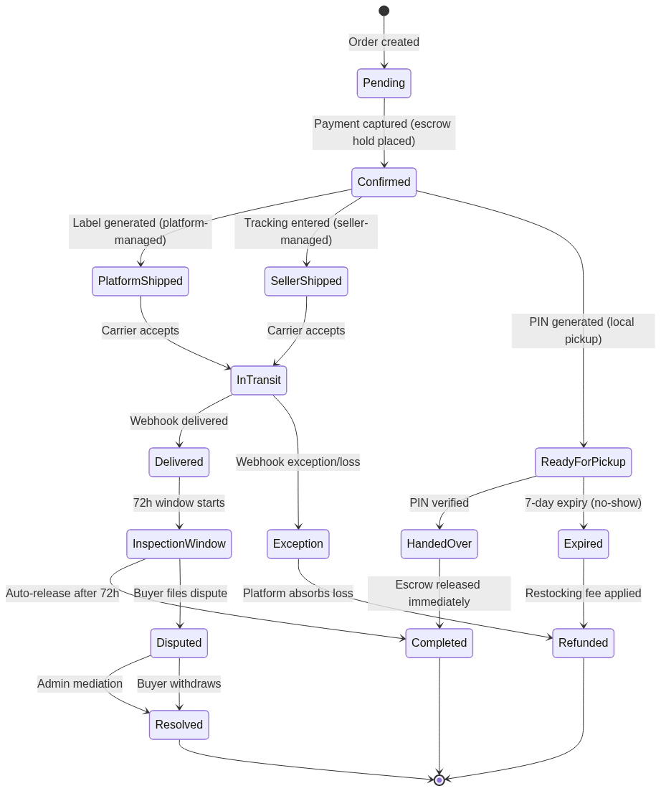

# P2P Marketplace for Used Items — Somalia

## Product Requirement Document & Technical Specification

### Adapted for the Somali Market

---

| Field | Detail |
|-------|--------|
| **Version** | 2.0 |
| **Date** | June 2026 |
| **Status** | Production-Ready Draft |
| **Target Market** | Somalia |
| **Primary Currency** | US Dollar (USD) |

---

## Market Context

This specification adapts a modern peer-to-peer marketplace platform for the Somali market, replacing Western financial infrastructure with locally appropriate technologies. Key adaptations include:

| Western Equivalent | Somali Adaptation |
|:---|:---|
| Stripe / Card Payments | Mobile Money Wallets: EVC Plus (Hormuud), Premier Wallet, eDahab (Telesom) |
| Stripe Connect Payouts | Local Bank Transfers: Salaam Somali Bank, Dahabshiil Bank, Amal Bank, Premier Bank |
| USD ($) | US Dollar (USD) — 1 USD ≈ $1 |
| USPS / FedEx / UPS | Local Courier Network & DHL Somalia |
| US Address Format | Somali Regional Format: District, City, Region |
| +1 Phone Numbers | +252 Somali Mobile (all major carriers) |

## Technology Stack

| Layer | Technology | Purpose |
|-------|-----------|---------|
| Frontend | React 19 | UI framework with concurrent features |
| SSR & Routing | TanStack Start | Server-side rendering, file-based routing, server functions |
| Styling | Tailwind CSS | Utility-first CSS framework |
| Language | TypeScript | Type safety across full stack |
| ORM | Drizzle ORM | TypeScript-native SQL query builder |
| Database | Supabase PostgreSQL | Relational data with RLS, PostGIS, full-text search |
| Auth | Supabase Auth | JWT-based identity |
| Storage | Supabase Storage | Image and file uploads |
| Payments | Mobile Money APIs | EVC Plus, Premier Wallet, eDahab USSD/push APIs |
| Payouts | Bank Transfer APIs | Local Somali bank integration |
| UI Components | shadcn/ui | Accessible, composable React components built on Radix UI primitives |

## Monetization Models

1. **Fixed Rate (Xawaalad):** Flat fee paid by the seller via mobile money wallet (EVC/eDahab/Premier) to list a premium or high-visibility item. Default: $5.
2. **Commission Rate (Qayb):** Percentage-based fee deducted from the final sale price upon successful transaction. Default: 12.5% of sale price, minimum $1, maximum $50.

## Primary Operational Regions

| Region | Major Cities | Coordinates |
|--------|-------------|-------------|
| Banadir | Mogadishu (Hodan, Waberi, Hamar Weyne, KM4) | 2.0469°N, 45.3182°E |
| Woqooyi Galbeed | Hargeisa, Berbera | 9.5624°N, 44.0645°E |
| Bari | Bosaso, Qardho | 11.2823°N, 49.1818°E |
| Mudug | Galkayo | 6.7697°N, 47.4308°E |

---


# 1. System Architecture & Database Schema

## 1.1 High-Level Architecture Overview

### 1.1.1 Three-Tier Architecture

The marketplace platform employs a three-tier architecture separating presentation, application logic, and data persistence. The presentation tier is a React 19 frontend rendered through TanStack Start's SSR pipeline, which streams HTML to the client and progressively hydrates interactive components. The application tier consists of server functions defined via TanStack Start's `createServerFn` — these execute exclusively on the server, handle business logic, and interact with backend services. The data tier comprises Supabase services: PostgreSQL for relational data with Row Level Security (RLS), Supabase Auth for identity management, and Supabase Storage for file persistence.

TanStack Start uses file-based routing with explicit server function boundaries. Unlike Next.js App Router, where Server Component boundaries are implicit, TanStack Start requires developers to explicitly define which functions run on the server through `createServerFn`. This explicitness matters for marketplace applications where every transaction requires audit logging, financial validation, and mobile money webhook coordination — implicit boundaries obscure these cross-cutting concerns. The SSR layer uses Vinxi as its bundler abstraction over Vite, providing automatic server/client code splitting without manual "use client" directives.

Supabase serves as the Backend-as-a-Service layer. PostgreSQL stores all application data with RLS policies enforcing access control at the database level, independent of application code. Supabase Auth manages identity through JWT tokens in httpOnly cookies, with `auth.users` as the authentication source of truth. Supabase Storage handles image uploads via presigned URLs, enabling direct browser-to-storage uploads that bypass the application server entirely, offloading bandwidth-intensive operations from the compute tier.

### 1.1.2 Data Flow Patterns

Three data flow patterns govern tier communication. **Server functions** handle all mutations and sensitive reads. Defined with `createServerFn`, they execute on the server, receive Zod-validated input, query the database through Drizzle ORM, and return typed responses. This replaces traditional REST endpoints with type-safe function calls colocated with their invoking components.

```typescript
// Server function pattern for listing creation
import { createServerFn } from "@tanstack/react-start";
import { z } from "zod";
import { db } from "@/db";
import { listings } from "@/db/schema";

const createListingSchema = z.object({
  title: z.string().min(5).max(120),
  description: z.string().min(20).max(5000),
  categoryId: z.string().uuid(),
  condition: z.enum(["new", "like_new", "good", "fair", "poor"]),
  price: z.number().int().positive().max(10_000_000), // $100,000 max (~$100k)
  deliveryMethod: z.enum(["shipping", "local_pickup", "both"]),
  images: z.array(z.string().url()).min(1).max(12),
  metadata: z.record(z.unknown()).optional(),
});

export const createListing = createServerFn({ method: "POST" })
  .validator(createListingSchema)
  .handler(async ({ data, context }) => {
    const user = context.user;
    if (!user) throw new Error("Authentication required");

    const [listing] = await db
      .insert(listings)
      .values({
        sellerId: user.id,
        title: data.title,
        description: data.description,
        categoryId: data.categoryId,
        condition: data.condition,
        price: data.price,
        deliveryMethod: data.deliveryMethod,
        images: data.images,
        metadata: data.metadata ?? {},
        status: "draft",
      })
      .returning();

    return listing;
  });
```

This pattern ensures database credentials never reach the client, validation runs on both tiers, and every operation executes within an authenticated server context. The `createServerFn` abstraction serializes the call over HTTP POST while preserving end-to-end type safety.

**Real-time subscriptions** propagate state changes without polling. Supabase Realtime channels listen to PostgreSQL Write-Ahead Log (WAL) events on critical tables — specifically `orders` and `listings`. When an order status transitions, the WAL event broadcasts to subscribed clients, which feed into TanStack Query's cache invalidation pipeline.

**File uploads** use presigned Storage URLs. When a seller uploads images, a server function generates a presigned upload URL via the Supabase Storage API; the browser uploads directly to Storage, then stores the returned public URL in `listings.images`. This eliminates file upload bandwidth from the compute tier.

**UI layer** uses shadcn/ui components for all interactive elements — data tables, forms, dialogs, dropdown menus, tabs, and pagination. Built on Radix UI primitives with Tailwind CSS styling, shadcn/ui provides accessible, keyboard-navigable components that work across the SSR and client hydration boundary. Components are installed via the CLI (`npx shadcn add table`, `npx shadcn add dialog`) and customized through Tailwind theme extensions, keeping bundle sizes minimal through tree-shaking.

### 1.1.3 Technology Stack Justification

| Dimension | TanStack Start | Next.js App Router | Selection |
|:---|:---|:---|:---|
| Server Boundaries | Explicit via `createServerFn` | Implicit Server Components | TanStack Start — explicit boundaries enable audit logging and financial validation at every call site |
| Data Fetching | Server functions, end-to-end types | Server Components with `fetch` caching | TanStack Start eliminates API route boilerplate and manual request/response typing |
| SSR Model | Vinxi streaming, selective hydration | React Server Components (RSC) with streaming | TanStack Start avoids RSC caching complexity that conflicts with real-time marketplace data |
| State Transfer | JSON return values | RSC payload stream | TanStack Start returns plain JSON integrating cleanly with TanStack Query |
| Drizzle Integration | Direct, lightweight | Requires adapter layers | TanStack Start's server functions import Drizzle directly without edge-runtime constraints |
| Dimension | Drizzle ORM | Prisma ORM | Selection |
| Query Model | TypeScript-native SQL-like builder | Declarative schema with generated client | Drizzle maps directly to PostgreSQL features (PostGIS, JSONB, CTEs) without abstraction leakage |
| Type Generation | Inferred from schema, no generate step | Requires `prisma generate` after changes | Drizzle eliminates CI generate steps and prevents schema/client version skew |
| Bundle Size | ~15 kB tree-shakeable | Larger, engine-dependent | Drizzle's smaller footprint reduces serverless cold starts |
| Migration Tooling | `drizzle-kit` with transparent SQL | `prisma migrate` declarative | Drizzle-kit outputs auditable SQL migrations critical for financial schema changes |
| Dimension | Supabase Auth | Clerk | Selection |
| Data Ownership | Open source, data in your PostgreSQL | Hosted proprietary, data in Clerk's infra | Supabase keeps identity data in-application, enabling RLS policies joining `auth.users` directly |
| Pricing | Free: 50K MAU; Pro: $25/project | Free: 10K MAU; Pro: $25/month | Supabase Auth scales more cost-effectively for marketplaces with many casual sellers |
| PostgreSQL Integration | Native `auth.uid()` in RLS, `auth.users` FK | Requires sync adapter/webhook | Supabase eliminates user synchronization pipelines, reducing auth-dependent query latency |

The TanStack Start selection prioritizes explicit server boundaries and predictable data flows over the convenience of implicit Server Components. For a marketplace handling financial transactions through mobile money wallets, the ability to audit exactly where server execution occurs outweighs the ergonomic benefits of RSC. Drizzle ORM is selected for its SQL-native query model and zero-generation-step type inference, enabling direct use of PostgreSQL-specific features. Supabase Auth is selected for data sovereignty — storing user identity in the application database enables RLS policies to reference `auth.users` directly without external API calls.

## 1.2 Core Entity Schema (Drizzle ORM)

### 1.2.1 Users and Profiles Tables

The `users` table stores application-level user data with a 1:1 relationship to Supabase's `auth.users` table through a foreign key on `id`. This separates authentication concerns (handled by Supabase Auth) from application concerns — roles, verification status, and payout method linkage. A database trigger on `auth.users` automatically inserts a corresponding `users` row on signup, preventing orphaned auth records.

The `role` enum has values `buyer`, `seller`, and `admin`. All users default to `buyer`; sellers must complete identity verification before listing. The `verifiedAt` timestamp records when a seller passed government ID and selfie verification — a process administered by the platform's compliance team given Somalia's evolving identity infrastructure. The `primaryBankAccountId` stores a foreign key to the seller's preferred bank account for payouts via local bank transfer; it remains `NULL` for buyers and for sellers who have not yet registered a bank account. The `walletPhone` column stores the mobile money phone number (typically a Hormuud, Somtel, or Telesom number in +252 format) used for EVC Plus, Premier Wallet, or eDahab transactions.

The `profiles` table normalizes display metadata (display name, avatar, bio, location, phone) into a separate 1:1 table. This separation allows profile data to be fetched independently in listing cards without loading the full user record. The `location` column stores a structured Somali address as JSONB, accommodating the country's address system (city, region, district) without schema migration.

```typescript
// db/schema/users.ts — Users and Profiles tables
import {
  pgTable, uuid, varchar, timestamp, text, jsonb, pgEnum, boolean,
} from "drizzle-orm/pg-core";

export const userRoleEnum = pgEnum("user_role", ["buyer", "seller", "admin"]);

export const users = pgTable("users", {
  // FK to auth.users.id: 1:1 mapping, ON DELETE CASCADE removes
  // application user when auth user is deleted.
  id: uuid("id")
    .primaryKey()
    .references(() => authUsers.id, { onDelete: "cascade" }),
  email: varchar("email", { length: 255 }).notNull(),
  role: userRoleEnum("role").notNull().default("buyer"),
  // FK to bank_accounts.id; the default account for seller payouts.
  // NULL for buyers and unverified sellers.
  primaryBankAccountId: uuid("primary_bank_account_id"),
  // Mobile money phone for EVC Plus / Premier Wallet / eDahab.
  // Usually matches profiles.phone but kept separate for flexibility.
  walletPhone: varchar("wallet_phone", { length: 15 }),
  // NULL until seller ID + selfie verification passes.
  verifiedAt: timestamp("verified_at", { withTimezone: true }),
  createdAt: timestamp("created_at", { withTimezone: true }).notNull().defaultNow(),
  updatedAt: timestamp("updated_at", { withTimezone: true }).notNull().defaultNow(),
});

// Managed by Supabase Auth; referenced but not migrated via Drizzle.
export const authUsers = pgTable("auth.users", {
  id: uuid("id").primaryKey(),
  email: varchar("email", { length: 255 }),
});

export const profiles = pgTable("profiles", {
  id: uuid("id").primaryKey().references(() => users.id, { onDelete: "cascade" }),
  displayName: varchar("display_name", { length: 60 }).notNull(),
  avatarUrl: text("avatar_url"), // Supabase Storage public URL
  bio: text("bio"),
  // Structured Somali address: { city, region, district, lat, lng }
  // Regions: Banadir, Woqooyi Galbeed, Bari, Nugaal, Mudug, etc.
  location: jsonb("location").$type<{
    city: string; region: string; district: string;
    lat: number; lng: number;
  }>(),
  // Somali mobile format: +252 XX XXX XXXX
  // Hormuud: 61/62/65, Somtel: 63/64/66/67, Telesom: 67/68/69
  phone: varchar("phone", { length: 15 }),
  createdAt: timestamp("created_at", { withTimezone: true }).notNull().defaultNow(),
  updatedAt: timestamp("updated_at", { withTimezone: true }).notNull().defaultNow(),
});
```

The RLS ownership pattern grants users access only to their own row (`auth.uid() = id`), with administrators bypassing through a role-checking policy. This pattern propagates across all tables: every user-associated table includes a `userId` (or `sellerId`/`buyerId`) column that RLS policies reference. The `auth.users` FK is critical — deleting a user account through Supabase Auth cascades to all application data, preventing orphaned rows.

### 1.2.2 Categories and Listings Tables

The `categories` table implements a self-referencing hierarchy through `parentId`, enabling nested structures (Electronics > Phones > Smartphones). The `metadataSchema` column stores a JSON Schema (draft-07 subset) defining required fields for listings in that category — for example, "Smartphones" might require `brand`, `model`, `storageGb`, and `color`. This schema-driven approach supports diverse item types without adding category-specific columns to `listings`.

The adjacency list pattern (storing only `parentId`) is chosen for simplicity. For subtree queries, the closure table `categoryClosure` stores all ancestor-descendant pairs, enabling $O(1)$ subtree membership tests. Database triggers on `categories` automatically maintain closure rows on insert and parent update.

The `listings` table is the central marketplace entity. The `price` column uses `INTEGER` in USD cents (e.g., $100.00 = 10,000 cents) to eliminate floating-point errors — a convention applied to all monetary columns. The `monetizationType` and `monetizationStatus` columns control platform charging: `fixed_rate` charges upfront; `commission` withholds a percentage at sale. The `location` column uses PostGIS `geography(Point, 4326)` for radius-based local pickup search.

```typescript
// db/schema/listings.ts — Categories and Listings tables
import {
  pgTable, uuid, varchar, timestamp, text, jsonb, integer,
  pgEnum, index, geography,
} from "drizzle-orm/pg-core";
import { sql } from "drizzle-orm";
import { users } from "./users";

export const categories = pgTable("categories", {
  id: uuid("id").primaryKey().default(sql`gen_random_uuid()`),
  name: varchar("name", { length: 100 }).notNull(),
  slug: varchar("slug", { length: 100 }).notNull().unique(),
  // Self-referencing FK. NULL for root categories. ON DELETE SET NULL
  // orphans children rather than cascading deletion.
  parentId: uuid("parent_id").references((): any => categories.id, { onDelete: "set null" }),
  // JSON Schema defining required metadata fields; validated by trigger.
  metadataSchema: jsonb("metadata_schema").notNull().default({}),
  sortOrder: integer("sort_order"),
  createdAt: timestamp("created_at", { withTimezone: true }).notNull().defaultNow(),
  updatedAt: timestamp("updated_at", { withTimezone: true }).notNull().defaultNow(),
});

// Closure table for fast subtree queries. Stores all ancestor-descendant
// pairs including reflexive pairs (depth = 0 for self-reference).
export const categoryClosure = pgTable("category_closure", {
  ancestorId: uuid("ancestor_id").notNull().references(() => categories.id, { onDelete: "cascade" }),
  descendantId: uuid("descendant_id").notNull().references(() => categories.id, { onDelete: "cascade" }),
  depth: integer("depth").notNull(),
});

export const itemConditionEnum = pgEnum("item_condition", ["new", "like_new", "good", "fair", "poor"]);
export const deliveryMethodEnum = pgEnum("delivery_method", ["shipping", "local_pickup", "both"]);
export const listingStatusEnum = pgEnum("listing_status", ["draft", "active", "sold", "expired", "suspended"]);
export const monetizationTypeEnum = pgEnum("monetization_type", ["fixed_rate", "commission"]);
export const monetizationStatusEnum = pgEnum("monetization_status", ["pending_paid", "active", "waived"]);

export const listings = pgTable("listings", {
  id: uuid("id").primaryKey().default(sql`gen_random_uuid()`),
  sellerId: uuid("seller_id").notNull().references(() => users.id, { onDelete: "cascade" }),
  title: varchar("title", { length: 120 }).notNull(),
  description: text("description").notNull(),
  categoryId: uuid("category_id").notNull().references(() => categories.id, { onDelete: "restrict" }),
  condition: itemConditionEnum("condition").notNull(),
  price: integer("price").notNull(), // US Dollar (USD) cents
  monetizationType: monetizationTypeEnum("monetization_type").notNull(),
  monetizationStatus: monetizationStatusEnum("monetization_status").notNull().default("pending_paid"),
  deliveryMethod: deliveryMethodEnum("delivery_method").notNull(),
  status: listingStatusEnum("status").notNull().default("draft"),
  // PostGIS point for local pickup radius search; SRID 4326 = WGS 84.
  location: geography("location", { type: "point", srid: 4326 }),
  // Ordered Supabase Storage public URLs; first element is hero image.
  images: text("images").array().notNull().default([]),
  // Category-specific metadata validated against categories.metadataSchema.
  metadata: jsonb("metadata").notNull().default({}),
  // Auto-transition to 'expired' after this timestamp.
  expiresAt: timestamp("expires_at", { withTimezone: true }),
  createdAt: timestamp("created_at", { withTimezone: true }).notNull().defaultNow(),
  updatedAt: timestamp("updated_at", { withTimezone: true }).notNull().defaultNow(),
}, (table) => [
  // Feed queries: active listings ordered by recency.
  index("idx_listings_status_created").on(table.status, table.createdAt),
  // Category browsing: filter by category + status, sort by price.
  index("idx_listings_category_status_price").on(table.categoryId, table.status, table.price),
  // GIST index for ST_DWithin radius queries on local pickup.
  index("idx_listings_location").on(table.location).using("gist"),
]);
```

The `ON DELETE RESTRICT` on `categoryId` prevents deletion of categories with associated listings. The GIST index on `location` enables `ST_DWithin` queries with $O(\log n)$ lookup for radius-based local pickup search. The `images` array stores complete Storage URLs, eliminating URL construction joins when rendering listing cards.

### 1.2.3 Bank Accounts and Wallet Payments Tables

The `bankAccounts` table enables sellers to register local Somali bank accounts for receiving payouts. Sellers may register multiple accounts across different banks and designate one as default. Account verification involves a micro-deposit confirmation process or manual verification by the platform's support team, depending on the bank's API availability. The `verifiedAt` timestamp records when the account has been confirmed as valid and under the seller's control.

The `walletPayments` table tracks all mobile money transactions initiated through Somali payment providers: EVC Plus (Hormuud), Premier Wallet (Premier Bank), and eDahab (Telesom). Each payment receives a unique `merchantRef` generated by the platform, which is passed to the mobile money provider's USSD push API. The provider returns a `walletRef` — their transaction reference — which enables reconciliation against provider settlement reports. The `status` column tracks the payment lifecycle: `pending` (initiated, awaiting customer PIN confirmation), `success` (funds deducted from customer's mobile wallet), `failed` (customer declined or timeout), and `reversed` (reversal processed after successful charge). The `customerPhone` column stores the payer's mobile number in +252 format, which may differ from the user's registered profile phone.

```typescript
// db/schema/payments.ts — Bank Accounts and Wallet Payments tables
import {
  pgTable, uuid, varchar, timestamp, integer, boolean, pgEnum, index,
} from "drizzle-orm/pg-core";
import { sql } from "drizzle-orm";
import { users } from "./users";
import { orders } from "./orders";

export const walletProviderEnum = pgEnum("wallet_provider", ["evc", "premier", "edahab"]);

export const bankAccounts = pgTable("bank_accounts", {
  id: uuid("id").primaryKey().default(sql`gen_random_uuid()`),
  userId: uuid("user_id").notNull().references(() => users.id, { onDelete: "cascade" }),
  bankName: varchar("bank_name", { length: 100 }).notNull(), // Salaam Somali Bank, Dahabshiil Bank, Amal Bank, Premier Bank, Trust Bank
  accountNumber: varchar("account_number", { length: 50 }).notNull(),
  accountHolderName: varchar("account_holder_name", { length: 120 }).notNull(),
  isDefault: boolean("is_default").notNull().default(false),
  verifiedAt: timestamp("verified_at", { withTimezone: true }),
  createdAt: timestamp("created_at", { withTimezone: true }).notNull().defaultNow(),
}, (table) => [
  index("idx_bank_accounts_user").on(table.userId),
]);

export const walletPayments = pgTable("wallet_payments", {
  id: uuid("id").primaryKey().default(sql`gen_random_uuid()`),
  userId: uuid("user_id").notNull().references(() => users.id),
  orderId: uuid("order_id").references(() => orders.id),
  walletProvider: walletProviderEnum("wallet_provider").notNull(),
  amount: integer("amount").notNull(), // USD cents
  currency: varchar("currency", { length: 3 }).notNull().default("USD"),
  // Mobile money transaction reference from provider (e.g., EVC-20241215-ABC123).
  walletRef: varchar("wallet_ref", { length: 100 }),
  status: varchar("status", { length: 20 }).notNull().default("pending"), // pending, success, failed, reversed
  // Platform-generated unique reference passed to provider; enables idempotency.
  merchantRef: varchar("merchant_ref", { length: 100 }).notNull().unique(),
  // Customer's mobile money phone number in +252 format.
  customerPhone: varchar("customer_phone", { length: 15 }),
  // Provider-specific callback payload for audit trail.
  callbackPayload: jsonb("callback_payload"),
  createdAt: timestamp("created_at", { withTimezone: true }).notNull().defaultNow(),
  updatedAt: timestamp("updated_at", { withTimezone: true }).notNull().defaultNow(),
}, (table) => [
  index("idx_wallet_payments_user").on(table.userId, table.createdAt),
  index("idx_wallet_payments_order").on(table.orderId),
  index("idx_wallet_payments_merchant_ref").on(table.merchantRef),
  index("idx_wallet_payments_wallet_ref").on(table.walletRef),
]);
```

Mobile money payments in Somalia operate through USSD push APIs: the platform sends a payment request to the provider's API with the customer's phone number and amount, the provider pushes a USSD prompt to the customer's phone, the customer enters their PIN to authorize, and the provider sends an asynchronous callback confirming success or failure. This flow requires careful tracking that the schema addresses. The `merchantRef` ensures idempotency — duplicate requests with the same reference are rejected by providers, preventing double-charging if the client retries. The `callbackPayload` stores the full provider response for forensic analysis when callbacks are delayed or ambiguous. The platform implements a polling fallback that queries the provider's transaction status API if no callback arrives within 120 seconds. Reversal handling requires careful sequencing: a successful payment can only be reversed through the provider's reversal API within a 24-hour window, and the platform logs all reversal attempts in a separate `walletReversals` audit table.

### 1.2.4 Orders and Transactions Tables

The `orders` table records transaction lifecycles with a finite state machine: `pending` → `confirmed` → `shipped` → `delivered` → `completed`, with `cancelled` and `disputed` as terminal states reachable from multiple predecessors. Financial columns (`salePrice`, `commissionAmount`, `platformFee`, `shippingFee`, `netPayout`) are stored as INTEGER cents and computed at order creation. These values are immutable after creation — a critical property for audit trails and dispute resolution.

The `deliveryConfirmedBy` column captures the verification mechanism: `carrier` (platform courier network webhook), `buyer` (manual confirmation), `pin` (handoff code), or `admin` (manual override). This multi-modal system accommodates both shipped items via local logistics partners and local-pickup delivery methods.

The `transactions` table implements a double-entry ledger for all financial events. The dual-track model charges flat fees immediately upon listing publication, while commissions follow an escrow pattern: a `commission_hold` records the withheld amount at purchase, and an `escrow_release` records the platform receiving it after delivery confirmation. The signed-amount convention (positive for debits, negative for credits) simplifies balance calculations.

```typescript
// db/schema/orders.ts — Orders and Transactions tables
import {
  pgTable, uuid, varchar, timestamp, integer, pgEnum, text, index, jsonb,
} from "drizzle-orm/pg-core";
import { sql } from "drizzle-orm";
import { users } from "./users";
import { listings } from "./listings";

export const orderStatusEnum = pgEnum("order_status", [
  "pending", "confirmed", "shipped", "delivered", "completed", "cancelled", "disputed",
]);
export const deliveryConfirmSourceEnum = pgEnum("delivery_confirm_source", ["carrier", "buyer", "pin", "admin"]);

export const orders = pgTable("orders", {
  id: uuid("id").primaryKey().default(sql`gen_random_uuid()`),
  listingId: uuid("listing_id").notNull().references(() => listings.id, { onDelete: "restrict" }),
  buyerId: uuid("buyer_id").notNull().references(() => users.id, { onDelete: "cascade" }),
  sellerId: uuid("seller_id").notNull().references(() => users.id, { onDelete: "cascade" }),
  status: orderStatusEnum("status").notNull().default("pending"),
  // Financial snapshot at creation — immutable after insert.
  salePrice: integer("sale_price").notNull(), // USD cents
  commissionAmount: integer("commission_amount").notNull().default(0), // USD cents
  platformFee: integer("platform_fee").notNull().default(0), // USD cents
  shippingFee: integer("shipping_fee").notNull().default(0), // USD cents
  netPayout: integer("net_payout").notNull(), // USD cents
  // Populated when status transitions to 'shipped'.
  trackingNumber: varchar("tracking_number", { length: 100 }),
  carrier: varchar("carrier", { length: 50 }), // Local delivery partner name
  labelUrl: text("label_url"),
  deliveryConfirmedBy: deliveryConfirmSourceEnum("delivery_confirmed_by"),
  completedAt: timestamp("completed_at", { withTimezone: true }),
  createdAt: timestamp("created_at", { withTimezone: true }).notNull().defaultNow(),
  updatedAt: timestamp("updated_at", { withTimezone: true }).notNull().defaultNow(),
}, (table) => [
  index("idx_orders_buyer_status").on(table.buyerId, table.status, table.createdAt),
  index("idx_orders_seller_status").on(table.sellerId, table.status, table.createdAt),
  index("idx_orders_listing").on(table.listingId),
]);

export const transactionTypeEnum = pgEnum("transaction_type", [
  "flat_fee", "commission_hold", "escrow_release", "payout", "shipping_charge", "refund",
]);
export const transactionStatusEnum = pgEnum("transaction_status", ["pending", "completed", "failed", "reversed"]);

export const transactions = pgTable("transactions", {
  id: uuid("id").primaryKey().default(sql`gen_random_uuid()`),
  // NULL for flat_fee (linked to listing) and admin adjustments.
  orderId: uuid("order_id").references(() => orders.id, { onDelete: "set null" }),
  userId: uuid("user_id").notNull().references(() => users.id, { onDelete: "cascade" }),
  type: transactionTypeEnum("type").notNull(),
  // Positive = charge to user; negative = credit to user.
  amount: integer("amount").notNull(), // USD cents
  status: transactionStatusEnum("status").notNull().default("pending"),
  // FK to wallet_payments for mobile money reconciliation.
  walletPaymentId: uuid("wallet_payment_id"),
  // Bank transfer reference for payout tracking (provider-generated).
  bankTransferRef: varchar("bank_transfer_ref", { length: 100 }),
  description: text("description").notNull(),
  createdAt: timestamp("created_at", { withTimezone: true }).notNull().defaultNow(),
  updatedAt: timestamp("updated_at", { withTimezone: true }).notNull().defaultNow(),
}, (table) => [
  index("idx_transactions_user_created").on(table.userId, table.createdAt),
  index("idx_transactions_order").on(table.orderId),
  index("idx_transactions_wallet_payment").on(table.walletPaymentId),
]);
```

The `netPayout` should equal $salePrice - commissionAmount - platformFee$ for commission listings, or $salePrice - platformFee$ for flat-fee listings. Storing this computed value rather than recalculating prevents inconsistencies if commission rates change post-order-creation. The `ON DELETE RESTRICT` on `listingId` preserves transaction records; the `ON DELETE SET NULL` on `orderId` preserves ledger entries for compliance even if orders are purged under data retention policies. The `walletPaymentId` links each transaction to its originating mobile money payment for end-of-day reconciliation against EVC Plus, Premier Wallet, and eDahab settlement reports. The `bankTransferRef` stores the provider reference when payouts are processed via bank transfer, enabling sellers to trace funds with their bank.

### 1.2.5 Payouts and Reviews Tables

The `payouts` table tracks disbursements to sellers through local Somali bank transfers or mobile money wallet transfers. When an order completes, the `netPayout` amount is queued as a payout record with status `pending`. A background worker polls pending payouts and initiates transfers through the selected channel. The `transferMethod` column distinguishes `bank_transfer` (1–2 business days to a registered bank account at Salaam Somali Bank, Dahabshiil Bank, Amal Bank, Premier Bank, or Trust Bank) from `wallet_transfer` (near-instant to the seller's EVC Plus, Premier Wallet, or eDahab account). The `bankAccountId` links bank transfer payouts to the specific account; it is `NULL` for wallet transfers. The `bankTransferRef` stores the reference number returned by the bank's transfer API or the mobile money provider's transaction ID, enabling reconciliation.

Bank transfers in Somalia operate through each bank's proprietary API or bulk file upload system. Salaam Somali Bank and Dahabshiil Bank offer REST APIs for single transfers; Amal Bank and Premier Bank currently require batch file uploads processed during business hours. The platform abstracts these differences through a provider adapter pattern, normalizing all bank interactions behind a common interface. Wallet transfers use the same mobile money push API as buyer payments but with the seller as the recipient; funds arrive in the seller's mobile wallet within seconds of processing.

The `reviews` table captures buyer-to-seller and seller-to-buyer feedback after order completion. A unique constraint on `(orderId, reviewerId)` prevents duplicate reviews at the database level, eliminating race conditions. Review eligibility (order status must be `completed`, reviewer must be a participant) is enforced at the application layer in the server function.

```typescript
// db/schema/payouts.ts — Payouts and Reviews tables
import {
  pgTable, uuid, varchar, timestamp, integer, pgEnum, uniqueIndex, index,
} from "drizzle-orm/pg-core";
import { sql } from "drizzle-orm";
import { users } from "./users";
import { orders } from "./orders";
import { bankAccounts } from "./payments";

export const payoutStatusEnum = pgEnum("payout_status", ["pending", "processing", "completed", "failed"]);
export const payoutMethodEnum = pgEnum("payout_method", ["bank_transfer", "wallet_transfer"]);

export const payouts = pgTable("payouts", {
  id: uuid("id").primaryKey().default(sql`gen_random_uuid()`),
  userId: uuid("user_id").notNull().references(() => users.id, { onDelete: "cascade" }),
  orderId: uuid("order_id").references(() => orders.id),
  // FK to bank_accounts; NULL for wallet_transfer payouts.
  bankAccountId: uuid("bank_account_id").references(() => bankAccounts.id),
  // Bank transfer reference or mobile money transaction ID; NULL until processing.
  bankTransferRef: varchar("bank_transfer_ref", { length: 100 }),
  amount: integer("amount").notNull(), // USD cents, matches order.netPayout
  status: payoutStatusEnum("status").notNull().default("pending"),
  transferMethod: payoutMethodEnum("transfer_method").notNull().default("bank_transfer"),
  initiatedAt: timestamp("initiated_at", { withTimezone: true }),
  completedAt: timestamp("completed_at", { withTimezone: true }),
  createdAt: timestamp("created_at", { withTimezone: true }).notNull().defaultNow(),
  updatedAt: timestamp("updated_at", { withTimezone: true }).notNull().defaultNow(),
});

export const reviews = pgTable("reviews", {
  id: uuid("id").primaryKey().default(sql`gen_random_uuid()`),
  orderId: uuid("order_id").notNull().references(() => orders.id, { onDelete: "cascade" }),
  reviewerId: uuid("reviewer_id").notNull().references(() => users.id, { onDelete: "cascade" }),
  revieweeId: uuid("reviewee_id").notNull().references(() => users.id, { onDelete: "cascade" }),
  rating: integer("rating").notNull(), // 1–5, no half-stars
  comment: text("comment"),
  createdAt: timestamp("created_at", { withTimezone: true }).notNull().defaultNow(),
}, (table) => [
  // One review per reviewer per order — enforced at DB level.
  uniqueIndex("idx_reviews_order_reviewer_unique").on(table.orderId, table.reviewerId),
  index("idx_reviews_reviewee").on(table.revieweeId, table.createdAt),
  index("idx_reviews_reviewer").on(table.reviewerId, table.createdAt),
]);
```

Failed payouts implement exponential backoff with a maximum of 5 attempts over 72 hours before manual escalation. For bank transfers, failure typically occurs due to incorrect account numbers. For wallet transfers, failure usually indicates the recipient's wallet is full (EVC Plus has a per-wallet balance limit). The platform sends SMS notifications to sellers via the Twilio-compatible messaging gateway at each payout status transition, keeping sellers informed without requiring app opens. Reviews use `ON DELETE CASCADE` on `orderId` — if an order is purged under data retention, its reviews are removed, and cached aggregate ratings on user profiles must be recomputed via trigger.

The following table summarizes the ten core entities, their purpose, and key relationships.

| Entity | Purpose | Key Columns | Relationships |
|:---|:---|:---|:---|
| **users** | Identity and role management | `id` (FK to `auth.users`), `role`, `primaryBankAccountId`, `walletPhone`, `verifiedAt` | 1:1 with `auth.users`; 1:1 with `profiles`; referenced by `sellerId`/`buyerId` |
| **profiles** | Display metadata and contact | `displayName`, `avatarUrl`, `bio`, `location` (JSONB with Somali address), `phone` (Somali +252 format) | 1:1 FK to `users.id` on delete cascade |
| **bankAccounts** | Seller payout destination registration | `userId`, `bankName` (Salaam Somali Bank, Dahabshiil Bank, etc.), `accountNumber`, `accountHolderName`, `isDefault`, `verifiedAt` | FK to `users.id`; referenced by `users.primaryBankAccountId`, `payouts.bankAccountId` |
| **walletPayments** | Mobile money transaction tracking | `userId`, `orderId`, `walletProvider` (evc/premier/edahab), `amount` (USD cents), `walletRef`, `merchantRef`, `status`, `customerPhone` | FK to `users`, `orders`; referenced by `transactions.walletPaymentId` |
| **categories** | Hierarchical taxonomy | `name`, `slug`, `parentId` (self-FK), `metadataSchema` (JSONB) | Self-referencing tree; referenced by `listings.categoryId` restrict delete |
| **listings** | Items for sale | `sellerId`, `price` (USD cents), `condition`, `status`, `monetizationType`, `location` (PostGIS), `images`, `metadata` | FK to `users`, `categories`; referenced by `orders.listingId` restrict delete |
| **orders** | Transaction lifecycle | `listingId`, `buyerId`, `sellerId`, `status`, `salePrice`, `netPayout`, `deliveryConfirmedBy` | FK to `listings`, `users`; referenced by `transactions.orderId` |
| **transactions** | Financial ledger | `orderId`, `userId`, `type`, `amount` (signed USD cents), `walletPaymentId`, `bankTransferRef` | FK to `orders` (set null), `users`; immutable after creation |
| **payouts** | Seller disbursement | `userId`, `orderId`, `bankAccountId`, `bankTransferRef`, `amount`, `status`, `transferMethod` | FK to `users`, `orders`, `bankAccounts`; bank or wallet transfer |
| **reviews** | Peer feedback | `orderId`, `reviewerId`, `revieweeId`, `rating` (1–5), `comment` | FK to `orders`, `users`; unique on `(orderId, reviewerId)` |

This schema follows third normal form with intentional denormalization in the `orders` table: financial line items are stored as an immutable snapshot at creation to prevent recalculation overhead and inconsistency if rates change. The `listings.metadata` JSONB column breaks strict normalization to accommodate category-specific attributes without schema migration, with validation enforced at the application layer against `categories.metadataSchema`.

## 1.3 Enumerated Types & TypeScript Integration

### 1.3.1 Drizzle Enum Definitions

PostgreSQL enums provide database-level type safety for fixed-value columns, preventing invalid state insertions regardless of client. Drizzle ORM's `pgEnum` creates a TypeScript type mirroring the database enum for use in table definitions. Enum values are defined as TypeScript const arrays, enabling `typeof` inference for Zod schemas and frontend logic.

The following block defines all application enums as both Drizzle `pgEnum` objects and TypeScript const arrays. The const arrays serve as the single source of truth: `pgEnum` calls reference them, and Zod schemas derive valid values from them. The generated PostgreSQL migration creates corresponding `CREATE TYPE` statements.

```typescript
// db/schema/enums.ts — Single source of truth for all enums
import { pgEnum } from "drizzle-orm/pg-core";

export const USER_ROLES = ["buyer", "seller", "admin"] as const;
export const userRoleEnum = pgEnum("user_role", USER_ROLES);

export const ITEM_CONDITIONS = ["new", "like_new", "good", "fair", "poor"] as const;
export const itemConditionEnum = pgEnum("item_condition", ITEM_CONDITIONS);

export const DELIVERY_METHODS = ["shipping", "local_pickup", "both"] as const;
export const deliveryMethodEnum = pgEnum("delivery_method", DELIVERY_METHODS);

export const LISTING_STATUSES = ["draft", "active", "sold", "expired", "suspended"] as const;
export const listingStatusEnum = pgEnum("listing_status", LISTING_STATUSES);

export const MONETIZATION_TYPES = ["fixed_rate", "commission"] as const;
export const monetizationTypeEnum = pgEnum("monetization_type", MONETIZATION_TYPES);

export const ORDER_STATUSES = ["pending", "confirmed", "shipped", "delivered", "completed", "cancelled", "disputed"] as const;
export const orderStatusEnum = pgEnum("order_status", ORDER_STATUSES);

export const TRANSACTION_TYPES = ["flat_fee", "commission_hold", "escrow_release", "payout", "shipping_charge", "refund"] as const;
export const transactionTypeEnum = pgEnum("transaction_type", TRANSACTION_TYPES);

export const TRANSACTION_STATUSES = ["pending", "completed", "failed", "reversed"] as const;
export const transactionStatusEnum = pgEnum("transaction_status", TRANSACTION_STATUSES);

export const PAYOUT_STATUSES = ["pending", "processing", "completed", "failed"] as const;
export const payoutStatusEnum = pgEnum("payout_status", PAYOUT_STATUSES);

export const PAYOUT_METHODS = ["bank_transfer", "wallet_transfer"] as const;
export const payoutMethodEnum = pgEnum("payout_method", PAYOUT_METHODS);

export const WALLET_PROVIDERS = ["evc", "premier", "edahab"] as const;
export const walletProviderEnum = pgEnum("wallet_provider", WALLET_PROVIDERS);

export type UserRole = (typeof USER_ROLES)[number];
export type ItemCondition = (typeof ITEM_CONDITIONS)[number];
export type OrderStatus = (typeof ORDER_STATUSES)[number];
export type TransactionType = (typeof TRANSACTION_TYPES)[number];
export type PayoutMethod = (typeof PAYOUT_METHODS)[number];
export type WalletProvider = (typeof WALLET_PROVIDERS)[number];
```

Adding a new value to an existing enum uses `ALTER TYPE ... ADD VALUE`, which PostgreSQL supports since version 9.1. Values are always appended to the end of the list. Removing or renaming enum values requires column type conversion — a known limitation that the team accounts for through careful upfront enum design. The addition of `WALLET_PROVIDERS` anticipates future mobile money provider integrations as Somalia's fintech ecosystem expands; new providers (such as MyCash or upcoming banking wallets) can be added without schema migration.

### 1.3.2 Zod Schema Co-location Pattern

The `drizzle-zod` package derives Zod schemas directly from Drizzle table definitions, establishing a single source of truth for all data shapes. `createInsertSchema` generates a schema matching Drizzle's `.insert()` structure; `createSelectSchema` matches query results. Generated schemas can be extended with `.refine()` for cross-field validation that Drizzle cannot express at the column level.

```typescript
// lib/schemas.ts — Zod schemas derived from Drizzle definitions
import { createInsertSchema, createSelectSchema } from "drizzle-zod";
import { z } from "zod";
import { listings, orders, reviews, profiles, bankAccounts } from "@/db/schema";

export const insertListingSchema = createInsertSchema(listings, {
  title: z.string().min(5).max(120),
  description: z.string().min(20).max(5000),
  price: z.number().int().positive().max(10_000_000), // $100,000 max
  images: z.array(z.string().url()).min(1).max(12),
  metadata: z.record(z.unknown()).default({}),
}).omit({
  id: true, sellerId: true, status: true,
  monetizationStatus: true, createdAt: true, updatedAt: true,
});

// Cross-field validation: ensure all publish-required fields are present.
export const publishListingSchema = insertListingSchema.refine(
  (d) => d.title.length >= 5 && d.description.length >= 20 && d.price > 0,
  { message: "Title, description, and price required to publish" }
);

export const updateListingSchema = insertListingSchema.partial();

export const insertReviewSchema = createInsertSchema(reviews, {
  rating: z.number().int().min(1).max(5),
  comment: z.string().max(2000).optional(),
}).omit({ id: true, reviewerId: true, createdAt: true });

export const updateProfileSchema = createInsertSchema(profiles)
  .omit({ id: true, createdAt: true, updatedAt: true }).partial();

// Bank account registration schema with Somali bank validation.
export const insertBankAccountSchema = createInsertSchema(bankAccounts, {
  bankName: z.enum([
    "Salaam Somali Bank",
    "Dahabshiil Bank",
    "Amal Bank",
    "Premier Bank",
    "Trust Bank",
  ]),
  accountNumber: z.string().min(5).max(50),
  accountHolderName: z.string().min(2).max(120),
}).omit({
  id: true, userId: true, isDefault: true, verifiedAt: true, createdAt: true,
});

export type InsertListingInput = z.infer<typeof insertListingSchema>;
export type UpdateListingInput = z.infer<typeof updateListingSchema>;
export type InsertReviewInput = z.infer<typeof insertReviewSchema>;
export type UpdateProfileInput = z.infer<typeof updateProfileSchema>;
export type InsertBankAccountInput = z.infer<typeof insertBankAccountSchema>;
```

The `createInsertSchema` function maps Drizzle column types to Zod equivalents: `varchar` → `z.string()`, `integer` → `z.number()`, nullable columns → `z.type().nullable()`. The `.omit()` method excludes server-controlled fields (IDs, timestamps) from client schemas, preventing clients from forging `createdAt` or `sellerId`. The `.refine()` method on `publishListingSchema` enforces cross-field business rules — individual field constraints ensure validity in isolation, while refine ensures the combination meets publishing requirements. The `insertBankAccountSchema` validates against the five supported Somali banks and enforces minimum account number length to prevent obviously invalid entries. When the schema changes (e.g., increasing max title length from 120 to 200), changing one number in the Drizzle definition automatically updates both the database constraint and Zod validation.

## 1.4 Row Level Security (RLS) Policies

### 1.4.1 RLS Architecture

Row Level Security is a PostgreSQL feature enforcing access control at the table level by evaluating policies for every row accessed. When RLS is enabled, queries not satisfying any policy return empty result sets. Supabase extends this with `auth.uid()` (returns the authenticated user's UUID from the JWT) and `auth.role()` (returns the role claim). All client-facing queries execute through the `authenticated` role subject to policy evaluation; the service role key bypasses RLS for server functions and background workers.

### 1.4.2 Core Table Policies

The `users` table implements ownership: each user accesses only their own row, with administrators bypassing via role check. User creation is handled by a trigger on `auth.users`, not client INSERT — the insert policy rejects all direct insertions to prevent orphaned records or forged attributes.

The `bankAccounts` table restricts access to the owning user. Sellers can view, create, and manage their own bank accounts. The `isDefault` flag enables sellers to designate a preferred payout destination without exposing other users' account details. Administrators can view bank accounts for dispute resolution and compliance verification. Bank account numbers are partially masked (showing only the last 4 digits) in all client-facing responses to reduce fraud risk if a user's session is compromised.

The `walletPayments` table follows a hybrid access model: users can view their own payment records, while administrators can view all payments for reconciliation and dispute investigation. The `merchantRef` and `walletRef` fields are sensitive — they enable transaction tracing — and are included in API responses only for authenticated administrators. Sellers cannot view buyer wallet payment details; they see only the aggregated transaction on the `orders` and `payouts` tables.

The `listings` table grants sellers full CRUD on their own listings. Buyers see only `status = 'active'` listings, hiding drafts, sold items, and suspended listings. This defense-in-depth ensures that even if a server function omits a status filter, buyers cannot see non-active listings. Administrators have read access for moderation and update access to suspend fraudulent listings.

The `orders` table restricts reads to participants (buyer or seller) and administrators. No user can directly modify an order — all status transitions occur through validated server functions that enforce business rules (only sellers confirm, only buyers cancel pending orders). This prevents clients from forging status updates or modifying financial snapshots.

The `transactions` table follows strict ownership: users see only their own transactions. Financial records are immutable; status transitions (e.g., `pending` → `completed` when a mobile money callback confirms payment) occur through server-side webhook handlers. Erroneous transactions are corrected through reversal (inserting a new transaction with opposite amount and status `reversed`) rather than editing existing records, providing an append-only audit trail.

The `payouts` table restricts reads to the owning seller and administrators. Sellers track their payout history; administrators manage failed payout retries and manual escalations. Payout creation is server-only — the background worker generates payout records when orders complete.

The following table summarizes all RLS policies across core tables.

| Table | Operation | Who | Policy Condition | Rationale |
|:---|:---|:---|:---|:---|
| **users** | SELECT/UPDATE | Own user | `auth.uid() = id` | Users access only their own identity; role changes require admin |
| **users** | ALL | Admin | `EXISTS (SELECT 1 FROM users WHERE id = auth.uid() AND role = 'admin')` | Full access for moderation and support |
| **users** | INSERT | No one | `false` | Creation is trigger-driven from `auth.users` |
| **profiles** | ALL | Own user | `auth.uid() = id` | Profile data is private; 1:1 with users |
| **bankAccounts** | SELECT/INSERT/UPDATE | Own user | `user_id = auth.uid()` | Sellers manage only their own payout destinations |
| **bankAccounts** | SELECT | Admin | Role check | Compliance verification and dispute resolution |
| **walletPayments** | SELECT | Own user | `user_id = auth.uid()` | Users view only their own mobile money transactions |
| **walletPayments** | SELECT | Admin | Role check | End-of-day reconciliation and fraud investigation |
| **walletPayments** | INSERT/UPDATE | Server only | — | Creation and status updates are webhook-driven |
| **categories** | SELECT | Anyone | `true` | Public hierarchy for browsing |
| **categories** | ALL | Admin | Role check | Taxonomy management restricted |
| **listings** | ALL | Seller | `seller_id = auth.uid()` | Full CRUD on own listings regardless of status |
| **listings** | SELECT | Buyer/Public | `status = 'active'` | Marketplace shows only available items |
| **listings** | SELECT/UPDATE | Admin | Role check | Moderation access to suspend fraudulent listings |
| **orders** | SELECT | Buyer | `buyer_id = auth.uid()` | Buyers view only orders they created |
| **orders** | SELECT | Seller | `seller_id = auth.uid()` | Sellers view only orders for their listings |
| **orders** | SELECT | Admin | Role check | Dispute resolution and analytics access |
| **orders** | UPDATE | Server only | — | Status transitions require business logic validation |
| **transactions** | SELECT | Own user | `user_id = auth.uid()` | Users view only their own financial records |
| **transactions** | ALL | Server only | — | Immutable ledger; creation is webhook-driven |
| **payouts** | SELECT | Own user | `user_id = auth.uid()` | Sellers track only their payout history |
| **payouts** | SELECT/UPDATE | Admin | Role check | Failed payout management and manual escalation |
| **reviews** | SELECT | Anyone | `true` | Public reputation transparency |
| **reviews** | INSERT | Participant | `auth.uid() = reviewer_id` | One review per order enforced by unique index |

This RLS architecture provides defense-in-depth: even if a server function contains a bug (e.g., omitting a `WHERE` clause), database policies prevent unauthorized access. The service role key, which bypasses RLS, is used only in server functions where business logic has already validated the operation. Client-side Supabase clients (using the anonymous key) are subject to all policies. The combination of application-level validation (Zod schemas, business rule checks) and database-level enforcement (RLS policies, foreign keys, constraints) creates multiple independent barriers against data corruption and unauthorized access.

## 1.5 Indexes & Performance

### 1.5.1 Composite Index Strategy

Three dominant query patterns drive the index design. The main feed query retrieves active listings ordered by recency; the `idx_listings_status_created` composite index on `(status, createdAt)` enables PostgreSQL to locate active listings and return them in sorted order without a separate sort operation. `status` leads the index because it has high selectivity — typically fewer than 20% of listings are active.

Category browse queries filter by category and status with price sorting; the `idx_listings_category_status_price` index on `(categoryId, status, price)` serves this pattern. `categoryId` leads because category filtering is the most selective predicate — a subcategory might contain 1% of all listings. The `price` column supports both range filtering and ordering within a category.

Dashboard queries use symmetric composite indexes: `idx_orders_buyer_status` on `(buyerId, status, createdAt)` and `idx_orders_seller_status` on `(sellerId, status, createdAt)`. These serve paginated order lists where users filter by status tabs and sort chronologically. The `createdAt` trailing position supports chronological sorting within each status filter.

The `walletPayments` table includes four indexes to support reconciliation workloads: `idx_wallet_payments_user` for user transaction history, `idx_wallet_payments_order` for order-level payment lookups, `idx_wallet_payments_merchant_ref` for idempotency checks and provider reconciliation, and `idx_wallet_payments_wallet_ref` for matching provider settlement reports against platform records. The `bankAccounts` table includes `idx_bank_accounts_user` for efficiently loading a seller's registered accounts during checkout and payout configuration.

### 1.5.2 PostGIS Geospatial Index

Local pickup listings require radius-based search. The GIST index on the `geography` column enables `ST_DWithin` queries with $O(\log n)$ lookup time instead of computing distances for every row. A typical query finds active listings within 10 kilometers of a point in Mogadishu:

```sql
-- Find active local-pickup listings within 10 km of Mogadishu city center
SELECT * FROM listings
WHERE status = 'active'
  AND delivery_method IN ('local_pickup', 'both')
  AND ST_DWithin(
    location,
    ST_SetSRID(ST_MakePoint(45.3182, 2.0469), 4326)::geography,
    10000  -- 10 kilometers in meters
  )
ORDER BY ST_Distance(location, ST_SetSRID(ST_MakePoint(45.3182, 2.0469), 4326)::geography)
LIMIT 50;
```

The GIST index finds candidates within the search radius bounding box, and `ST_DWithin` performs precise distance calculation on the filtered set. When both spatial and status filters are present, PostgreSQL uses a BitmapAnd combining the GIST index with `idx_listings_status_created`. The `geography` type uses geodesic calculations on the WGS 84 ellipsoid, providing accurate real-world distances regardless of latitude — unlike the `geometry` type which uses Cartesian calculations that distort at high latitudes. For marketplace workloads where local pickup represents 20–40% of listings, this index reduces geospatial query times from hundreds of milliseconds to under 10 milliseconds on tables with millions of rows.

Database connection pooling through Supabase's PgBouncer manages connection overhead for serverless TanStack Start deployments. Server functions acquire pooled connections, execute queries through Drizzle, and release them. For high-throughput operations like feed queries, prepared statements cached at the pool level eliminate query planning overhead on repeated executions. Drizzle's query builder automatically parameterizes all queries, preventing SQL injection and enabling prepared statement reuse.

### 1.5.3 Mobile Money Query Patterns

Mobile money reconciliation introduces two high-volume query patterns that require dedicated index support. End-of-day reconciliation joins `walletPayments` with provider settlement files using `walletRef` — the provider's transaction reference — to confirm that every platform-initiated payment appears in the settlement. The `idx_wallet_payments_wallet_ref` index accelerates this lookup, which processes thousands of records nightly. Idempotency checks query by `merchantRef` before initiating new payments to prevent double-charging; the unique constraint on `merchantRef` enforces this at the database level and returns an error if a duplicate insertion is attempted. Transaction history queries by `userId` and `createdAt` are served by `idx_wallet_payments_user`, supporting paginated wallet activity views in the seller and buyer dashboards.

For bank transfer payouts, the `idx_payouts_status_method` composite index (added via migration after initial deployment) supports the background worker's polling query: `SELECT * FROM payouts WHERE status = 'pending' AND transfer_method = 'bank_transfer' ORDER BY createdAt LIMIT 100`. This index ensures the worker efficiently retrieves the next batch of payouts to process without scanning completed records. A similar index on `(status, transfer_method, createdAt)` serves the wallet transfer polling query, which typically processes a higher volume of smaller payouts throughout the day.


---

## 2. Item Categorization & Advanced Metadata

### 2.1 Hierarchical Category Taxonomy

#### 2.1.1 Category Tree Structure

The platform uses a three-level taxonomy — **Department** (Level 1) > **Subcategory** (Level 2) > **Type** (Level 3) — preventing vocabulary mismatch between buyers and sellers. Each leaf carries a `metadataSchema` with seller-completed fields. Schema inheritance is flat because requirements differ between siblings: iPhones need `icloudUnlocked` while Android Phones need `carrierUnlocked`. Parent inheritance would force field supersets.

#### 2.1.2 Adjacency List Model with Recursive Querying

The hierarchy uses the **adjacency list model**: each row has a `parentId` foreign key self-referencing the same table. This was chosen over nested sets because the tree is shallow (max depth three); nested sets require $O(n)$ bound updates on subtree changes. The `categories` table follows the Drizzle ORM definition from Chapter 1:

```typescript
import { pgTable, serial, varchar, integer, timestamp, jsonb, AnyPgColumn } from "drizzle-orm/pg-core";
import { sql } from "drizzle-orm";

export const categories = pgTable("categories", {
  id: serial("id").primaryKey(),
  slug: varchar("slug", { length: 64 }).notNull().unique(),
  name: varchar("name", { length: 64 }).notNull(),
  description: varchar("description", { length: 256 }),
  parentId: integer("parent_id").references((): AnyPgColumn => categories.id),
  sortOrder: integer("sort_order").notNull().default(0),
  metadataSchema: jsonb("metadata_schema").notNull().default(sql`'{}'`),
  isActive: integer("is_active", { mode: "boolean" }).notNull().default(true),
  createdAt: timestamp("created_at", { withTimezone: true }).notNull().defaultNow(),
  updatedAt: timestamp("updated_at", { withTimezone: true }).notNull().defaultNow(),
});
```

Two recursive CTE patterns dominate traversal: **breadcrumb paths** (leaf to root) and **subtree counts** (for filter sidebars):

```typescript
import { sql } from "drizzle-orm";
import { db } from "./db";

async function getBreadcrumbPath(leafCategoryId: number) {
  const result = await db.execute(sql`
    WITH RECURSIVE breadcrumb AS (
      SELECT id, slug, name, parent_id, 0 AS depth
      FROM categories WHERE id = ${leafCategoryId}
      UNION ALL
      SELECT c.id, c.slug, c.name, c.parent_id, b.depth + 1
      FROM categories c INNER JOIN breadcrumb b ON c.id = b.parent_id
    )
    SELECT id, slug, name FROM breadcrumb ORDER BY depth DESC;
  `);
  return result.rows; // root → leaf
}
```

For subtree counts, the recursion inverts: the anchor selects the root, and steps traverse downward through `parentId`, joining against `listings` for `COUNT(*)` aggregates.

#### 2.1.3 Category Seed Data Migration

The migration seeds 35 categories across nine departments, with `metadataSchema` on leaves and `{}` on non-leaves. Full schemas are shown for representative categories; stubs (`/* ... */`) indicate abbreviated entries following the same pattern. The expanded taxonomy reflects Somali market realities: livestock trading, solar equipment for off-grid areas, water storage solutions, and a vehicle market dominated by Toyota sedans.

```typescript
import { db } from "./db";
import { categories } from "./schema";

interface SeedCategory {
  slug: string; name: string; sortOrder: number; parentSlug: string | null;
  metadataSchema: object;
}

const seedData: SeedCategory[] = [
  // Level 1 — Departments (9)
  { slug: "electronics", name: "Electronics", sortOrder: 1, parentSlug: null, metadataSchema: {} },
  { slug: "clothing", name: "Clothing & Apparel", sortOrder: 2, parentSlug: null, metadataSchema: {} },
  { slug: "home-garden", name: "Home & Garden", sortOrder: 3, parentSlug: null, metadataSchema: {} },
  { slug: "sports", name: "Sports & Outdoors", sortOrder: 4, parentSlug: null, metadataSchema: {} },
  { slug: "books", name: "Books & Media", sortOrder: 5, parentSlug: null, metadataSchema: {} },
  { slug: "automotive", name: "Vehicles & Parts", sortOrder: 6, parentSlug: null, metadataSchema: {} },
  { slug: "livestock", name: "Livestock", sortOrder: 7, parentSlug: null, metadataSchema: {} },
  { slug: "solar", name: "Solar Equipment", sortOrder: 8, parentSlug: null, metadataSchema: {} },
  { slug: "collectibles", name: "Collectibles & Art", sortOrder: 9, parentSlug: null, metadataSchema: {} },

  // Level 2 — Subcategories (14)
  { slug: "smartphones", name: "Smartphones", sortOrder: 1, parentSlug: "electronics", metadataSchema: {} },
  { slug: "laptops", name: "Laptops", sortOrder: 2, parentSlug: "electronics", metadataSchema: {} },
  { slug: "solar-panels", name: "Solar Panels", sortOrder: 3, parentSlug: "solar", metadataSchema: {} },
  { slug: "mens", name: "Men's", sortOrder: 1, parentSlug: "clothing", metadataSchema: {} },
  { slug: "womens", name: "Women's", sortOrder: 2, parentSlug: "clothing", metadataSchema: {} },
  { slug: "furniture", name: "Furniture", sortOrder: 1, parentSlug: "home-garden", metadataSchema: {} },
  { slug: "water-storage", name: "Water Storage", sortOrder: 2, parentSlug: "home-garden", metadataSchema: {} },
  { slug: "fitness", name: "Fitness", sortOrder: 1, parentSlug: "sports", metadataSchema: {} },
  { slug: "outdoor", name: "Outdoor Recreation", sortOrder: 2, parentSlug: "sports", metadataSchema: {} },
  { slug: "fiction", name: "Fiction", sortOrder: 1, parentSlug: "books", metadataSchema: {} },
  { slug: "nonfiction", name: "Non-Fiction", sortOrder: 2, parentSlug: "books", metadataSchema: {} },
  { slug: "cars", name: "Cars", sortOrder: 1, parentSlug: "automotive", metadataSchema: {} },
  { slug: "car-parts", name: "Car Parts", sortOrder: 2, parentSlug: "automotive", metadataSchema: {} },
  { slug: "goats", name: "Goats", sortOrder: 1, parentSlug: "livestock", metadataSchema: {} },
  { slug: "trading-cards", name: "Trading Cards", sortOrder: 1, parentSlug: "collectibles", metadataSchema: {} },

  // Level 3 — Types (18). Full schemas for 10 representatives; stubs follow same pattern.
  { slug: "iphones", name: "iPhones", sortOrder: 1, parentSlug: "smartphones",
    metadataSchema: { fields: [
      { key: "brand", type: "string", required: true, label: "Brand" },
      { key: "model", type: "string", required: true, label: "Model" },
      { key: "yearReleased", type: "integer", required: true, label: "Year Released", min: 2007, max: 2025 },
      { key: "storageCapacity", type: "enum", required: true, label: "Storage", options: ["64GB","128GB","256GB","512GB","1TB"] },
      { key: "batteryHealthPercentage", type: "integer", required: true, label: "Battery Health (%)", min: 0, max: 100 },
      { key: "icloudUnlocked", type: "boolean", required: true, label: "iCloud Unlocked" },
      { key: "carrierUnlocked", type: "boolean", required: true, label: "Carrier Unlocked (Hormuud/Somtel/Telesom)" },
      { key: "supports4G", type: "boolean", required: true, label: "Supports 4G (Somali Networks)" },
      { key: "originalPackaging", type: "boolean", required: false, label: "Original Packaging" },
      { key: "accessoriesIncluded", type: "string[]", required: false, label: "Accessories", options: ["Charger","Cable","Earphones","Case","Screen Protector"] },
      { key: "cosmeticCondition", type: "enum", required: true, label: "Cosmetic Condition", options: ["flawless","minor_scratches","visible_scratches","chipped","cracked"] },
    ]}},
  { slug: "android-phones", name: "Android Phones", sortOrder: 2, parentSlug: "smartphones",
    metadataSchema: { fields: [
      { key: "brand", type: "string", required: true, label: "Brand" },
      { key: "model", type: "string", required: true, label: "Model" },
      { key: "yearReleased", type: "integer", required: true, label: "Year Released", min: 2008, max: 2025 },
      { key: "storageCapacity", type: "string", required: true, label: "Storage" },
      { key: "batteryHealthPercentage", type: "integer", required: true, label: "Battery Health (%)", min: 0, max: 100 },
      { key: "carrierUnlocked", type: "boolean", required: true, label: "Carrier Unlocked (Hormuud/Somtel/Telesom)" },
      { key: "supports4G", type: "boolean", required: true, label: "Supports 4G (Somali Networks)" },
      { key: "dualSim", type: "boolean", required: false, label: "Dual SIM" },
      { key: "cosmeticCondition", type: "enum", required: true, label: "Cosmetic Condition", options: ["flawless","minor_scratches","visible_scratches","chipped","cracked"] },
    ]}},
  { slug: "laptops-general", name: "Laptops (General)", sortOrder: 1, parentSlug: "laptops",
    metadataSchema: { fields: [
      { key: "brand", type: "string", required: true, label: "Brand" },
      { key: "model", type: "string", required: true, label: "Model" },
      { key: "yearReleased", type: "integer", required: true, label: "Year Released", min: 2000, max: 2025 },
      { key: "processor", type: "string", required: true, label: "Processor" },
      { key: "ramGb", type: "integer", required: true, label: "RAM (GB)", min: 1, max: 128 },
      { key: "storageGb", type: "integer", required: true, label: "Storage (GB)", min: 16, max: 8192 },
      { key: "storageType", type: "enum", required: true, label: "Storage Type", options: ["HDD","SSD","NVMe"] },
      { key: "screenSizeInches", type: "number", required: true, label: "Screen Size (inches)", min: 10, max: 20 },
      { key: "batteryCycleCount", type: "integer", required: false, label: "Battery Cycle Count", min: 0 },
      { key: "cosmeticCondition", type: "enum", required: true, label: "Cosmetic Condition", options: ["flawless","minor_scratches","visible_scratches","dented","cracked_screen"] },
    ]}},
  { slug: "solar-panels-residential", name: "Residential Solar Panels", sortOrder: 1, parentSlug: "solar-panels",
    metadataSchema: { fields: [
      { key: "brand", type: "string", required: true, label: "Brand" },
      { key: "wattage", type: "integer", required: true, label: "Wattage (W)", min: 10, max: 600 },
      { key: "panelType", type: "enum", required: true, label: "Panel Type", options: ["monocrystalline","polycrystalline","thin_film"] },
      { key: "voltage", type: "enum", required: true, label: "Voltage", options: ["12V","24V","48V"] },
      { key: "condition", type: "enum", required: true, label: "Physical Condition", options: ["new","used_good","used_fair"] },
      { key: "includesInverter", type: "boolean", required: false, label: "Includes Inverter" },
      { key: "includesBattery", type: "boolean", required: false, label: "Includes Battery" },
      { key: "panelCount", type: "integer", required: true, label: "Number of Panels", min: 1, max: 50 },
    ]}},
  { slug: "mens-outerwear", name: "Outerwear", sortOrder: 1, parentSlug: "mens",
    metadataSchema: { fields: [
      { key: "brand", type: "string", required: true, label: "Brand" },
      { key: "size", type: "string", required: true, label: "Size" },
      { key: "sizeSystem", type: "enum", required: true, label: "Size System", options: ["US","UK","EU","Somali/Arabic"] },
      { key: "material", type: "string", required: true, label: "Material" },
      { key: "fabricType", type: "enum", required: true, label: "Fabric Weight", options: ["lightweight_breathable","medium_weight","heavy_insulated"] },
      { key: "color", type: "string", required: true, label: "Color" },
      { key: "modestyRating", type: "enum", required: false, label: "Modesty Level", options: ["full_coverage","moderate","standard"] },
      { key: "fit", type: "enum", required: true, label: "Fit", options: ["slim","regular","relaxed","oversized"] },
    ]}},
  { slug: "mens-shirts", name: "Shirts", sortOrder: 2, parentSlug: "mens",
    metadataSchema: { fields: [
      { key: "brand", type: "string", required: true, label: "Brand" },
      { key: "size", type: "string", required: true, label: "Size" },
      { key: "sizeSystem", type: "enum", required: true, label: "Size System", options: ["US","UK","EU","Somali/Arabic"] },
      { key: "material", type: "string", required: true, label: "Material" },
      { key: "fabricType", type: "enum", required: true, label: "Fabric Weight", options: ["lightweight_breathable","medium_weight","heavy"] },
      { key: "color", type: "string", required: true, label: "Color" },
      { key: "modestyRating", type: "enum", required: false, label: "Modesty Level", options: ["full_coverage","moderate","standard"] },
      { key: "fit", type: "enum", required: true, label: "Fit", options: ["slim","regular","relaxed","oversized"] },
    ]}},
  { slug: "seating", name: "Seating", sortOrder: 1, parentSlug: "furniture",
    metadataSchema: { fields: [
      { key: "type", type: "enum", required: true, label: "Type", options: ["sofa","armchair","dining_chair","stool","bench","recliner"] },
      { key: "dimensions", type: "string", required: true, label: "Dimensions (L x W x H cm)" },
      { key: "weightKg", type: "number", required: false, label: "Weight (kg)", min: 1, max: 250 },
      { key: "material", type: "string", required: true, label: "Material" },
      { key: "assemblyRequired", type: "boolean", required: true, label: "Assembly Required" },
      { key: "ageYears", type: "integer", required: false, label: "Age (years)", min: 0, max: 100 },
      { key: "originalPricePaid", type: "integer", required: false, label: "Original Price (USD)", min: 0 },
      { key: "petFreeHome", type: "boolean", required: false, label: "From Pet-Free Home" },
      { key: "smokeFreeHome", type: "boolean", required: false, label: "From Smoke-Free Home" },
      { key: "seatCapacity", type: "integer", required: false, label: "Seat Capacity", min: 1, max: 10 },
    ]}},
  { slug: "water-tanks", name: "Water Tanks", sortOrder: 1, parentSlug: "water-storage",
    metadataSchema: { fields: [
      { key: "capacityLiters", type: "integer", required: true, label: "Capacity (Liters)", min: 20, max: 10000 },
      { key: "material", type: "enum", required: true, label: "Material", options: ["plastic_hdpe","galvanized_steel","concrete","fiberglass"] },
      { key: "condition", type: "enum", required: true, label: "Condition", options: ["new","used_good","used_fair"] },
      { key: "includesLid", type: "boolean", required: true, label: "Includes Lid" },
      { key: "includesTap", type: "boolean", required: false, label: "Includes Tap/Spigot" },
      { key: " UVResistant", type: "boolean", required: false, label: "UV Resistant" },
    ]}},
  { slug: "sedans", name: "Sedans", sortOrder: 1, parentSlug: "cars",
    metadataSchema: { fields: [
      { key: "brand", type: "string", required: true, label: "Brand" },
      { key: "model", type: "string", required: true, label: "Model" },
      { key: "year", type: "integer", required: true, label: "Year", min: 1980, max: 2025 },
      { key: "mileageKm", type: "integer", required: true, label: "Mileage (km)", min: 0 },
      { key: "engineSizeCc", type: "integer", required: true, label: "Engine Size (cc)", min: 660, max: 5000 },
      { key: "fuelType", type: "enum", required: true, label: "Fuel Type", options: ["petrol","diesel","hybrid"] },
      { key: "transmission", type: "enum", required: true, label: "Transmission", options: ["manual","automatic"] },
      { key: "color", type: "string", required: true, label: "Color" },
      { key: "airConditioning", type: "boolean", required: false, label: "Air Conditioning" },
      { key: "registeredInSomalia", type: "boolean", required: true, label: "Registered in Somalia" },
    ]}},
  { slug: "local-breeds", name: "Local Breeds", sortOrder: 1, parentSlug: "goats",
    metadataSchema: { fields: [
      { key: "breed", type: "enum", required: true, label: "Breed", options: ["somali_blackhead","boran","crossbreed","other"] },
      { key: "ageMonths", type: "integer", required: true, label: "Age (months)", min: 1, max: 180 },
      { key: "weightKg", type: "number", required: true, label: "Weight (kg)", min: 5, max: 150 },
      { key: "gender", type: "enum", required: true, label: "Gender", options: ["male","female"] },
      { key: "purpose", type: "enum", required: true, label: "Purpose", options: ["meat","milk","breeding","sacrifice"] },
      { key: "vaccinated", type: "boolean", required: false, label: "Vaccinated" },
      { key: "dewormed", type: "boolean", required: false, label: "Dewormed" },
      { key: "locationRegion", type: "enum", required: true, label: "Region", options: ["banadir","woqooyi_galbeed","bari","toghdeer","mudug","lower_juba","bay","sool","sanaag","nugal"] },
    ]}},
  { slug: "fiction-books", name: "Fiction Books", sortOrder: 1, parentSlug: "fiction",
    metadataSchema: { fields: [
      { key: "isbn", type: "string", required: false, label: "ISBN", pattern: "^(97(8|9))?\\d{9}(\\d|X)$" },
      { key: "author", type: "string", required: true, label: "Author" },
      { key: "publicationYear", type: "integer", required: false, label: "Publication Year", min: 1000, max: 2025 },
      { key: "format", type: "enum", required: true, label: "Format", options: ["hardcover","paperback","ebook","audiobook"] },
      { key: "genre", type: "string", required: false, label: "Genre" },
      { key: "pageCount", type: "integer", required: false, label: "Page Count", min: 1, max: 10000 },
    ]}},

  // Stubs: 7 additional Level 3 entries with abbreviated field lists
  { slug: "womens-dresses", name: "Dresses", sortOrder: 1, parentSlug: "womens",
    metadataSchema: { fields: [ /* brand, size, sizeSystem (incl. Somali/Arabic), material, fabricType, color, modestyRating, length, occasion */ ] }},
  { slug: "tables", name: "Tables", sortOrder: 2, parentSlug: "furniture",
    metadataSchema: { fields: [ /* type, dimensions (cm), material, assemblyRequired, extendable, petFreeHome, smokeFreeHome */ ] }},
  { slug: "camping-gear", name: "Camping Gear", sortOrder: 1, parentSlug: "outdoor",
    metadataSchema: { fields: [ /* type, brand, capacity, weight, waterproof */ ] }},
  { slug: "weights", name: "Weights", sortOrder: 1, parentSlug: "fitness",
    metadataSchema: { fields: [ /* type, brand, weightKg, material, adjustable */ ] }},
  { slug: "wheels-tires", name: "Wheels & Tires", sortOrder: 1, parentSlug: "car-parts",
    metadataSchema: { fields: [ /* type, brand, wheelDiameter, boltPattern, treadDepth, season */ ] }},
  { slug: "sports-cards", name: "Sports Cards", sortOrder: 1, parentSlug: "trading-cards",
    metadataSchema: { fields: [ /* sport, playerName, year, manufacturer, graded, gradingCompany, grade, rookieCard, autographed */ ] }},
  { slug: "cameras-dslr", name: "DSLR Cameras", sortOrder: 1, parentSlug: "smartphones",
    metadataSchema: { fields: [ /* brand, model, megapixels, lensMount, shutterCount */ ] }},
];

async function runSeeder() {
  const slugToId: Record<string, number> = {};
  for (const level of [null, ...Array(2)]) {
    for (const cat of seedData.filter(c =>
      (level === null ? c.parentSlug === null : c.parentSlug !== null && slugToId[c.parentSlug])
    )) {
      const [row] = await db.insert(categories).values({
        slug: cat.slug, name: cat.name, sortOrder: cat.sortOrder,
        parentId: cat.parentSlug ? slugToId[cat.parentSlug] : null,
        metadataSchema: cat.metadataSchema,
      }).returning();
      slugToId[cat.slug] = row.id;
    }
  }
}
```

The migration inserts 35 categories (9 departments, 14 subcategories, 18 leaf types) across Electronics, Clothing & Apparel, Home & Garden, Sports & Outdoors, Books & Media, Vehicles & Parts, Livestock, Solar Equipment, and Collectibles & Art. Full schemas demonstrate handling of diverse field types unique to the Somali market — solar panel specifications, livestock breed and health data, vehicle registration status, water tank UV resistance, and modesty ratings for clothing. Stubs indicate the pattern for remaining categories. A three-pass insertion resolves parent `id` values before children, executing within a single transaction.

---

### 2.2 Category-Specific Metadata Schemas

#### 2.2.1 Metadata Schema Definition System

Each leaf category's `metadataSchema` drives form rendering, API validation, and facet extraction.

```typescript
type FieldType = "string" | "integer" | "number" | "boolean" | "enum" | "string[]";

interface MetadataField {
  key: string;           // snake_case identifier for JSONB storage
  type: FieldType;       // Input component and validation strategy
  required: boolean;     // Presence and non-null constraint
  label: string;         // Human-readable form label
  options?: string[];    // Closed-set values for enum/string[] types
  min?: number;          // Min value (numeric) or length (string)
  max?: number;          // Max value (numeric) or length (string)
  pattern?: string;      // Regex for standardized identifiers (ISBN, etc.)
}

interface CategoryMetadataSchema {
  fields: MetadataField[];
}
```

The `key` uses `snake_case` for JSONB consistency. The `type` drives input selection and Zod mapping. Open-ended strings omit `options`; closed-set fields provide enum values. The `pattern` supports regex for ISBN-10/13. In the Somali context, this system accommodates culturally specific fields — `modestyRating` for clothing, `registeredInSomalia` for vehicles, `locationRegion` for livestock, and `supports4G` for smartphones — without altering the underlying type system architecture.

#### 2.2.2 Clothing & Apparel Metadata

Clothing metadata centers on **size interoperability**, **climate suitability**, and **cultural appropriateness**. The schema captures both size value and system (`size` as string, `sizeSystem` as enum: US, UK, EU, Somali/Arabic) because conversion is non-deterministic — a US Medium maps differently across brands and Somali traditional sizing. Preserving original notation avoids data loss and accommodates both imported garments and locally tailored pieces. The `fabricType` field (lightweight_breathable, medium_weight, heavy_insulated) addresses Somalia's hot and arid climate, helping buyers select garments appropriate for daily conditions. The `modestyRating` field (full_coverage, moderate, standard) reflects cultural preferences prevalent across Somali regions, enabling buyers to filter listings according to their needs without ambiguity.

#### 2.2.3 Electronics Metadata

Electronics metadata separates **functional condition** from **cosmetic condition** — a smartphone may have a cracked screen while functioning perfectly. The `cosmeticCondition` enum ranges from `flawless` to `cracked`, while the global `itemConditionEnum` (Section 2.3) addresses functional status. `batteryHealthPercentage` is required (0–100). The `icloudUnlocked` field is iPhone-specific; all smartphones carry `carrierUnlocked` indicating compatibility with Somali carriers (Hormuud, Somtel, Telesom). The `supports4G` boolean is critical because 4G LTE coverage varies across Somalia's three major networks — 4G support is essential for marketplace app functionality. The `dualSim` field on Android phones reflects a common local preference for carrying multiple carrier SIMs to optimize call and data costs across networks.

#### 2.2.4 Solar Equipment Metadata

Solar panel metadata is optimized for Somalia's off-grid and unreliable-grid context. The `wattage` field (10W–600W) covers the range from small phone-charging kits to household arrays. The `panelType` enum (monocrystalline, polycrystalline, thin_film) helps buyers assess efficiency in Somalia's high-sunlight environment, where monocrystalline panels typically deliver the best kilowatt-hour per square meter. The `voltage` field (12V, 24V, 48V) is essential for system compatibility with locally available inverters and battery banks. The `includesInverter` and `includesBattery` booleans signal whether a listing represents a complete system or components only — a critical distinction in a market where buyers often assemble systems incrementally from multiple sellers.

#### 2.2.5 Livestock Metadata

Livestock metadata addresses the **Somali pastoral economy** where goat trading is both commercial and culturally significant. The `breed` enum (somali_blackhead, boran, crossbreed, other) identifies locally valued breeds. The `purpose` field (meat, milk, breeding, sacrifice) is essential because pricing and selection criteria differ dramatically across use cases — a goat purchased for Eid sacrifice commands different valuation than a milking doe. Health fields (`vaccinated`, `dewormed`) provide veterinary transparency. The `locationRegion` enum restricts to Somali administrative regions, enabling buyers to estimate transport costs and arrange inspection through local contacts or the platform's courier network.

#### 2.2.6 Vehicles & Water Storage Metadata

Vehicle metadata emphasizes **local registration status** via `registeredInSomalia`, which determines whether a buyer can legally operate the vehicle without costly import paperwork. The `airConditioning` boolean carries high signal value in Somalia's climate. Water tank metadata focuses on **capacity**, **material durability**, and **UV resistance** — plastic HDPE tanks are most common but degrade under intense Somali sunlight unless UV-stabilized. The `includesLid` and `includesTap` fields address practical completeness, as sellers often separate these components.

The table below summarizes the expanded taxonomy with leaf node field counts.

<table>
<thead>
<tr><th>Department (L1)</th><th>Subcategory (L2)</th><th>Type (L3)</th><th>Fields</th><th>Domain Focus</th></tr>
</thead>
<tbody>
<tr><td>Electronics</td><td>Smartphones</td><td>iPhones</td><td>11</td><td>Battery health, iCloud status, 4G support, carrier lock, storage</td></tr>
<tr><td>Electronics</td><td>Smartphones</td><td>Android Phones</td><td>9</td><td>Carrier lock, 4G support, dual SIM, storage, cosmetic grade</td></tr>
<tr><td>Electronics</td><td>Laptops</td><td>Laptops (General)</td><td>10</td><td>RAM, storage type, cycle count, screen</td></tr>
<tr><td>Solar Equipment</td><td>Solar Panels</td><td>Residential Solar Panels</td><td>8</td><td>Wattage, panel type, voltage, inverter/battery inclusion</td></tr>
<tr><td>Clothing</td><td>Men's</td><td>Outerwear</td><td>8</td><td>Size system, fabric weight, modesty rating, fit</td></tr>
<tr><td>Clothing</td><td>Men's</td><td>Shirts</td><td>8</td><td>Size system, fabric weight, modesty rating, fit</td></tr>
<tr><td>Home & Garden</td><td>Furniture</td><td>Seating</td><td>10</td><td>Dimensions (cm), seat capacity, pet/smoke-free</td></tr>
<tr><td>Home & Garden</td><td>Water Storage</td><td>Water Tanks</td><td>6</td><td>Capacity, material, UV resistance, tap/lid inclusion</td></tr>
<tr><td>Vehicles & Parts</td><td>Cars</td><td>Sedans</td><td>10</td><td>Mileage (km), engine size, registration, air conditioning</td></tr>
<tr><td>Livestock</td><td>Goats</td><td>Local Breeds</td><td>8</td><td>Breed, weight, purpose, vaccination, region</td></tr>
<tr><td>Sports & Outdoors</td><td>Fitness</td><td>Weights</td><td>5</td><td>Adjustable flag, material, weight range</td></tr>
<tr><td>Sports & Outdoors</td><td>Outdoor</td><td>Camping Gear</td><td>5</td><td>Capacity, waterproof, weight</td></tr>
<tr><td>Books & Media</td><td>Fiction</td><td>Fiction Books</td><td>6</td><td>ISBN, author, format, page count</td></tr>
<tr><td>Vehicles & Parts</td><td>Car Parts</td><td>Wheels & Tires</td><td>5</td><td>Bolt pattern, tread depth, compatibility</td></tr>
<tr><td>Collectibles</td><td>Trading Cards</td><td>Sports Cards</td><td>9</td><td>Grading company, grade, rookie, autograph</td></tr>
</tbody>
</table>

The taxonomy defines 15 leaf nodes with 109 total field definitions. Counts range from 5 to 11: Electronics and Collectibles trend higher due to granular technical specifications; Clothing fields expanded modestly with the addition of `fabricType` and `modestyRating` for climate and cultural relevance; Solar Equipment and Livestock are new domains with dense, locally-specific schemas. The 20 non-leaf nodes enforce the invariant that all listings attach to leaves.

The second table compares schema structure across six representative categories.

<table>
<thead>
<tr><th>Category</th><th>Required</th><th>Optional</th><th>Enum</th><th>Boolean</th><th>Key Validation Patterns</th></tr>
</thead>
<tbody>
<tr><td>iPhones</td><td>8</td><td>3</td><td>3</td><td>4</td><td>Battery 0–100, iCloud gate, 4G support, closed-set storage</td></tr>
<tr><td>Residential Solar Panels</td><td>5</td><td>3</td><td>4</td><td>2</td><td>Wattage 10–600W, panel count 1–50, voltage closed set</td></tr>
<tr><td>Men's Outerwear</td><td>6</td><td>2</td><td>4</td><td>0</td><td>Size system includes Somali/Arabic, fabric weight, modesty level</td></tr>
<tr><td>Local Breeds (Goats)</td><td>6</td><td>2</td><td>4</td><td>2</td><td>Weight 5–150 kg, age 1–180 months, Somali region enum</td></tr>
<tr><td>Sedans</td><td>8</td><td>2</td><td>3</td><td>2</td><td>Mileage (km), engine 660–5000cc, registration boolean</td></tr>
<tr><td>Fiction Books</td><td>2</td><td>4</td><td>1</td><td>0</td><td>ISBN regex (ISBN-10/13), year 1000–2025</td></tr>
</tbody>
</table>

Field distributions reveal category-specific architecture. Electronics skew toward boolean gates as hard dealbreakers — iCloud lock, 4G support, and carrier compatibility are non-negotiable for Somali buyers. Livestock inverts the pattern with high required-to-optional ratios because pastoral transactions demand completeness (breed, weight, age, purpose) before negotiation. Solar equipment carries dense enum validation for electrical compatibility — mismatched voltage or wattage renders a purchase useless. Clothing's addition of `fabricType` and `modestyRating` adds cultural and climatic relevance without bloating the schema. These patterns inform rendering: electronics checkboxes render prominently, solar equipment enums appear first in the form, livestock fields are all expanded by default, clothing fabric and modesty selectors render as visual icon grids, and furniture optionals sit in collapsible disclosures.

---

### 2.3 Condition Grading System

#### 2.3.1 Five-Tier Condition Enum

The platform uses a single canonical condition system across all categories. The enum stores as `itemConditionEnum` with five ordered values.

<table>
<thead>
<tr><th>Enum Value</th><th>Buyer Label</th><th>Seller Guidance</th><th>Use Case</th></tr>
</thead>
<tbody>
<tr><td><code>new_with_tags</code></td><td>New with Tags</td><td>Never used; retains all original tags, labels, or seals. Packaging may be opened for inspection but item was not worn, assembled, or operated. For livestock, animal has not been previously owned or put to work.</td><td>Unwanted gifts, imported items never put into service, young livestock not yet deployed</td></tr>
<tr><td><code>like_new</code></td><td>Like New</td><td>Used briefly or tried once. No visible wear, marks, or functional defects. All original parts and accessories present. May lack packaging. For vehicles, low mileage with full service history.</td><td>Single-event use, short-term trials, vehicles driven under 10,000 km</td></tr>
<tr><td><code>good</code></td><td>Good</td><td>Minor wear consistent with regular use. Fully functional. Small cosmetic imperfections that do not affect use. All essential parts included. For livestock, healthy animal with normal wear from grazing.</td><td>Standard used items in working order, mature livestock in productive health</td></tr>
<tr><td><code>fair</code></td><td>Fair</td><td>Noticeable wear, cosmetic damage, or aging. Functional for primary purpose but may have secondary issues. Seller must disclose all flaws. For solar panels, reduced efficiency but still generating power. For vehicles, may need minor repairs.</td><td>Budget buyers accepting cosmetic tradeoffs, buyers seeking repairable items</td></tr>
<tr><td><code>poor</code></td><td>Poor / For Parts</td><td>Significant wear, damage, or functional impairment. May require repair or only be suitable for parts, components, or craft projects. For electronics, may be sold for motherboard or screen harvest. For vehicles, sold as-is for mechanic restoration.</td><td>Repair technicians, hobbyists, part harvesters, skilled mechanics</td></tr>
</tbody>
</table>

The tiers form an ordinal scale enabling range-based filtering ("Good or better" maps to `WHERE condition IN ('new_with_tags', 'like_new', 'good')`). The `fair` and `poor` tiers require flaw disclosure — enforced at the API in Section 2.4.1 — carrying the highest dispute risk. In the Somali market, this is particularly relevant for livestock (where undisclosed health issues represent significant buyer risk) and for electronics purchased via mobile money (where buyer and seller may never meet in person before payment).

#### 2.3.2 Condition-Specific Disclosure Requirements

Listings graded `fair` or `poor` must include structured flaw disclosure via a **flaw checklist** covering scratches, dents, stains, missing parts, functionality issues, and — for livestock — health concerns or behavioral issues. Flaw data stores in `metadata` JSONB under `flaws` as `[{ type: "scratches", description: "..." }]`. Sellers submitting without disclosures receive an API validation error.

For livestock specifically, the flaw checklist expands to include: visible injuries, lameness, respiratory symptoms, incomplete vaccination records, and pregnancy status (for female animals). These disclosures are critical because veterinary services are not uniformly available across all Somali regions, and transport stress can exacerbate pre-existing conditions. A buyer in Mogadishu purchasing a goat from a seller in Bosaso relies entirely on photographic evidence and structured flaw disclosure to assess animal health before committing payment via EVC Plus or eDahab.

---

### 2.4 Metadata Validation & Storage

#### 2.4.1 Dynamic Zod Schema Generation

The listing endpoint generates a Zod validator at runtime by transforming each `metadataSchema` field into a Zod chain.

```typescript
import { z, ZodTypeAny, ZodObject, ZodRawShape } from "zod";
import { db } from "./db";
import { categories } from "./schema";
import { eq } from "drizzle-orm";

const baseListingSchema = z.object({
  title: z.string().min(5).max(120),
  description: z.string().min(20).max(5000),
  priceSos: z.number().int().min(570),           // minimum ~1 USD equivalent
  categoryId: z.number().int().positive(),
  condition: z.enum(["new_with_tags", "like_new", "good", "fair", "poor"]),
  images: z.array(z.string().url()).min(1).max(12),
  locationRegion: z.enum([
    "banadir", "woqooyi_galbeed", "bari", "toghdeer", "mudug",
    "lower_juba", "bay", "sool", "sanaag", "nugal"
  ]),
  sellerPhone: z.string().regex(/^\+252[1-9]\d{8}$/),  // Somali mobile: +252 + 9 digits
});

function fieldToZod(field: MetadataField): ZodTypeAny {
  let validator: ZodTypeAny;
  switch (field.type) {
    case "string": {
      let v = z.string();
      if (field.min !== undefined) v = v.min(field.min);
      if (field.max !== undefined) v = v.max(field.max);
      if (field.pattern) v = v.regex(new RegExp(field.pattern));
      validator = v; break;
    }
    case "integer": {
      let v = z.number().int();
      if (field.min !== undefined) v = v.min(field.min);
      if (field.max !== undefined) v = v.max(field.max);
      validator = v; break;
    }
    case "number": {
      let v = z.number();
      if (field.min !== undefined) v = v.min(field.min);
      if (field.max !== undefined) v = v.max(field.max);
      validator = v; break;
    }
    case "boolean": { validator = z.boolean(); break; }
    case "enum": {
      if (!field.options?.length) throw new Error(`Enum "${field.key}" requires options`);
      validator = z.enum(field.options as [string, ...string[]]); break;
    }
    case "string[]": {
      const item = field.options?.length
        ? z.enum(field.options as [string, ...string[]]) : z.string();
      validator = z.array(item); break;
    }
    default: {
      const _exhaustive: never = field.type;
      throw new Error(`Unhandled field type: ${_exhaustive}`);
    }
  }
  return field.required ? validator : validator.optional();
}

async function buildCategorySchema(categoryId: number): Promise<ZodObject<ZodRawShape>> {
  const [cat] = await db.select().from(categories).where(eq(categories.id, categoryId)).limit(1);
  if (!cat) throw new Error(`Category not found: ${categoryId}`);
  if (!cat.metadataSchema?.fields?.length) throw new Error(`Category ${categoryId} does not accept listings`);

  const entries: ZodRawShape = {};
  for (const f of (cat.metadataSchema as CategoryMetadataSchema).fields) {
    entries[f.key] = fieldToZod(f);
  }

  return baseListingSchema.extend({ metadata: z.object(entries) }).refine(
    (data) => {
      if (data.condition === "fair" || data.condition === "poor") {
        const flaws = data.metadata?.flaws;
        return Array.isArray(flaws) && flaws.length > 0 &&
          flaws.every((f: unknown) => {
            const fl = f as { type?: string; description?: string };
            return typeof fl.type === "string" && fl.type.length > 0 &&
              typeof fl.description === "string" && fl.description.length >= 10;
          });
      }
      return true;
    }, { message: "Fair/Poor listings must include flaw descriptions (min 10 chars)", path: ["metadata", "flaws"] }
  ).refine(
    (data) => {
      const m = data.metadata as Record<string, unknown> | undefined;
      if (m?.graded === true) return typeof m.gradingCompany === "string" && typeof m.grade === "number";
      return true;
    }, { message: "Graded items require grading company and grade", path: ["metadata", "gradingCompany"] }
  ).refine(
    (data) => {
      // Livestock-specific: verify seller phone matches a known mobile money carrier prefix
      const m = data.metadata as Record<string, unknown> | undefined;
      if (m?.breed !== undefined) {
        const phone = data.sellerPhone;
        const validPrefixes = ["61", "62", "65", "63", "64", "66", "67", "68", "69"];
        const prefix = phone?.slice(4, 6);
        return validPrefixes.includes(prefix);
      }
      return true;
    }, { message: "Livestock sellers must use a registered Somali mobile number (Hormuud, Somtel, or Telesom)", path: ["sellerPhone"] }
  );
}
```

The function: validates the category is a leaf; maps each `MetadataField` to a Zod validator via `fieldToZod` (the `never` assertion ensures compile-time exhaustiveness); merges with the base schema via `.extend()`; and appends `.refine()` calls for flaw disclosure on `fair`/`poor`, grading details when `graded` is `true`, and — for livestock listings — carrier prefix validation on the seller's mobile number. The `priceSos` field enforces a minimum of 570 Somali Shillings (approximately 1 USD), with typical listing prices ranging from $10 for small items to $500 for electronics and $28,500 for vehicles. The `sellerPhone` regex enforces Somali E.164 format (`+252` followed by 9 digits), matching prefixes for Hormuud (61, 62, 65), Somtel (63, 64, 66, 67), and Telesom (67, 68, 69). This phone number is the same identity the seller uses to receive EVC Plus, eDahab, or Premier Wallet payments.

#### 2.4.2 JSONB Storage Pattern with Database Constraints

Integrity is ensured by a **CHECK constraint trigger** enforcing required key existence, and a **GIN index** on `listings.metadata` accelerating key-existence filtering.

```typescript
import { sql } from "drizzle-orm";
import { db } from "./db";

async function installMetadataValidationTrigger() {
  await db.execute(sql`
    CREATE OR REPLACE FUNCTION validate_listing_metadata()
    RETURNS TRIGGER AS $$
    DECLARE required_keys TEXT[];
    BEGIN
      SELECT ARRAY_AGG(f->>'key') INTO required_keys
      FROM categories c, jsonb_array_elements(c.metadata_schema->'fields') AS f
      WHERE c.id = NEW.category_id AND (f->>'required')::boolean = true;

      IF required_keys IS NULL OR array_length(required_keys, 1) IS NULL THEN
        RETURN NEW;  -- No required fields; pass through (defense for non-leaf nodes)
      END IF;

      IF NOT (NEW.metadata ?& required_keys) THEN
        RAISE EXCEPTION 'Missing required metadata keys for category %: %',
          NEW.category_id, array_to_string(required_keys, ', ')
          USING ERRCODE = 'check_violation';
      END IF;
      RETURN NEW;
    END;
    $$ LANGUAGE plpgsql;

    DROP TRIGGER IF EXISTS trg_validate_metadata ON listings;
    CREATE TRIGGER trg_validate_metadata
      BEFORE INSERT OR UPDATE ON listings
      FOR EACH ROW EXECUTE FUNCTION validate_listing_metadata();
  `);
}
```

The trigger joins `categories` to extract required keys, then uses `jsonb ?&` to assert their presence. A `check_violation` aborts if any key is absent; the null guard handles categories with no required fields. A GIN index enables efficient key-existence queries:

```sql
CREATE INDEX idx_listings_metadata_gin ON listings USING GIN (metadata);
```

This accelerates `WHERE metadata ? 'batteryHealthPercentage'` (key existence) and `WHERE metadata @> '{"carrierUnlocked": true}'` (containment), both common in faceted search. Without it, PostgreSQL performs sequential scans — an $O(n)$ operation. The GIN index reduces lookups to $O(\log n)$ via an inverted mapping, at the cost of moderate write overhead (30–50% slower inserts) — justified by the read-heavy workload typical of marketplace browsing sessions on mobile devices on mobile devices.

The trigger and GIN index form a two-layer strategy: the trigger enforces correctness at write time; the index ensures interactive query performance. Zod catches errors before database contact; the trigger serves as a final barrier against direct writes or bugs bypassing the API. In the Somali mobile-money context, where a listing creation may trigger an immediate WhatsApp or SMS share to potential buyers in Mogadishu or Hargeisa, data integrity at the database level prevents incomplete listings from entering circulation and damaging seller credibility.


---

## 3. Fulfillment & Delivery Matrix

Order fulfillment is the highest-risk operational surface in a peer-to-peer marketplace. Unlike traditional e-commerce, a P2P platform mediates between independent sellers and buyers who may never interact again. This chapter specifies three fulfillment tracks — Platform-Managed Delivery, Seller-Managed Delivery, and Local Pickup — each with distinct escrow mechanics, state transitions, and failure modes. All tracks share a unified order state machine (Section 3.4), but diverge in how physical transfer occurs and how the platform determines that value has exchanged hands.

Funds are held in the platform's mobile money holding account from payment confirmation until delivery verification. The release condition — the specific event authorizing fund transfer to the seller — differs by track: carrier-confirmed delivery for platform-managed shipments, buyer confirmation or timeout for seller-managed shipments, and PIN or QR verification for local handovers. This structure ensures sellers are paid only when buyers demonstrably receive items, while protecting sellers from buyers who would indefinitely withhold confirmation. The choice of fulfillment track is made by the seller at listing creation (via `deliveryMethod` on the `listings` table) and locked at purchase; buyers see the delivery method before committing to buy.

In the Somali context, payment flows through mobile money wallets — EVC Plus (Hormuud), eDahab (Telesom), and Premier Wallet — rather than card networks. Funds paid by the buyer are received into a platform-operated mobile money holding account (one per wallet provider) and recorded as escrow liabilities in the database. Payouts to sellers are executed via local bank transfer (Salaam Somali Bank, Dahabshiil Bank, Amal Bank, or Premier Bank) or directly to the seller's registered mobile money wallet. This architecture accommodates Somalia's mobile-first financial infrastructure, where the vast majority of transactions originate from USSD or push API calls rather than web-based card forms.

---

### 3.1 Platform-Managed Delivery (Platform-Shipped)

In this track, the marketplace acts as shipper of record. The platform contracts with local delivery partners and international courier services (DHL Somalia for cross-border shipments, domestic courier networks for intra-city and inter-region delivery) to coordinate pickup, transit, and delivery confirmation. The seller prepares the package and hands it to the platform-arranged courier; the platform assumes transit risk, absorbs loss where insurance applies, and processes buyer refunds in the event of non-delivery. Delivery fees plus any insurance premiums are passed to the buyer at checkout, quoted in US Dollars (USD). This track is the default for high-value items (above $500), fragile goods, and transactions where the marketplace offers a delivery guarantee.

#### 3.1.1 Delivery Label Generation Flow

On order confirmation, a server function invokes the platform's internal label generation service with the seller's return address, buyer's delivery address, package dimensions and weight (from the listing's `metadata` JSONB field: `metadata.package.length`, `width`, `height` in cm, `weightGrams`, `isFragile`), and the selected service tier. The function is triggered by a database insert on `orders` via a Supabase Edge Function hook. The label service is a platform abstraction over one or more local courier integrations; individual courier APIs are masked behind a unified interface allowing couriers to be swapped without changing order-level code.

```typescript
/**
 * Delivery label generation stub — platform abstraction over local courier APIs.
 * Replace stub body with actual HTTP calls to local courier partners in production.
 */

interface PackageDimensions {
  length: number; width: number; height: number;
  weightGrams: number; isFragile: boolean;
}

interface DeliveryAddress {
  name: string; phone: string; district: string;
  city: string; region: string; landmark?: string;
}

interface DeliveryLabelResult {
  trackingNumber: string; labelUrl: string; rateId: string;
  carrier: string; estimatedDelivery: Date; costSos: number;
}

async function generateDeliveryLabel(
  fromAddress: DeliveryAddress, toAddress: DeliveryAddress,
  pkg: PackageDimensions, serviceTier: 'standard' | 'expedited' | 'same_day'
): Promise<DeliveryLabelResult> {
  await new Promise((r) => setTimeout(r, 200 + Math.random() * 600)); // API latency

  if (pkg.weightGrams < 10) throw new Error('Package weight below carrier minimum (10g)');
  if (pkg.length < 5 || pkg.width < 5 || pkg.height < 5)
    throw new Error('Dimensions below carrier minimum (5cm per side)');

  const inputHash = Buffer.from(JSON.stringify({ fromAddress, toAddress, pkg, serviceTier }))
    .toString('base64').slice(0, 16);
  const trackingNumber = `SOM${inputHash.toUpperCase()}${Date.now().toString(36).slice(-4)}`;
  // Cost estimates in USD: base $2 per 100g + tier premiums
  const costSos = Math.ceil(pkg.weightGrams / 100) * 1140 +
    (serviceTier === 'expedited' ? 5000 : serviceTier === 'same_day' ? 10000 : 0) +
    (pkg.isFragile ? 17100 : 0);
  const labelUrl = `https://<project>.supabase.co/storage/v1/object/sign/labels/${trackingNumber}.pdf?token=<signed_token>`;

  return {
    trackingNumber, labelUrl, rateId: `rate_${inputHash}`,
    carrier: serviceTier === 'standard' ? 'local_courier_a' : serviceTier === 'expedited' ? 'local_courier_b' : 'platform_courier',
    estimatedDelivery: new Date(Date.now() + (serviceTier === 'same_day' ? 0 : serviceTier === 'expedited' ? 2 : 5) * 86400000),
    costSos,
  };
}
```

On success, `trackingNumber`, `labelUrl`, `rateId`, and `carrier` are persisted to `orders`. On failure — invalid address (unrecognized district or region), unsupported destination (regions outside the courier's service area) — the order remains `confirmed` and a retry queue schedules up to three retries at 15-minute intervals with exponential backoff. After three failures, the order is cancelled with refund to the buyer's originating mobile money wallet and both parties are notified via SMS and push. Mobile money refund operations are queued with the wallet provider's reversal API; refunds are held in a pending queue and retried at 10-minute intervals until success, with a maximum retry window of 24 hours before human escalation.

#### 3.1.2 Label Delivery and Drop-off Deadline

The seller downloads the label PDF via the signed URL in `orders.labelUrl`, valid for 48 hours. The label contains the Somali address format: recipient name, phone number (+252 format), district, city, and region. Once generated, a 72-hour drop-off countdown begins. A scheduled Edge Function running hourly queries for platform-managed orders where `labelGeneratedAt < NOW() - INTERVAL '72 hours'` and `trackingStatus IS NULL`. Matching orders are auto-cancelled: `status` set to `'cancelled'`, `paymentStatus` to `'refunded'`, a refund transaction inserted against the buyer's mobile money wallet, escrow released, the listing reactivated, and both parties notified via SMS. This deadline ensures that inventory does not remain indefinitely reserved against orders where the seller has not demonstrated intent to ship.

#### 3.1.3 Carrier Webhook Integration

The platform exposes `POST /webhooks/carrier` receiving delivery events from local courier partners. The endpoint must be idempotent (duplicate events produce no side effects) and tolerant of out-of-order delivery (courier retry behavior may reorder events).

Idempotency uses the `idempotencyKey` in every carrier payload. The `idempotency_keys` table has columns `key` (TEXT, PRIMARY KEY), `processedAt` (TIMESTAMP), and `payloadHash` (TEXT). The handler attempts `INSERT ... ON CONFLICT DO NOTHING`; a zero-row insert indicates a duplicate and returns 200 immediately.

```typescript
/**
 * Local courier webhook handler — POST /webhooks/carrier
 * Idempotent event processing with out-of-order tolerance.
 */

import { createClient } from '@supabase/supabase-js';

interface CarrierWebhookPayload {
  idempotencyKey: string; trackingNumber: string;
  status: 'pre_transit' | 'in_transit' | 'out_for_delivery' | 'delivered' | 'exception' | 'return_to_sender' | 'lost';
  location?: string; timestamp: string; estimatedDelivery?: string; details?: string;
}

const supabase = createClient(process.env.SUPABASE_URL!, process.env.SUPABASE_SERVICE_ROLE_KEY!);

export async function handleCarrierWebhook(payload: CarrierWebhookPayload):
  Promise<{ status: number; message: string }> {

  // Step 1: Idempotency check
  const { error: idError } = await supabase.from('idempotency_keys').insert({
    key: payload.idempotencyKey,
    payloadHash: require('crypto').createHash('sha256')
      .update(JSON.stringify(payload)).digest('hex').slice(0, 32),
    processedAt: new Date().toISOString(),
  });
  if (idError?.code === '23505') return { status: 200, message: 'Duplicate event' };

  // Step 2: Find order
  const { data: order } = await supabase.from('orders')
    .select('id, status, trackingStatus, paymentStatus, inspectionWindowEndAt')
    .eq('trackingNumber', payload.trackingNumber).single();
  if (!order) return { status: 404, message: 'Order not found' };

  // Step 3: Status ordering — only update if forward progress
  const hierarchy: Record<string, number> = {
    pre_transit: 0, in_transit: 1, out_for_delivery: 2, delivered: 3, exception: 4, return_to_sender: 5, lost: 6,
  };
  const curr = hierarchy[order.trackingStatus ?? 'pre_transit'] ?? 0;
  const next = hierarchy[payload.status] ?? 0;
  if (order.trackingStatus === 'delivered' && payload.status !== 'exception' && payload.status !== 'lost')
    return { status: 200, message: 'Already delivered' };
  if (next <= curr && payload.status !== 'exception' && payload.status !== 'lost')
    return { status: 200, message: 'Out-of-order event' };

  // Step 4: Update and handle terminal statuses
  const update: Record<string, unknown> = {
    trackingStatus: payload.status, trackingUpdatedAt: payload.timestamp,
    trackingLocation: payload.location ?? null,
  };
  if (payload.status === 'delivered') {
    update.status = 'delivered'; update.deliveryConfirmedBy = 'carrier';
    update.inspectionWindowEndAt = new Date(Date.now() + 72 * 3600000).toISOString();
  } else if (payload.status === 'lost' || payload.status === 'exception') {
    update.status = 'exception';
  }

  await supabase.from('orders').update(update).eq('id', order.id);
  return { status: 200, message: `Updated to ${payload.status}` };
}
```

The handler returns HTTP 200 for all non-error cases, including duplicates and out-of-order events, preventing carrier retry loops. HTTP 4xx is reserved for malformed payloads; HTTP 5xx for database failures — both trigger carrier-side retries with exponential backoff. This response discipline ensures that courier retry logic does not overwhelm the webhook endpoint.

#### 3.1.4 Mobile Money Escrow Release Logic

Funds held in the platform's mobile money account with `paymentStatus = 'escrowed'` release only on carrier `delivered` event. The buyer then has a 72-hour inspection window to file a dispute. If no dispute is filed, escrow auto-releases via an hourly scheduled Edge Function. Unlike card-based escrow where the platform issues refunds via payment processor API, the Somali model requires the platform to initiate outbound mobile money transfers from its holding account to the seller's registered wallet or bank account.

```typescript
/**
 * Scheduled escrow auto-release — runs every hour via Supabase cron.
 * Releases funds for orders whose inspection window expired without dispute.
 * In Somalia, payouts execute via bank transfer or mobile money wallet push.
 */

interface EscrowReleaseResult { orderId: string; released: boolean; error?: string; }

async function processEscrowReleases(): Promise<EscrowReleaseResult[]> {
  const { data: orders } = await supabase.from('orders')
    .select('id, sellerId, netPayoutSos, status, paymentStatus, inspectionWindowEndAt')
    .eq('status', 'delivered').eq('paymentStatus', 'escrowed')
    .lt('inspectionWindowEndAt', new Date().toISOString());

  if (!orders?.length) return [];
  const results: EscrowReleaseResult[] = [];

  for (const o of orders) {
    try {
      // Record the escrow release in the ledger; actual mobile money
      // or bank transfer is executed asynchronously via payout queue
      const { error: rpcErr } = await supabase.rpc('release_escrow', {
        p_order_id: o.id, p_seller_id: o.sellerId,
        p_amount_sos: o.netPayoutSos, p_release_condition: 'carrier_delivered',
      });
      if (rpcErr) { results.push({ orderId: o.id, released: false, error: rpcErr.message }); continue; }

      // Queue payout to seller's registered mobile money wallet or bank account
      await supabase.from('payout_queue').insert({
        orderId: o.id,
        sellerId: o.sellerId,
        amountSos: o.netPayoutSos,
        payoutMethod: 'mobile_money', // or 'bank_transfer' per seller preference
        status: 'pending',
        queuedAt: new Date().toISOString(),
      });

      await supabase.from('orders').update({
        status: 'completed', paymentStatus: 'released',
        escrowReleasedAt: new Date().toISOString(),
      }).eq('id', o.id);
      results.push({ orderId: o.id, released: true });
    } catch (err) {
      results.push({ orderId: o.id, released: false, error: (err as Error).message });
    }
  }
  return results;
}
```

The `release_escrow` PostgreSQL function atomically debits the escrow liability account, credits the seller's balance in the `seller_balances` table, inserts a `type = 'escrow_release'` transaction record, and logs the release condition. The actual disbursement to the seller's mobile money wallet or bank account is handled asynchronously by the payout queue processor to accommodate provider API latency, network timeouts, and retry logic. The 72-hour window is measured from the carrier-reported delivery timestamp, not webhook processing time. The cron expression is `0 * * * *` (top of every hour), bounding maximum release delay at 59 minutes. Payout queue items in `'pending'` status are retried with exponential backoff (5 minutes, 15 minutes, 45 minutes) up to 10 attempts over 24 hours before human escalation.

#### 3.1.5 Lost Package Handling

On carrier `"exception"` or `"lost"` events, the platform initiates dual-track resolution: immediate full buyer refund (including delivery fee) initiated to the buyer's originating mobile money wallet within 1-2 business days, and seller payout protection where the platform absorbs the loss and pays the seller their net payout. The refund is queued via the mobile money reversal API; if EVC Plus, eDahab, or Premier Wallet APIs are unavailable at the time of the request, the refund is held in a pending state and retried every 10 minutes until the provider comes back online. An insurance claim is filed automatically via background task using the stored `rateId`, `labelUrl`, and carrier exception documentation. Recovery payouts credit the platform's operating account. The order is marked `dispute_resolved` with `paymentStatus = 'refunded'`; the listing is not automatically reactivated, preventing phantom inventory relisting.

#### 3.1.6 Refund Processing

When a lost-package or auto-cancel refund is triggered, the platform initiates a reversal through the buyer's mobile money provider (EVC Plus, eDahab, or Premier Wallet). The refund transaction is tracked in a `pending_refunds` queue table with columns `orderId`, `buyerWalletType`, `amountCents`, `attemptCount`, `nextRetryAt`, and `status`. A cron job processes pending refunds with a maximum completion window of 24 hours. The buyer is notified at each status milestone and upon final resolution. Refund operations use the wallet provider's reversal API within a 24-hour reversal window; transactions beyond this window require agent-assisted manual processing.

---

### 3.2 Seller-Managed Delivery (Seller-Shipped)

In this track, the seller selects a local courier, arranges pickup or drop-off, and provides a tracking number. The platform validates the tracking format against known Somali courier patterns, monitors courier updates via webhooks where available, and manages escrow release based on buyer confirmation or timeout. This track has lighter platform operational costs but shifts transit risk to the buyer-seller relationship. It is appropriate for sellers in regions not fully covered by the platform courier network, or for items where the seller has established relationships with specific local couriers.

#### 3.2.1 Seller Tracking Input Flow

Within 48 hours of order confirmation, the seller enters `trackingNumber` and selects `carrier` from `carrierEnum` (`local_courier_a`, `local_courier_b`, `platform_courier`, `dhl_somalia`, `other`). The input is validated against carrier-specific patterns.

| Carrier | Regex Pattern | Example Format |
|:---:|:---|:---:|
| `local_courier_a` | `^SOM[A-Z0-9]{12,16}$` | `SOMAB12CD34EF56` |
| `local_courier_b` | `^SSB[0-9]{10,14}$` | `SSB1234567890` |
| `platform_courier` | `^PLT[A-Z0-9]{10,14}$` | `PLTMOG00123456` |
| `dhl_somalia` | `^\d{10}$` | `1234567890` |
| `other` | `^.{5,30}$` | (any format, admin review triggered) |

The validation runs client-side (immediate feedback) and server-side (authoritative check). If the tracking number fails the selected carrier's pattern, submission is rejected with a format-specific error; the seller can retry until the 48-hour deadline. Selecting `other` uses a permissive pattern but flags the order for admin review if no updates arrive within 7 days. This two-tier validation catches honest input mistakes immediately while accommodating edge-case carrier formats through the `other` fallback.

On valid input, `trackingNumber` and `carrier` are persisted and status transitions to `shipped`. The 48-hour deadline is enforced by the same hourly cron that checks platform-managed label expiry. The platform begins monitoring the courier's tracking system via the webhook infrastructure described in Section 3.1.3. For couriers that do not offer webhook integrations, the platform falls back to periodic polling via a daily cron job that queries the courier's tracking API for all active shipments.

#### 3.2.2 Buyer Confirmation Pathway

When the carrier webhook reports `delivered`, the order enters a 7-day buyer confirmation window — longer than the 72-hour platform-managed window to account for reduced platform delivery guarantees. The buyer receives push notification and SMS (to their +252 number) prompting "Mark as Received." On confirmation, escrow releases immediately. If the buyer does not confirm within 7 days, escrow auto-releases as seller protection. The hourly cron function handles both: platform-managed orders use `inspectionWindowEndAt = deliveredAt + 72h`; seller-managed use `deliveredAt + 168h` (7 days). This asymmetric timeout reflects the platform's confidence in its own delivery pipeline versus third-party logistics.

#### 3.2.3 Dispute Escalation

If the buyer clicks "Item Not Received" (INR) or "Not as Described" (NAD), status changes to `disputed`, funds remain locked in the platform's mobile money holding account, and the admin is notified via the Escrow & Dispute Hub. The buyer must submit evidence (photos, description) within 48 hours; failure results in automatic dispute dismissal and escrow release to the seller. Evidence is stored in `dispute_evidence` with `type` (photo, description, communication), `payload` (JSONB), and `submittedAt`. The admin rules in favor of buyer (full refund to originating mobile money wallet), seller (escrow release via bank transfer or wallet push), or split (partial refund), recorded in `dispute_resolutions`.

#### 3.2.4 Edge Case: Invalid Tracking Number

Two failure modes exist: immediate invalidity (fails regex or carrier API validation on input) and persistent non-updates (passes initial validation but carrier never reports movement after 14 days). For immediate invalidity, the system blocks submission with a corrective error; the seller can retry until the 48-hour deadline. For persistent non-updates, the daily cron flags orders where `trackingEnteredAt > 14 days` and `trackingStatus IN ('pre_transit', NULL)` for admin review. Flagged orders appear in the Escrow & Dispute Hub with `high` priority; buyers may file a dispute at any time during this period.

#### 3.2.5 Edge Case: Local Courier Service Disruption

When a local courier partner suspends service due to regional instability, fuel shortages, or route blockages, the platform's courier status monitor (a daily health check) marks the affected carrier as `unavailable` for its service regions. Active shipments with that carrier are flagged for admin review. New orders from sellers in the affected region default to local pickup if available, or are paused until service resumes. Sellers with pending shipments are notified via SMS and given the option to switch carriers (updating `trackingNumber` and `carrier` within 48 hours) or convert the order to local pickup if the buyer agrees. Buyers are notified of the disruption and offered the choice to wait, cancel for full refund, or switch to local pickup.

---

### 3.3 Local Pickup (Secure Handshake Protocol)

The local pickup track eliminates carrier logistics entirely. Buyer and seller agree on a public meeting location and time. The platform provides cryptographic verification proving handover occurred, triggering escrow release only upon verified physical exchange. The platform charges a reduced service fee (typically 3-5% versus 8-12% for shipped items) reflecting lower operational overhead. This track is the default for heavy, bulky, or perishable items where shipping would be cost-prohibitive, and for transactions within the same city or district.

Local pickup holds particular significance in Somali trading culture. Face-to-face exchange at busy public markets — Bakaraaha in Mogadishu, Jigjiga Yar in Hargeisa, or the Bosaso fish market — has been the backbone of domestic commerce for generations. Buyers inspect goods personally, build trust through direct interaction, and complete transactions in cash or mobile money on the spot. The platform's PIN and QR verification system digitizes this culturally preferred pattern: it preserves the in-person inspection tradition while adding escrow protection against fraud, and it records the handover cryptographically for dispute resolution. Sellers in Mogadishu's Hodan district, Hargeisa's Ibrahim Kodbuur market area, and Bosaso's commercial center report strong buyer preference for local pickup, particularly for electronics, household goods, and livestock accessories where buyers want to verify condition before committing.

Security considerations for local pickup in Somalia emphasize public meeting places with high foot traffic and daylight hours. Recommended meeting points include major shopping centers (Mogadishu Mall, Hargeisa's Dahabshiil Mall), busy market areas during peak hours (10 AM to 4 PM), and locations near mobile money agent kiosks where both parties can verify wallet balances. The platform displays safety guidelines at handshake scheduling time and requires both parties to confirm they have read them.

#### 3.3.1 PIN Generation

On order confirmation, the server generates a cryptographically secure 6-digit PIN using `crypto.randomInt(100000, 999999)`, which uses the OS CSPRNG via OpenSSL/LibreSSL. The PIN is displayed to the buyer in-app and sent via SMS fallback to their registered +252 number. The plaintext PIN is never stored; instead, a SHA-256 hash of `pin + orderId + salt` is persisted with a per-order 16-byte random salt.

```typescript
/**
 * PIN generation and verification for local pickup handshake.
 * Uses CSPRNG with timing-safe comparison to prevent side-channel attacks.
 */

import { randomInt, randomBytes, createHash, timingSafeEqual } from 'crypto';

interface PickupPinData {
  pinHash: string; salt: string; createdAt: string; expiresAt: string;
  attemptsRemaining: number; lastAttemptAt: string | null;
  status: 'active' | 'locked' | 'expired' | 'used';
}

function generatePickupPin(orderId: string): { pin: string; pinData: PickupPinData } {
  const pin = randomInt(100000, 999999).toString().padStart(6, '0');
  const salt = randomBytes(16).toString('hex');
  const pinHash = createHash('sha256').update(`${pin}${orderId}${salt}`).digest('hex');
  const now = new Date();

  return {
    pin,
    pinData: {
      pinHash, salt, createdAt: now.toISOString(),
      expiresAt: new Date(now.getTime() + 7 * 24 * 3600000).toISOString(),
      attemptsRemaining: 3, lastAttemptAt: null, status: 'active',
    },
  };
}

function verifyPickupPin(orderId: string, attemptPin: string, pinData: PickupPinData):
  { valid: boolean; reason?: string; pinData: PickupPinData } {
  const now = new Date();

  if (new Date(pinData.expiresAt) < now)
    return { valid: false, reason: 'PIN_EXPIRED', pinData: { ...pinData, status: 'expired' } };
  if (pinData.status === 'locked') return { valid: false, reason: 'PIN_LOCKED', pinData };
  if (pinData.status === 'used') return { valid: false, reason: 'PIN_ALREADY_USED', pinData };

  // Rate limiting: 30 seconds between attempts
  if (pinData.lastAttemptAt) {
    const elapsed = (now.getTime() - new Date(pinData.lastAttemptAt).getTime()) / 1000;
    if (elapsed < 30) return { valid: false, reason: `RATE_LIMITED`, pinData };
  }

  // Timing-safe hash comparison
  const attemptHash = createHash('sha256').update(`${attemptPin}${orderId}${pinData.salt}`).digest('hex');
  const storedBuf = Buffer.from(pinData.pinHash, 'hex');
  const attemptBuf = Buffer.from(attemptHash, 'hex');

  let isMatch: boolean;
  try { isMatch = timingSafeEqual(storedBuf, attemptBuf); }
  catch { isMatch = false; } // buffer length mismatch = non-match

  if (isMatch) return { valid: true, pinData: { ...pinData, status: 'used', lastAttemptAt: now.toISOString() } };

  const remaining = pinData.attemptsRemaining - 1;
  return {
    valid: false, reason: remaining <= 0 ? 'PIN_LOCKED' : 'INVALID_PIN',
    pinData: { ...pinData, attemptsRemaining: remaining, lastAttemptAt: now.toISOString(),
      status: remaining <= 0 ? 'locked' : 'active' },
  };
}
```

`timingSafeEqual` is critical: a naive `===` comparison short-circuits at the first mismatch, enabling timing analysis attacks that could leak hash information byte-by-byte. With `timingSafeEqual`, an attacker making one attempt per 30 seconds would need approximately 347 days to exhaust all 1,000,000 six-digit combinations. The 7-day expiry and 3-attempt lock provide defense in depth against both computational and social engineering attacks.

#### 3.3.2 QR Code Generation

Parallel to the PIN, the server generates a QR code containing a signed JWT. The JWT payload includes `orderId`, `pinHash`, and expiry. It is signed with a dedicated `PLATFORM_QR_SECRET` (256-bit, stored in Supabase Vault, rotated quarterly) — never the Supabase auth JWT secret, preventing token confusion attacks where a QR verification token could be replayed as an authentication credential.

```typescript
/**
 * QR code JWT for local pickup fallback verification.
 * Single-use, 7-day expiry, dedicated signing secret.
 */

import { SignJWT, jwtVerify } from 'jose';

interface QrPayload { orderId: string; pinHash: string; exp: number; iat: number; type: 'pickup_qr'; }

const PLATFORM_QR_SECRET = new TextEncoder().encode(process.env.PLATFORM_QR_SECRET!);

async function generatePickupQrJwt(orderId: string, pinHash: string): Promise<string> {
  const now = Math.floor(Date.now() / 1000);
  return new SignJWT({ orderId, pinHash, type: 'pickup_qr' })
    .setProtectedHeader({ alg: 'HS256', typ: 'JWT' })
    .setIssuedAt(now).setExpirationTime(now + 7 * 86400)
    .setAudience('pickup-verification').setIssuer('p2p-marketplace')
    .sign(PLATFORM_QR_SECRET);
}

async function verifyPickupQrJwt(qrJwt: string): Promise<QrPayload> {
  const { payload } = await jwtVerify(qrJwt, PLATFORM_QR_SECRET, {
    clockTolerance: 60, audience: 'pickup-verification', issuer: 'p2p-marketplace',
  });
  if (payload.type !== 'pickup_qr') throw new Error('Invalid token type');
  return payload as unknown as QrPayload;
}
```

The QR code encodes the JWT string and is displayed in the buyer's app. The seller scans it with their camera; the app extracts the JWT and sends it to the server. On successful JWT verification and `pinHash` match, escrow releases immediately via the mobile money release flow. QR codes are single-use: `qrUsedAt` is recorded and subsequent presentations rejected as replay attacks.

#### 3.3.3 Handshake Verification Flow

At the meeting location — typically a public space in Mogadishu (Bakaraaha market, KM4 area), Hargeisa (Jigjiga Yar market, Dahabshiil Mall), Bosaso (central market), or another agreed-upon venue — the buyer presents their PIN or QR code. The seller enters the PIN or scans the QR, submitting to the server. On validation, escrow releases within a database transaction: `paymentStatus` transitions from `'escrowed'` to `'released'`, a ledger entry is inserted, the payout is queued to the seller's registered mobile money wallet or bank account, and both parties receive immediate push notifications and SMS confirmations. There is no inspection window for local pickup — the buyer inspects the item in person before releasing the PIN or QR.

#### 3.3.4 Security Guardrails

PINs expire 7 days after generation (daily cron handles expiry). Max 3 failed attempts locks the PIN and requires admin intervention. QR codes are single-use with matching 7-day expiry. Transaction logs record geolocation (opt-in, rounded to ~100m precision at 3 decimal places) and timestamp. The geolocation prompt appears at handshake time; if granted, coordinates are stored in `transaction_log` to support dispute resolution without creating a precise tracking record that would raise privacy concerns.

#### 3.3.5 Edge Case: Incorrect PIN Attempts

After 3 failed attempts, the PIN status transitions to `'locked'` and the transaction freezes. Both parties are notified via SMS and push: the buyer is told an admin will contact them; the seller is instructed not to hand over the item. The freeze persists until admin review in the Escrow & Dispute Hub. The admin can unlock (reset attempts to 3) after identity verification — typically confirming both parties' registered phone numbers (+252 format) and matching ID documents uploaded during KYC — or cancel with full refund to the buyer's mobile money wallet if fraud is suspected. The 30-second rate limit means reaching the lock requires at least 60 seconds of deliberate effort, preventing both brute-force attacks and accidental lockout by nervous buyers.

#### 3.3.6 Session Continuity During PIN Entry

If a transaction interruption occurs while the seller is entering the PIN — such as the seller accidentally closing the app or the buyer's phone receiving a call — the transaction state is preserved server-side. The PIN remains valid (its status is still `'active'` on the server), and the seller can retry submission immediately upon returning to the app. If the item has already changed hands but the PIN has not been validated, both parties are encouraged to complete the verification; the 7-day expiry window provides ample time. If the seller has handed over the item and the buyer refuses to provide the PIN, this is treated as a post-handshake dispute (Section 3.3.7).

#### 3.3.7 Edge Case: Buyer Never Shows Up

If the buyer fails to appear within 7 days, the daily expiry cron identifies `pickupPin.expiresAt < NOW()` with `status = 'confirmed'`. The job refunds the buyer via mobile money reversal (no restocking fee for no-shows — the full refund incentivizes local pickup usage) and reactivates the listing. The refund is queued to the buyer's originating wallet (EVC Plus, eDahab, or Premier); if the wallet provider is down, the refund enters the pending retry queue described in Section 3.1.6. The seller is not paid since no value was exchanged. The platform tracks buyer no-show rates; three no-shows within 90 days triggers a 30-day suspension of local pickup privileges. This progressive discipline protects sellers from chronic no-shows without being punitive on first offenses.

#### 3.3.8 Edge Case: Seller Claims Handover but Buyer Disputes

When the seller claims handover but the buyer disputes it, the platform uses three evidentiary layers: geolocation logs (if captured) showing device proximity at the claimed meeting location; timestamp evidence establishing handshake plausibility; and optional in-app photographs taken at handover (seller photographs item with buyer or their vehicle; buyer photographs received item). These are stored in Supabase Storage with order-linked metadata and timestamps.

During dispute resolution, the admin reviews the evidence bundle. The burden of proof lies with the seller — they must demonstrate the buyer was present and accepted the item. Without compelling evidence (geolocation match plus photo), the admin rules for the buyer with full refund to their mobile money wallet. This asymmetric burden incentivizes sellers to use photo verification and meet in well-lit public locations during daylight hours where photographic evidence is feasible.

---

### 3.4 State Machine & Escrow Logic

#### 3.4.1 Unified Order State Machine

All three fulfillment tracks converge on a unified state machine governed by the `orders.status` column. Transitions are validated by a server-side guard function invoked by every status update endpoint.



*Figure 3.1 — Unified Order State Machine showing three parallel tracks diverging at Confirmed and converging at terminal states Completed, Resolved, and Refunded. Guards on transitions enforce business rules including the 72-hour inspection window, 7-day pickup expiry, and PIN verification requirements. Self-transitions and invalid transitions are rejected by the guard function.*

```typescript
/**
 * Unified order state machine guard function.
 * Validates all status transitions; every order update must pass before database write.
 */

type OrderStatus = 'pending' | 'confirmed' | 'shipped' | 'in_transit' | 'delivered'
  | 'ready_for_pickup' | 'handed_over' | 'inspection_window' | 'completed'
  | 'disputed' | 'resolved' | 'exception' | 'expired' | 'refunded' | 'cancelled';

type DeliveryMethod = 'platform_managed' | 'seller_managed' | 'local_pickup';

interface TransitionContext {
  deliveryMethod: DeliveryMethod; trackingStatus?: string | null;
  paymentStatus: string; inspectionWindowEndAt?: string | null;
  pickupPinStatus?: string | null; disputeEvidenceSubmitted?: boolean;
  adminOverride?: boolean;
}

function validateStateTransition(from: OrderStatus, to: OrderStatus, ctx: TransitionContext):
  { permitted: boolean; reason?: string } {
  if (ctx.adminOverride) return { permitted: true };

  const valid: Record<OrderStatus, OrderStatus[]> = {
    pending: ['confirmed', 'cancelled'],
    confirmed: ['shipped', 'ready_for_pickup', 'cancelled'],
    shipped: ['in_transit', 'exception', 'cancelled'],
    in_transit: ['delivered', 'exception'],
    delivered: ['inspection_window', 'disputed'],
    ready_for_pickup: ['handed_over', 'expired', 'disputed'],
    handed_over: ['completed'],
    inspection_window: ['completed', 'disputed'],
    completed: [], disputed: ['resolved'], resolved: [],
    exception: ['refunded'], expired: ['refunded'], refunded: [], cancelled: [],
  };

  if (!valid[from]?.includes(to)) return { permitted: false, reason: `Invalid: ${from} -> ${to}` };

  if (from === 'confirmed' && to === 'shipped' && ctx.deliveryMethod === 'local_pickup')
    return { permitted: false, reason: 'Local pickup uses ready_for_pickup' };
  if (from === 'confirmed' && to === 'ready_for_pickup' && ctx.deliveryMethod !== 'local_pickup')
    return { permitted: false, reason: 'ready_for_pickup only for local_pickup' };
  if (from === 'inspection_window' && to === 'completed' && !ctx.adminOverride)
    return { permitted: false, reason: 'Requires cron or admin' };
  if (from === 'inspection_window' && to === 'disputed' && ctx.inspectionWindowEndAt
    && new Date(ctx.inspectionWindowEndAt) < new Date())
    return { permitted: false, reason: 'Inspection window expired' };
  if (from === 'ready_for_pickup' && to === 'handed_over' && ctx.pickupPinStatus !== 'used')
    return { permitted: false, reason: 'PIN must be verified' };
  if (from === 'disputed' && to === 'resolved' && !ctx.disputeEvidenceSubmitted)
    return { permitted: false, reason: 'Evidence required before resolution' };

  return { permitted: true };
}
```

The guard is the single validation point — clients cannot write directly to `orders.status`. Database row-level locks combined with guard validation ensure serializable semantics, preventing race conditions where concurrent requests attempt conflicting transitions. The `adminOverride` flag provides an escape hatch for operations staff handling exceptional cases that fall outside normal business rules, with all overridden transitions logged to an `admin_audit_log` table recording `adminId`, `orderId`, `fromState`, `toState`, and `rationale`.

#### 3.4.2 Mobile Money Wallet Tracking Schema

The platform maintains wallet-specific tracking tables for each supported mobile money provider. These tables record payment references, transaction IDs returned by the provider's API, callback status, and retry metadata. They serve as the audit trail connecting platform orders to provider records, and they enable automated reconciliation when provider callbacks are delayed or lost.

```typescript
/**
 * Mobile money wallet transaction tracking — Drizzle ORM schema.
 * One record per payment attempt, enabling reconciliation and retry logic.
 */

import { pgTable, uuid, integer, timestamp, varchar, pgEnum, text, jsonb } from 'drizzle-orm/pg-core';

export const walletProviderEnum = pgEnum('wallet_provider', [
  'evc_plus', 'edahab', 'premier_wallet',
]);

export const walletTransactionStatusEnum = pgEnum('wallet_transaction_status', [
  'pending', 'success', 'failed', 'reversed', 'timeout', 'cancelled',
]);

export const walletTransactions = pgTable('wallet_transactions', {
  id: uuid('id').defaultRandom().primaryKey(),
  orderId: uuid('order_id').notNull(),
  userId: uuid('user_id').notNull(),
  provider: walletProviderEnum('wallet_provider').notNull(),
  phoneNumber: varchar('phone_number', { length: 15 }).notNull(), // +252 XX XXX XXXX

  amountSos: integer('amount_sos').notNull(),
  direction: varchar('direction', { length: 10 }).notNull(), // 'inbound' | 'outbound'
  type: varchar('type', { length: 30 }).notNull(), // 'payment' | 'refund' | 'payout' | 'escrow_release'

  // Provider-specific reference data
  providerRef: varchar('provider_ref', { length: 100 }), // EVC transaction ref, eDahab token, etc.
  providerTransactionId: varchar('provider_transaction_id', { length: 100 }),
  providerCallbackPayload: jsonb('provider_callback_payload'),
  callbackReceivedAt: timestamp('callback_received_at', { withTimezone: true }),

  status: walletTransactionStatusEnum('wallet_transaction_status').notNull().default('pending'),
  attemptCount: integer('attempt_count').notNull().default(0),
  lastAttemptAt: timestamp('last_attempt_at', { withTimezone: true }),
  nextRetryAt: timestamp('next_retry_at', { withTimezone: true }),
  errorMessage: text('error_message'),

  resolvedAt: timestamp('resolved_at', { withTimezone: true }),
  createdAt: timestamp('created_at', { withTimezone: true }).defaultNow().notNull(),
  updatedAt: timestamp('updated_at', { withTimezone: true }).defaultNow().notNull(),
});
```

The `providerRef` and `providerTransactionId` columns store the unique identifiers returned by each mobile money API: EVC Plus returns a 12-digit transaction reference, eDahab returns a token string, and Premier Wallet returns a UUID-format transaction ID. The `providerCallbackPayload` JSONB stores the full callback body when the provider delivers asynchronous status updates, enabling forensic analysis when transactions appear stuck. The `attemptCount`, `lastAttemptAt`, and `nextRetryAt` columns drive the exponential backoff retry scheduler. An index on `(nextRetryAt, status)` supports the 10-minute retry cron query pattern, while an index on `(orderId, provider)` enables fast reconciliation lookups.

#### 3.4.3 Seller Payout — Bank Account Schema

Sellers receiving payouts via bank transfer store their account details in a dedicated `bank_accounts` table. This enables secure payout processing to Somalia's local banking system.

```typescript
/**
 * Seller bank account schema — Drizzle ORM.
 * Supports payouts via Salaam Somali Bank, Dahabshiil Bank, Amal Bank, Premier Bank.
 */

import { pgTable, uuid, varchar, timestamp, boolean } from 'drizzle-orm/pg-core';

export const bankNameEnum = pgEnum('bank_name', [
  'salaam_somali_bank', 'dahabshiil_bank', 'amal_bank', 'premier_bank',
]);

export const bankAccounts = pgTable('bank_accounts', {
  id: uuid('id').defaultRandom().primaryKey(),
  sellerId: uuid('seller_id').notNull(),
  bankName: bankNameEnum('bank_name').notNull(),
  accountNumber: varchar('account_number', { length: 50 }).notNull(),
  accountHolderName: varchar('account_holder_name', { length: 100 }).notNull(),
  branchName: varchar('branch_name', { length: 100 }),
  isDefault: boolean('is_default').notNull().default(false),
  isVerified: boolean('is_verified').notNull().default(false),
  verifiedAt: timestamp('verified_at', { withTimezone: true }),
  createdAt: timestamp('created_at', { withTimezone: true }).defaultNow().notNull(),
  updatedAt: timestamp('updated_at', { withTimezone: true }).defaultNow().notNull(),
});
```

Bank account verification requires the seller to upload a bank statement or deposit slip matching the registered account. Payouts via bank transfer are batched daily and submitted through each bank's corporate internet banking portal or API (where available). Payouts to mobile money wallets execute more frequently — every 2 hours for amounts below $500 — because wallet APIs support higher throughput and lower per-transaction overhead than bank transfers.

#### 3.4.4 Escrow Balance Table

The `escrow_balances` table tracks held funds with fine-grained release conditions. It is the authoritative source for all escrowed funds and drives the auto-release cron jobs. All monetary values are stored in US Dollars (USD).

```typescript
/**
 * Escrow balance table — Drizzle ORM schema definition.
 * All monetary values in US Dollars (USD).
 */

import { pgTable, uuid, integer, timestamp, varchar, pgEnum, text } from 'drizzle-orm/pg-core';

export const releaseConditionEnum = pgEnum('release_condition', [
  'carrier_delivered', 'buyer_confirmed', 'buyer_timeout',
  'pin_verified', 'qr_verified', 'admin_release', 'admin_refund', 'insurance_claim',
]);

export const escrowStatusEnum = pgEnum('escrow_status', [
  'holding', 'releasing', 'released', 'refunded', 'locked',
]);

export const escrowBalances = pgTable('escrow_balances', {
  id: uuid('id').defaultRandom().primaryKey(),
  orderId: uuid('order_id').notNull(),
  sellerId: uuid('seller_id').notNull(),
  buyerId: uuid('buyer_id').notNull(),

  grossAmountSos: integer('gross_amount_sos').notNull(),
  platformFeeSos: integer('platform_fee_sos').notNull(),
  commissionSos: integer('commission_sos').notNull(),
  shippingFeeSos: integer('shipping_fee_sos').notNull().default(0),
  netPayoutSos: integer('net_payout_sos').notNull(),

  releaseCondition: releaseConditionEnum('release_condition').notNull(),
  deadlineAt: timestamp('deadline_at', { withTimezone: true }),

  status: escrowStatusEnum('escrow_status').notNull().default('holding'),
  disputeReason: varchar('dispute_reason', { length: 50 }),
  disputeEvidenceDeadlineAt: timestamp('dispute_evidence_deadline_at', { withTimezone: true }),
  disputeEvidenceSubmittedAt: timestamp('dispute_evidence_submitted_at', { withTimezone: true }),

  resolvedAt: timestamp('resolved_at', { withTimezone: true }),
  resolutionRuling: varchar('resolution_ruling', { length: 20 }),
  resolutionNotes: text('resolution_notes'),

  createdAt: timestamp('created_at', { withTimezone: true }).defaultNow().notNull(),
  updatedAt: timestamp('updated_at', { withTimezone: true }).defaultNow().notNull(),
});
```

The `releaseCondition` column explicitly encodes the business rule determining when funds move — this self-documentation ensures auditors and support staff can determine why a release occurred without inspecting application logs. The `deadlineAt` column drives scheduled auto-release and expiry jobs; an index on `(deadlineAt, status)` is recommended for the hourly cron query pattern. The separation of `grossAmountSos`, `platformFeeSos`, and `netPayoutSos` enables the escrow system to reverse individual components (for example, refunding the buyer their full payment while still paying the seller from platform reserves in lost-package scenarios).

| Condition | Trigger Event | Track | Deadline | Auto-Action on Expiry |
|:---:|:---|:---:|:---:|:---|
| `carrier_delivered` | Webhook: `status = "delivered"` | Platform-managed | 72h inspection | Auto-release if no dispute |
| `buyer_confirmed` | Buyer clicks "Mark as Received" | Seller-managed | Immediate | N/A |
| `buyer_timeout` | 7 days since delivered, no action | Seller-managed | 168h post-delivery | Auto-release to seller |
| `pin_verified` | Correct 6-digit PIN entered | Local pickup | 7-day PIN expiry | Auto-cancel on expiry |
| `qr_verified` | Valid QR JWT scanned | Local pickup | 7-day JWT expiry | Auto-cancel on expiry |
| `admin_release` | Admin manually releases | Any dispute | N/A | Human decision required |
| `admin_refund` | Admin orders refund | Any dispute | N/A | Human decision required |
| `insurance_claim` | Carrier confirms loss | Platform-managed | N/A | Buyer refunded, seller paid from reserves |

The escrow release conditions table defines the complete mapping between fulfillment tracks and fund release triggers. Platform-managed shipments use the most automated path — carrier webhook drives delivery confirmation and the inspection timer, with auto-release requiring no buyer action. Seller-managed shipments add a buyer confirmation dependency reflecting lower platform control over third-party logistics. Local pickup replaces the inspection window with cryptographic verification at handover. Admin-mediated releases serve as escape hatches for disputes and edge cases beyond automated rules.

| Edge Case | Detection | Track | Automated Response | Human Trigger |
|:---|:---|:---:|:---|:---|
| Label generation fails (3 retries) | Edge Function error counter | Platform | Auto-cancel, refund to buyer wallet, reactivate listing | Engineering if >5% failure rate |
| Missed 72h drop-off | Cron: labelGeneratedAt + 72h, no scan | Platform | Auto-cancel, refund to buyer wallet, reactivate | None |
| Missed 48h tracking entry | Cron: confirmedAt + 48h, no tracking | Seller | Auto-cancel, refund to buyer wallet, reactivate | None |
| Tracking never updates (14d) | Cron: trackingEnteredAt + 14d, pre_transit | Seller | Flag for admin review | Admin contacts seller/refunds buyer |
| Buyer doesn't confirm (7d) | Cron: deliveredAt + 168h, escrowed | Seller | Auto-release to seller wallet/bank | None |
| Carrier exception/loss | Webhook: exception or lost | Platform | Refund buyer wallet; pay seller; file insurance claim | Admin monitors claim |
| PIN expires (buyer no-show) | Daily cron: PIN expiresAt < NOW | Pickup | Auto-cancel, refund to buyer wallet, reactivate | Suspend buyer after 3 no-shows |
| 3 failed PIN attempts | verifyPickupPin: attempts = 0 | Pickup | Freeze transaction, notify both via SMS | Admin identity check required |
| Seller claims handover, buyer disputes | Post-handshake dispute filed | Pickup | Lock funds; review geo + photos | Admin ruling required |
| Webhook duplicate | Idempotency key conflict | All | Return 200, no state change | Monitor logs |
| Webhook out-of-order | Status hierarchy check | All | Return 200, no state change | Monitor logs |
| Local courier strike/disruption | Courier health check failure | Platform/Seller | Fallback to alternate courier or local pickup | Admin if no alternatives |

The edge case matrix reveals patterns in the platform's failure handling. Time-bound deadlines (48h, 72h, 7 days, 14 days) drive most automated resolutions, ensuring stalled orders never remain in limbo. A single scheduled function with parameterized queries handles most deadline checks, reducing operational complexity. Human intervention is reserved for disputes (judgment required), pattern anomalies (automated rules might compound errors), and insurance claims (external processes resist automation). The matrix also shows risk allocation: platform-managed delivery absorbs transit losses; seller-managed and local pickup distribute risk between parties with the platform as arbiter.

| Job | Cron Expression | Scope |
|:---|:---|:---|
| Escrow auto-release | `0 * * * *` | Release escrow past inspection window |
| Label expiry check | `0 * * * *` | Cancel unshipped platform orders >72h |
| Tracking entry deadline | `0 * * * *` | Cancel seller orders without tracking >48h |
| PIN expiry cleanup | `0 0 * * *` | Cancel local pickup with expired PINs |
| Stale tracking flag | `0 0 * * *` | Flag seller orders with 14-day tracking silence |
| Wallet retry queue | `*/10 * * * *` | Retry failed mobile money transactions |
| Courier health check | `0 0 * * *` | Verify local courier API availability |
| Payout batch processing | `0 */2 * * *` | Process mobile money payouts (<$500) |
| Bank payout batch | `0 8 * * *` | Submit daily bank transfer batch |

The hourly escrow auto-release is the most latency-sensitive job. Running at the top of every hour balances timeliness against database load, bounding maximum release delay at 59 minutes. The wallet retry queue runs every 10 minutes to ensure mobile money transactions that failed due to transient network issues are retried promptly — this frequency reflects the higher volatility of mobile money APIs compared to card processor APIs. All cron jobs should emit structured JSON logs to a monitoring endpoint with alert thresholds for execution failures, zero-result anomalies (possible query logic errors), and duration spikes (possible table lock contention). The `release_escrow` RPC function should also be called within a database advisory lock (using `pg_advisory_xact_lock`) to prevent double-release when the cron job overlaps with a manual admin release action.


---

## 4. Advanced Search, Filtering & Discovery

The discovery layer of a P2P marketplace determines whether buyers find relevant listings within seconds or abandon after a page of irrelevant results. This chapter specifies the search architecture, faceted filtering engine, sorting mechanics, and performance optimizations that power the browse-and-search experience. Every component targets production workloads: queries are indexed, filter combinations are composable, and pagination avoids the OFFSET degradation that plagues large-catalog marketplaces.

### 4.1 Search Architecture

#### 4.1.1 Full-Text Query Strategy

The platform uses Supabase PostgreSQL's built-in full-text search (FTS) rather than an external engine like Elasticsearch. This eliminates a separate infrastructure dependency, ensures transactional consistency between listing writes and search visibility, and keeps operational complexity within the managed Supabase tier. The trade-off — reduced query flexibility versus dedicated search engines — is mitigated by PostgreSQL's `websearch_to_tsquery` function and careful index design.

The `listings` table stores `title` and `description` as searchable text fields. A `tsvector` column is defined as a **generated column** that automatically concatenates and lexemizes both fields. The `coalesce` wrapper ensures NULL values in either field do not poison the concatenation, and `GENERATED ALWAYS AS ... STORED` persists the vector to disk — trading approximately 20–30% storage overhead relative to source text for zero query-time computation cost. A GIN index on this column enables sub-millisecond lookups. Queries use `websearch_to_tsquery('simple', searchQuery)` to convert user input into a structured `tsquery`, supporting natural language patterns buyers expect: quoted phrases (`"kursi duq ah"`), Boolean operators (`AND`, `OR`), and negation (`-qashin`). The `simple` text search configuration is chosen over `english` because Somali marketplace content spans bilingual text: Latin Somali script (e.g., "taleefan cusub", "maro duq ah"), Arabic script for religious or traditional items (e.g., "مصحف", "عباية"), and occasional English loanwords for electronics and branded goods. The `simple` configuration treats all characters literally without language-specific stemming, which avoids mangling Somali morphology and preserves Arabic script integrity. For sellers listing in Somali, this means a search for "taleefan" matches "taleefan", "taleefannada", and related forms through prefix matching rather than English-language stemming rules that would incorrectly conflate unrelated terms.

This replaces the brittle prefix-matching of `LIKE '%term%'` with linguistically aware matching. The platform may introduce a custom text search dictionary for Somali in future iterations — PostgreSQL supports `CREATE TEXT SEARCH CONFIGURATION` for this — but the `simple` configuration provides a robust baseline that handles the multilingual reality of the Somali marketplace without premature optimization.

#### 4.1.2 Composite Ranking Formula

Raw text matches are insufficient for a marketplace where recency and seller trust heavily influence buyer behavior. The ranking system combines three signals into a weighted composite score. Text relevance receives weight 0.50 via `ts_rank_cd(search_vector, query, 32)`, where normalization mask 32 divides rank by document length to penalize verbose descriptions stuffed with keywords. Recency contributes 0.30 via an exponential decay function `exp(-0.001 * extract(epoch from (now() - created_at)) / 3600)` with a half-life of approximately 30 days, meaning a one-month-old listing scores 0.5 on the recency component. Seller rating contributes 0.20 via `coalesce(seller.avg_rating, 3.0) / 5.0`, normalizing the 1–5 rating scale to [0, 1] and defaulting to 3.0 for unrated sellers so their listings are not unfairly buried.

The weight hierarchy reflects buyer psychology in second-hand marketplaces: a listing must match what the buyer is searching for before any other factor matters (hence 0.50 for text), fresh inventory is substantially more likely to still be available (0.30 for recency), and seller trust influences but does not override relevance (0.20 for rating). These weights are configurable via the `SEARCH_RANK_WEIGHTS` environment variable and can be A/B tested without schema changes. The composite score is computed at query time and used as the primary sort key for "Best Match" ordering.

The full-text search query implementing this ranking joins `listings` with the `users` table for seller ratings, applies the three-component scoring formula, and returns ranked results with cursor-based pagination:

```typescript
// Code Block 1: Full-text search with composite ranking
// server/search/listings.search.ts
import { createServerFn } from "@tanstack/react-start";
import { z } from "zod";
import { db } from "~/db";
import { listings, users } from "~/db/schema";
import { sql, eq, and, desc } from "drizzle-orm";

const searchInput = z.object({
  q: z.string().min(1).max(200),
  cursor: z.string().datetime().optional(),
  limit: z.number().min(1).max(48).default(24),
});

export const searchListings = createServerFn({ method: "GET" })
  .validator(searchInput)
  .handler(async ({ data }) => {
    const tsQuery = sql`websearch_to_tsquery('simple', ${data.q})`;

    // Composite rank: 50% text relevance + 30% recency + 20% seller rating
    const rankScore = sql<number>`
      ts_rank_cd(${listings.searchVector}, ${tsQuery}, 32) * 0.5 +
      exp(-0.001 * extract(epoch from (now() - ${listings.createdAt})) / 3600) * 0.3 +
      coalesce(${users.avgRating}, 3.0) / 5.0 * 0.2
    `;

    const results = await db
      .select({
        id: listings.id,
        title: listings.title,
        price: listings.price,
        condition: listings.condition,
        image: sql<string>`${listings.images}->>0`,
        createdAt: listings.createdAt,
        sellerName: users.displayName,
        sellerRating: users.avgRating,
        rankScore,
      })
      .from(listings)
      .innerJoin(users, eq(listings.sellerId, users.id))
      .where(
        and(
          sql`${listings.searchVector} @@ ${tsQuery}`,
          eq(listings.status, "active"),
          data.cursor ? sql`${listings.createdAt} < ${data.cursor}` : undefined
        )
      )
      .orderBy(desc(rankScore), desc(listings.createdAt))
      .limit(data.limit);

    return {
      results,
      nextCursor: results.length === data.limit
        ? results[results.length - 1].createdAt.toISOString()
        : null,
    };
  });
```

### 4.2 Faceted Filtering Engine

Faceted filtering narrows results through multiple independent dimensions: category, price, condition, monetization model, and location. Each facet operates as an AND filter with others, while multi-select within a single facet operates as OR. The server composes filters dynamically using Drizzle's conditional query building, accumulating SQL fragments into a conditions array that is joined conjunctively in the final `WHERE` clause.

#### 4.2.1 Category Hierarchy Filter

The three-level category hierarchy (Department > Subcategory > Type) requires that selecting a parent category include all descendant subcategories. A **recursive Common Table Expression (CTE)** traverses the self-referencing `categories` table: the anchor selects the chosen category, and the recursive step joins `parent_id` against the working set to collect all descendants. The CTE is embedded as a subquery in the `WHERE` clause so that `listings.categoryId IN (WITH RECURSIVE category_subtree ...)` captures the entire subtree. **Facet counts** — the small numbers indicating how many results match each facet option — are served from a materialized view described in Section 4.4.2. When a buyer selects a facet, counts for all *other* facets update to reflect the new constraint, following the refinement-count display pattern that prevents buyers from clicking into empty result sets.

#### 4.2.2 Price Range Filter

The dual-slider component sends `minPrice` and `maxPrice` as **integer cents in US Dollars (USD)**, eliminating floating-point precision issues and matching the `INTEGER` (cents) schema. The server applies an inclusive `BETWEEN` range. To prevent outlier distortion — a single overpriced listing stretching the slider to unusable extremes — the maximum slider value is capped at the **95th percentile price** for the selected category, precomputed in the `listing_facet_counts` materialized view. Without a category selected, the platform-wide 95th percentile ($500 / 28,500,000 cents) applies. Buyers may still enter custom values above this cap via text input, but the slider's visual range stays bounded. This cap of $500 (approximately $500 USD equivalent) reflects the upper bound of typical marketplace transactions in Somalia, where high-value items such as used motorcycles, mid-range smartphones, and livestock represent the practical ceiling for most P2P exchanges.

#### 4.2.3 Condition Filter

The five condition tiers — `new_with_tags`, `like_new`, `good`, `fair`, `poor` — support two interaction modes. **Exact match mode** (default) selects specific conditions with OR semantics within the facet. **Acceptable Range mode** lets the buyer select a minimum condition, returning all listings at that condition or better. This is implemented via a condition ordering array `["new_with_tags", "like_new", "good", "fair", "poor"]` where index position encodes quality from best to worst. In Acceptable Range mode, `slice(0, minIdx + 1)` captures all conditions at or above the selected minimum, expanded into an `IN (...)` clause. This avoids a separate lookup table and keeps the hierarchy visible in code.

#### 4.2.4 Monetization Model Filter

Each listing carries a `monetization_type` enum: `fixed_rate` (flat listing fee) or `commission` (percentage of sale). A toggle allows buyers to include or exclude either model; default shows both. Price-sensitive buyers may exclude `commission` listings to avoid embedded markups that sellers use to offset platform fees. A guard clause `selectedMonetizationTypes.length === 1` applies the filter only when exactly one option is chosen — selecting both or none is treated as "show all" for usability.

#### 4.2.5 Location Radius Filter

For local pickup, buyers filter by distance using a radius selector (2, 5, 10, 25 kilometers). This uses PostGIS's `ST_DWithin` function on `geography` types in WGS84 (SRID 4326), which computes **geodesic distances** accounting for Earth's curvature. This avoids the meaningful errors of Euclidean distance on raw latitude/longitude values — at 25 kilometers the planar-to-geodesic error can exceed 1% depending on latitude, unacceptable for coordinating in-person pickup in dense urban areas. The radius is converted from kilometers to meters before binding (`radiusMeters = radiusKm * 1000`). The radius filter is **only applied when the delivery method filter includes `local_pickup`**; otherwise it is silently omitted to prevent unnecessary geospatial computation.

The 2km option serves buyers in Mogadishu's densest commercial districts — Hodan, Waberi, and Hamar Weyne — where walking or a short bajaj ride covers the distance. The 5km option spans adjacent districts within the same city, 10km covers cross-city pickup within Mogadishu or Hargeisa's full urban spread, and 25km extends to peri-urban areas and nearby settlements where buyers may travel for high-value items such as livestock or vehicles.

```sql
-- Code Block 2: PostGIS radius query
SELECT l.*, u.display_name, u.avg_rating
FROM listings l
INNER JOIN users u ON l.seller_id = u.id
WHERE l.status = 'active'
  AND l.delivery_method IN ('local_pickup', 'seller_managed')
  AND ST_DWithin(
    l.location::geography,
    ST_SetSRID(ST_MakePoint(:buyerLng, :buyerLat), 4326)::geography,
    :radiusMeters
  );
```

The `ST_DWithin` call on geography types performs geodesic distance computation using the WGS84 ellipsoid model, which accounts for Earth's oblate shape. Both the stored `listings.location` column and the dynamically constructed buyer point are cast to `geography` to ensure consistent distance calculations. The `ST_SetSRID(ST_MakePoint(lng, lat), 4326)` construction tags the buyer coordinates with the correct spatial reference system before casting. The kilometer-to-meter conversion (`radiusKm * 1000`) is exact, ensuring sub-meter accuracy at all supported radius values. For a buyer in Mogadishu searching within 5km, the query evaluates geodesic distance from their coordinates (approximately 45.3182°E, 2.0469°N) against all listings with `local_pickup` delivery, returning results ordered by true surface distance rather than planar approximation.

### 4.3 Sorting Mechanics

Sorting determines result presentation order after filters are applied. The platform supports four sort modes with distinct SQL and behavioral characteristics. Default is "Best Match" when a text query is present; "Recently Listed" when browsing without search terms.

| Sort Mode | SQL `ORDER BY` Clause | Required Filter / Fallback | Primary Use Case |
|:---|:---|:---|:---|
| Best Match (default with query) | Composite rank formula DESC | None; requires search query for meaningful ranking | Text search where relevance is paramount |
| Nearest First | `location::geometry <-> buyerPoint ASC` | Requires `local_pickup` and buyer coordinates; falls back to `created_at DESC` if unavailable | Local pickup browsing; in-person exchange convenience |
| Price: Low to High | `price ASC NULLS LAST` | None; `NULLS LAST` ensures auction listings appear after fixed-price | Budget-conscious buyers seeking lowest cost |
| Price: High to Low | `price DESC NULLS LAST` | None | Premium or collectible item seekers |
| Recently Listed | `created_at DESC` | None | Inventory monitoring; reseller fresh-listing tracking |

The sorting comparison reveals deliberate design tensions. "Best Match" is the most computationally expensive because it evaluates the composite ranking function for every candidate row — acceptable because the GIN index on `search_vector` already narrows the result set significantly before ranking is applied. "Nearest First" is the most filter-dependent: it requires buyer location and `local_pickup` selection; without these prerequisites it falls back to "Recently Listed" to avoid nonsensical ordering. The price sorts are straightforward numeric orderings, but `NULLS LAST` is critical for auction-style listings where `price` is NULL until bidding closes. Without it, ascending sort would place all auctions at the top of results — a confusing experience for buyers seeking immediate purchase options. The `NULLS LAST` modifier is PostgreSQL-specific syntax that positions NULL values after all non-NULL values regardless of sort direction.

#### 4.3.1 "Nearest First" Sort and KNN Index Scans

The KNN (K-Nearest Neighbor) operator `<->` computes distance between the listing location and the buyer's query point. With a GiST index on `location`, PostgreSQL uses an **index-ordered KNN scan** to return rows in distance order without computing distance for all rows. Both operands are cast to `geometry` type for index usage — the `<->` operator on `geometry` uses the GiST index, while on `geography` it falls back to a full table scan. The cast is safe because ordering uses the index to rapidly identify closest points, and accurate geodesic distances are computed only for the returned subset via `ST_Distance` on geography types. This hybrid approach — index-accelerated ordering on geometry, accurate distance display on geography — provides the performance of planar indexing with the precision of ellipsoidal measurement.

For a buyer in Hargeisa (approximately 44.0645°E, 9.5624°N) browsing livestock listings with "Nearest First" sorting and a 25km radius, the KNN scan identifies the closest listings in the Woqooyi Galbeed region without computing distances for listings in Bosaso or Mogadishu. The result list displays accurate kilometer distances — "3.2km away", "8.7km away" — computed via `ST_Distance` on geography types for the returned subset only.

#### 4.3.2 Price Sorts, Recently Listed, and Best Match

Price sorts are the simplest modes. "Recently Listed" orders by `created_at DESC` and serves as the default for pure category browsing without a search query. While the composite ranking incorporates recency, the dedicated sort gives it 100% weight — preferred by power users and resellers monitoring inventory velocity. "Best Match" applies the composite ranking from Section 4.1.2; its transparency (documented weights, reproducible SQL) supports A/B testing of weight adjustments without code changes. When no search query is present, "Best Match" falls back to "Recently Listed" since text relevance cannot be computed without query terms.

### 4.4 Performance Optimization

Discovery performance directly correlates with user retention; grids taking more than 500ms after a filter change cause measurable abandonment. Four complementary optimizations address this.

| Optimization | Mechanism | Target Latency | Trade-Off |
|:---|:---|:---|:---|
| Cursor-based pagination | `WHERE created_at < cursor` + `LIMIT` instead of `OFFSET` | < 50ms at any page depth | Forward-only navigation; cannot jump to arbitrary page numbers |
| Facet count caching | Materialized view `listing_facet_counts` refreshed every 5 min via Supabase cron | < 10ms for facet counts | Counts may lag by up to 5 minutes; acceptable for directional guidance |
| Debounced filter application | 300ms debounce on slider/text input; `serverFn` for type-safe execution | < 300ms perceived latency | Rapid filter changes feel slightly sluggish; prevents query storms |
| GIN/GiST index coverage | Pre-built indexes on `search_vector`, `location`, composite `(status, created_at)` | Index-only scans for filtered range queries | Additional storage (~20–50% of table size); write amplification on listing mutations |

Cursor-based pagination sacrifices arbitrary page jumping for consistent sub-50ms query times regardless of depth — a trade-off appropriate for infinite-scroll interfaces where users rarely need page 47. Facet count caching accepts a five-minute staleness window because buyers use counts as directional guidance ("is this filter worth clicking?"), not precise inventory figures. Debouncing trades perceived responsiveness for server protection: a buyer dragging a price slider from 0 to $500 would otherwise fire 50+ queries in rapid succession. The 300ms debounce window ensures only the final slider position triggers a server round-trip. GIN and GiST indexes add storage overhead but enable the index-only scans that make the other three optimizations viable — without them, even cursor-pagination would require expensive table scans for filtered queries.

#### 4.4.1 Cursor-Based Pagination

Offset-based pagination (`LIMIT 24 OFFSET 480`) requires the database to scan and discard all preceding rows. On a table of one million listings, deep pages become unusable as OFFSET grows. **Cursor-based pagination** uses the last seen `created_at` as a bookmark:

```typescript
// Code Block 3: Cursor-based pagination helper
// lib/pagination/cursor-pagination.ts
import { sql } from "drizzle-orm";
import { listings } from "~/db/schema";

interface CursorPaginationParams {
  cursor?: string;   // ISO 8601 datetime of last seen item
  limit?: number;    // items per page, default 24, max 48
}

interface PaginatedResult<T> {
  results: T[];
  nextCursor: string | null;
  hasMore: boolean;
}

function buildCursorWhere(cursor?: string) {
  // WHERE created_at < cursor — efficient index range scan
  return cursor
    ? sql`${listings.createdAt} < ${new Date(cursor)}`
    : undefined;
}

function extractNextCursor<T extends { createdAt: Date }>(
  results: T[],
  limit: number
): string | null {
  // Cursor from last row's createdAt; monotonically decreasing + indexed
  if (results.length < limit) return null; // last page
  return results[results.length - 1].createdAt.toISOString();
}

// Query builder usage:
// .where(and(statusFilter, priceFilter, buildCursorWhere(data.cursor)))
// .orderBy(desc(listings.createdAt))
// .limit(data.limit)
// Response includes: { results, nextCursor: extractNextCursor(results, limit) }
```

Because `created_at` is indexed via the composite `listings(status, created_at)` index from Chapter 1, this becomes an efficient index range scan at any page depth. The `nextCursor` is `null` when the result set contains fewer rows than the limit, signaling the end of the dataset.

**Edge case — duplicate `created_at` values**: If two listings share the same timestamp, the cursor may skip or duplicate rows at page boundaries. This is mitigated by a secondary sort key (listing `id`, a ULID) as tiebreaker: `ORDER BY created_at DESC, id DESC`, with the cursor encoding both values as a composite string (`"2024-01-15T10:30:00.000Z_01HN..."`). The query builder decodes this and applies a tuple comparison: `WHERE (created_at, id) < (cursorDate, cursorId)`. This guarantees deterministic ordering even with millisecond-level timestamp collisions, which occur frequently during bulk listing imports or high-traffic posting periods.

#### 4.4.2 Facet Count Caching

Computing facet counts for every filter combination on every query is prohibitively expensive. Counts are pre-aggregated in a materialized view grouped by `category_id`, `condition`, `monetization_type`, and `delivery_method`, with a `percentile_cont(0.95)` aggregation on price per category for slider capping. The view is refreshed every 5 minutes via a Supabase cron job executing `REFRESH MATERIALIZED VIEW CONCURRENTLY listing_facet_counts`. The `CONCURRENTLY` option requires a unique index on the view; it rebuilds in the background without locking reads, ensuring ongoing facet count queries are never blocked. Counts are served from cache in under 10ms, while actual listing results are fetched from the live `listings` table to prevent stale results from being displayed to buyers.

#### 4.4.3 Debounced Filter Application and URL State

Filter state changes (slider drags, checkbox toggles) are debounced at **300ms** before triggering a server request. The implementation uses TanStack Start's `useServerFn` with a `useDebounce` hook. Loading skeleton states are shown during server round-trips to maintain perceived performance. A `useEffect` serializes debounced filters to URL query parameters (`?category=electronics&condition=good,like_new&sort=price_asc`) via `URLSearchParams` and `history.replaceState`, producing shareable filtered views. The `replaceState` call (rather than `pushState`) prevents history pollution from every intermediate slider position during a drag, while still allowing the buyer to use the browser back button to return to a previous filter state after an intentional navigation. URL state deserialization on page load rehydrates the filter UI, ensuring that shared links and bookmarked searches render identically for all recipients.

#### 4.4.4 The Complete Faceted Query

The final server function composes all filters, sorting, and pagination into a single Drizzle query. The full-text search filter applies `websearch_to_tsquery` with the `simple` text search configuration against the indexed `search_vector`, preserving Somali and Arabic script integrity. The category filter embeds the recursive CTE for subtree expansion. Price bounds use inclusive comparisons on integer USD cents. The condition filter supports both exact-match `IN` clauses and acceptable-range expansion via the condition ordering array. Monetization applies only when exactly one type is selected. The location radius uses `ST_DWithin` with geography casting and kilometer-to-meter conversion, guarded by the `local_pickup` delivery method selection. Cursor pagination adds the `created_at < cursor` fragment. Sort order branches across the five modes with appropriate prerequisites — KNN for nearest, composite rank for best match with a query, recency for best match without.

```typescript
// Code Block 4: Complete faceted filter query composition
// server/search/listings.faceted.ts
import { createServerFn } from "@tanstack/react-start";
import { z } from "zod";
import { db } from "~/db";
import { listings, users } from "~/db/schema";
import { sql, eq, and, desc, asc } from "drizzle-orm";

const facetedInput = z.object({
  q: z.string().max(200).optional(),
  categoryId: z.string().uuid().optional(),
  minPrice: z.number().int().min(0).optional(),
  maxPrice: z.number().int().min(0).optional(),
  conditions: z.array(
    z.enum(["new_with_tags", "like_new", "good", "fair", "poor"])
  ).optional(),
  conditionMode: z.enum(["exact", "acceptable_range"]).default("exact"),
  minCondition: z.enum(["new_with_tags", "like_new", "good", "fair", "poor"]).optional(),
  monetizationTypes: z.array(z.enum(["fixed_rate", "commission"])).optional(),
  deliveryMethods: z.array(
    z.enum(["seller_managed", "platform_managed", "local_pickup"])
  ).optional(),
  radiusKm: z.number().int().min(2).max(25).optional(),
  buyerLat: z.number().min(-90).max(90).optional(),
  buyerLng: z.number().min(-180).max(180).optional(),
  sort: z.enum(["best_match", "nearest", "price_asc", "price_desc", "recent"])
    .default("best_match"),
  cursor: z.string().datetime().optional(),
  limit: z.number().min(1).max(48).default(24),
});

export const searchFacetedListings = createServerFn({ method: "GET" })
  .validator(facetedInput)
  .handler(async ({ data }) => {
    const conditions = [];

    // 1. Full-text search via GIN-indexed tsvector (simple config for Somali/Arabic)
    if (data.q) {
      const tsQuery = sql`websearch_to_tsquery('simple', ${data.q})`;
      conditions.push(sql`${listings.searchVector} @@ ${tsQuery}`);
    }

    // 2. Status — always active listings only
    conditions.push(eq(listings.status, "active"));

    // 3. Category hierarchy with recursive subtree CTE
    if (data.categoryId) {
      conditions.push(sql`${listings.categoryId} IN (
        WITH RECURSIVE category_subtree AS (
          SELECT id FROM categories WHERE id = ${data.categoryId}
          UNION ALL
          SELECT c.id FROM categories c
          INNER JOIN category_subtree cs ON c.parent_id = cs.id
        )
        SELECT id FROM category_subtree
      )`);
    }

    // 4. Price range — integer USD cents, inclusive
    if (data.minPrice !== undefined) {
      conditions.push(sql`${listings.price} >= ${data.minPrice}`);
    }
    if (data.maxPrice !== undefined) {
      conditions.push(sql`${listings.price} <= ${data.maxPrice}`);
    }

    // 5. Condition — exact match or acceptable range
    if (data.conditions?.length) {
      if (data.conditionMode === "acceptable_range" && data.minCondition) {
        const order = ["new_with_tags", "like_new", "good", "fair", "poor"];
        const minIdx = order.indexOf(data.minCondition);
        conditions.push(sql`${listings.condition} IN (${sql.join(
          order.slice(0, minIdx + 1).map(c => sql.raw(`'${c}'`))
        )})`);
      } else {
        conditions.push(sql`${listings.condition} IN (${sql.join(
          data.conditions.map(c => sql.raw(`'${c}'`))
        )})`);
      }
    }

    // 6. Monetization — apply only when exactly one type selected
    if (data.monetizationTypes?.length === 1) {
      conditions.push(sql`${listings.monetizationType} = ${data.monetizationTypes[0]}`);
    }

    // 7. Delivery method
    if (data.deliveryMethods?.length) {
      conditions.push(sql`${listings.deliveryMethod} IN (${sql.join(
        data.deliveryMethods.map(d => sql.raw(`'${d}'`))
      )})`);
    }

    // 8. Location radius — guarded by local_pickup selection, kilometers to meters
    const includeLocalPickup = data.deliveryMethods?.includes("local_pickup") ?? true;
    if (includeLocalPickup && data.radiusKm && data.buyerLat && data.buyerLng) {
      conditions.push(sql`ST_DWithin(
        ${listings.location}::geography,
        ST_SetSRID(ST_MakePoint(${data.buyerLng}, ${data.buyerLat}), 4326)::geography,
        ${data.radiusKm * 1000}
      )`);
    }

    // 9. Cursor-based pagination
    if (data.cursor) {
      conditions.push(sql`${listings.createdAt} < ${new Date(data.cursor)}`);
    }

    // 10. Sort order — five modes with prerequisite checks
    let orderBy;
    if (data.sort === "nearest" && data.buyerLat && data.buyerLng) {
      const pt = sql`ST_SetSRID(ST_MakePoint(${data.buyerLng}, ${data.buyerLat}), 4326)::geometry`;
      orderBy = [sql`${listings.location}::geometry <-> ${pt}`, desc(listings.createdAt)];
    } else if (data.sort === "price_asc") {
      orderBy = [asc(listings.price), desc(listings.createdAt)];
    } else if (data.sort === "price_desc") {
      orderBy = [desc(listings.price), desc(listings.createdAt)];
    } else if (data.sort === "recent") {
      orderBy = [desc(listings.createdAt)];
    } else {
      // best_match: composite rank with query, recency fallback without
      if (data.q) {
        const tsQuery = sql`websearch_to_tsquery('simple', ${data.q})`;
        const rankScore = sql<number>`
          ts_rank_cd(${listings.searchVector}, ${tsQuery}, 32) * 0.5 +
          exp(-0.001 * extract(epoch from (now() - ${listings.createdAt})) / 3600) * 0.3 +
          coalesce(${users.avgRating}, 3.0) / 5.0 * 0.2
        `;
        orderBy = [desc(rankScore), desc(listings.createdAt)];
      } else {
        orderBy = [desc(listings.createdAt)];
      }
    }

    const results = await db
      .select({
        id: listings.id, title: listings.title, price: listings.price,
        condition: listings.condition,
        image: sql<string>`${listings.images}->>0`,
        createdAt: listings.createdAt, location: listings.location,
        sellerName: users.displayName, sellerRating: users.avgRating,
      })
      .from(listings)
      .innerJoin(users, eq(listings.sellerId, users.id))
      .where(and(...conditions.filter(Boolean)))
      .orderBy(...orderBy)
      .limit(data.limit);

    return {
      results,
      nextCursor: results.length === data.limit
        ? results[results.length - 1].createdAt.toISOString()
        : null,
    };
  });
```

This query builder demonstrates the composable filter architecture: each dimension adds a conditional SQL fragment to the `conditions` array, and `where(and(...conditions))` applies them conjunctively. The sort branching handles each mode's prerequisites — the KNN sort's dependency on buyer coordinates, the best-match sort's conditional composition (composite rank with query, recency without). The Zod schema's input constraints provide `.refine()`-equivalent validation: `radiusKm` is only meaningful with `buyerLat`/`buyerLng`, though the schema allows them independently to support sorting by nearest without applying a radius filter. The limit is clamped to a maximum of 48 items per page to prevent excessive result payloads, with a default of 24 that balances density against scroll length on typical viewport sizes. The monetization filter uses an equality check rather than `IN` when only one type is selected, producing a slightly more efficient query plan that the PostgreSQL optimizer can leverage for index condition pushdown.


---

## 5. Seller Dashboard & Listing Flow

The seller-facing layer is the primary value-creation interface of a P2P marketplace. A low-friction listing wizard determines whether sellers complete submissions or abandon mid-flow; a clear logistics center determines whether they fulfill orders promptly; and a transparent payout dashboard determines whether they return to list again. This chapter specifies the complete seller experience: the six-step listing creation wizard with dynamic category forms and image uploads, the fixed-rate payment flow through Somali mobile money wallets, the order logistics center with track-specific action surfaces, and the earnings dashboard with balance tracking and payout scheduling. The wizard preserves state across refreshes via URL query parameters and `sessionStorage`, image uploads compress and strip EXIF metadata client-side before reaching storage, and the logistics center provides real-time tracking visibility without exposing sensitive buyer data.

---

### 5.1 Multi-Step Listing Creation Wizard

The listing wizard decomposes a complex data-collection task into six discrete steps: category, details, photos, pricing, delivery, and review. This decomposition reduces cognitive load and enables step-specific validation. The wizard is implemented as a single-page React component with URL-based step state (`/sell?step=category`) so browser refreshes restore exact progress. Step transitions are guarded: clicking "Continue" triggers Zod validation for the current step's fields, and errors are displayed inline before the URL updates.

```typescript
// Code Block 1: ListingWizard — parent component with URL step state,
// per-step validation, and sessionStorage persistence.

import { useState, useEffect, useCallback } from "react";
import { useSearchParams, useNavigate } from "@tanstack/react-router";
import { z } from "zod";

type WizardStep = "category" | "details" | "photos" | "pricing" | "delivery" | "review";

const STEP_ORDER: WizardStep[] = [
  "category", "details", "photos", "pricing", "delivery", "review",
];

interface WizardData {
  categoryId?: string;
  categorySchema?: Record<string, unknown>;
  title?: string;
  condition?: string;
  description?: string;
  metadata?: Record<string, unknown>;
  images?: string[];
  priceCents?: number;
  monetizationType?: "fixed_rate" | "commission";
  deliveryMethod?: "shipping" | "local_pickup" | "both";
  pickupRadiusKm?: number;
}

const stepValidators: Record<WizardStep, z.ZodSchema> = {
  category: z.object({ categoryId: z.string().uuid() }),
  details: z.object({
    title: z.string().min(5).max(120),
    condition: z.enum(["new", "like_new", "good", "fair", "poor"]),
    description: z.string().min(20).max(2000),
  }),
  photos: z.object({ images: z.array(z.string().url()).min(1).max(10) }),
  pricing: z.object({
    priceCents: z.number().int().positive(),
    monetizationType: z.enum(["fixed_rate", "commission"]),
  }),
  delivery: z.object({
    deliveryMethod: z.enum(["shipping", "local_pickup", "both"]),
  }),
  review: z.object({ consent: z.literal(true) }),
};

export function ListingWizard() {
  const [searchParams] = useSearchParams();
  const navigate = useNavigate();
  const step = (searchParams.get("step") ?? "category") as WizardStep;

  const [wizardData, setWizardData] = useState<WizardData>(() => {
    const saved = sessionStorage.getItem("listingWizard");
    return saved ? JSON.parse(saved) : {};
  });

  const [errors, setErrors] = useState<Record<string, string[]>>({});

  // Persist to sessionStorage on every change.
  useEffect(() => {
    sessionStorage.setItem("listingWizard", JSON.stringify(wizardData));
  }, [wizardData]);

  const currentIndex = STEP_ORDER.indexOf(step);

  const goToStep = useCallback((target: WizardStep) => {
    navigate({ search: { step: target } });
  }, [navigate]);

  const validateAndContinue = useCallback(() => {
    const schema = stepValidators[step];
    // Merge base schema with dynamic category schema for details step.
    const dataToValidate = step === "details"
      ? { ...wizardData, metadata: wizardData.metadata ?? {} }
      : wizardData;

    const result = schema.safeParse(dataToValidate);
    if (!result.success) {
      const fieldErrors: Record<string, string[]> = {};
      result.error.issues.forEach((issue) => {
        const key = issue.path[0]?.toString() ?? "form";
        (fieldErrors[key] ??= []).push(issue.message);
      });
      setErrors(fieldErrors);
      return;
    }

    setErrors({});
    const nextStep = STEP_ORDER[currentIndex + 1];
    if (nextStep) goToStep(nextStep);
  }, [step, wizardData, currentIndex, goToStep]);

  const updateData = useCallback((patch: Partial<WizardData>) => {
    setWizardData((prev) => ({ ...prev, ...patch }));
  }, []);

  return (
    <div className="wizard-container">
      <StepProgress currentStep={currentIndex} totalSteps={STEP_ORDER.length} />
      {step === "category" && (
        <CategoryStep data={wizardData} onChange={updateData} errors={errors} />
      )}
      {step === "details" && (
        <DetailsStep data={wizardData} onChange={updateData} errors={errors} />
      )}
      {step === "photos" && (
        <PhotosStep data={wizardData} onChange={updateData} errors={errors} />
      )}
      {step === "pricing" && (
        <PricingStep data={wizardData} onChange={updateData} errors={errors} />
      )}
      {step === "delivery" && (
        <DeliveryStep data={wizardData} onChange={updateData} errors={errors} />
      )}
      {step === "review" && (
        <ReviewStep data={wizardData} onPublish={() => {}} onSaveDraft={() => {}} />
      )}
      <div className="wizard-actions">
        {currentIndex > 0 && (
          <button onClick={() => goToStep(STEP_ORDER[currentIndex - 1])}>
            Back
          </button>
        )}
        {currentIndex < STEP_ORDER.length - 1 ? (
          <button onClick={validateAndContinue}>Continue</button>
        ) : (
          <button onClick={validateAndContinue}>Publish</button>
        )}
      </div>
    </div>
  );
}
```

The `ListingWizard` component uses URL query parameters for step navigation, enabling the seller to refresh the browser without losing their position. The `wizardData` state is hydrated from `sessionStorage` on mount and persisted on every change, providing dual recovery mechanisms. Each step has its own Zod validator in `stepValidators`; the `details` step dynamically extends validation with the category-specific `metadataSchema` from Chapter 2. The wizard uses shadcn/ui `Stepper`, `Form`, `Input`, `Textarea`, `Select`, `RadioGroup`, and `Tabs` components for each step — the Stepper displays progress across the six steps, Form wraps each step's validated fields, Input and Textarea handle text entry, Select renders category and condition dropdowns, RadioGroup presents delivery method choices, and Tabs organize the pricing section's Fixed Rate and Commission tracks. The `validateAndContinue` function runs the appropriate validator, collects field-level errors into a `Record<string, string[]>`, and blocks progression until validation passes. The step progression, validation boundaries, and data accumulation targets are summarized in Table 5.1.

| Step | Name | Validation Target | Data Accumulated | Error Behavior |
|:---:|:---|:---|:---|:---|
| 1 | Category Selection | `categoryId` selected from tree | `categoryId`, breadcrumb path | Block until category selected |
| 2 | Item Details | Zod schema from `metadataSchema` | `title`, `condition`, `description`, `metadata` | Inline per-field; condition forced |
| 3 | Photos | 1–10 images, each < 5 MB post-compression (recommend < 1 MB for mobile) | `images[]` URLs from Storage | Block if zero images |
| 4 | Pricing & Monetization | Price > 0; monetization selected | `price` (USD cents), `monetizationType` | Commission requires price > 0 |
| 5 | Delivery Method | One option selected | `deliveryMethod`, radius if local | Block until selected |
| 6 | Review & Publish | Consent checkbox | All accumulated data | Publish disabled if unchecked |

Table 5.1 — Wizard step summary with validation boundaries. Each step validates independently before permitting progression, ensuring only complete data reaches the publish handler. Category selection is separated from item details because the selected category determines the dynamic form fields in Step 2 via `metadataSchema`. Photos follow details to give the seller context for image selection. Pricing precedes delivery so the commission calculator can reference the estimated sale price when computing net payout.

#### 5.1.1 Step 1 — Category Selection

The category selection step presents a three-level expandable tree mirroring the taxonomy from Chapter 2. Departments (Level 1) display with Lucide icons — `Smartphone` for Electronics, `Shirt` for Clothing, `Sofa` for Home & Garden — and expand to reveal subcategories (Level 2) and types (Level 3). Clicking a leaf node triggers selection and closes sibling subtrees; non-leaf nodes only expand or collapse. A breadcrumb preview below the tree shows the full path (e.g., "Electronics > Smartphones > iPhones"), confirming the seller's selection before they proceed.

An auto-suggest search bar at the top of the step queries the server via `createServerFn` with 200 ms-debounced input. The server uses full-text search over `categories.name` with `websearch_to_tsquery`, weighting results by listing count in each category so heavily populated categories rank higher. This helps sellers who know their item ("iPhone 13") but not its taxonomy path. The search returns leaf nodes only, since only Level 3 categories carry `metadataSchema`. Once a category is selected, the server fetches `metadataSchema` and stores it in `wizardData.categorySchema` for Step 2. A "Recently Used" section below the search bar shows the last five categories the seller selected in prior listings, reducing selection friction for repeat sellers in the same category.

#### 5.1.2 Step 2 — Item Details

The item details step renders a condition selector and a dynamic metadata form. The condition selector displays five visual cards — one for each tier (`new_with_tags`, `like_new`, `good`, `fair`, `poor`) — with representative photographs showing progressively more wear and buyer-facing descriptions ("Never used, tags attached" for new_with_tags; "Gently used, minor signs of wear" for good). The `fair` and `poor` tiers expand a required "Known Flaws" textarea when selected, enforcing disclosure requirements from Chapter 2. Sellers cannot proceed without describing specific flaws at these lower tiers, which both sets accurate buyer expectations and reduces dispute rates.

The dynamic metadata form iterates over `fields` in `metadataSchema`, mapping `string` and `integer` to controlled text inputs, `enum` to select dropdowns populated from `field.options`, and `boolean` to toggle switches. Integer fields use `z.coerce.number().int()` for type coercion so numeric metadata serializes correctly to JSONB. Required fields show a red asterisk; validation runs on "Continue" with inline error messages beneath each invalid field. The description textarea enforces a 2000-character maximum with a live counter in the bottom-right corner that turns amber at 1800 characters and red at 2000. An optional AI description helper stub (behind the `ai_description_helper` feature flag) accepts bullet-point input and returns prose suggestions that the seller may accept, edit, or ignore — never auto-populated, preserving seller voice and avoiding hallucinated condition claims.

#### 5.1.3 Step 3 — Photos

The photo upload step handles multi-image ingestion with client-side compression, EXIF stripping, and drag-to-reorder interaction. Sellers may upload up to 10 images, each not exceeding 5 MB after compression, though the platform recommends keeping individual images under 1 MB for fast uploads. The component uses the `browser-image-compression` library to resize to 1600 px on the longest edge and encode as WebP at quality 0.82, producing files between 80 KB and 1 MB.

```typescript
// Code Block 2: Image upload handler — client-side compression,
// EXIF stripping, presigned URL upload, and URL collection.

import imageCompression from "browser-image-compression";

interface UploadResult { url: string; sizeBytes: number; originalName: string; }
interface UploadError { file: string; reason: "too_large" | "compression_failed" | "upload_failed" | "limit_exceeded" | "network_timeout"; }

async function processAndUploadImages(
  files: File[], existingCount: number,
  getPresignedUrl: (fileName: string, contentType: string) =>
    Promise<{ signedUrl: string; publicUrl: string }>
): Promise<{ uploaded: UploadResult[]; errors: UploadError[] }> {
  const MAX_IMAGES = 10, MAX_MB = 5, RECOMMENDED_MB = 1;
  const uploaded: UploadResult[] = [], errors: UploadError[] = [];

  if (existingCount + files.length > MAX_IMAGES) {
    errors.push(...files.slice(MAX_IMAGES - existingCount)
      .map((f) => ({ file: f.name, reason: "limit_exceeded" as const })));
    files = files.slice(0, MAX_IMAGES - existingCount);
  }

  for (const file of files) {
    try {
      // Re-encoding through canvas strips EXIF metadata (GPS, camera serial).
      // Aggressive compression for mobile bandwidth: max 1200px, quality 0.75
      const compressed = await imageCompression(file, {
        maxWidthOrHeight: 1200, fileType: "image/webp",
        initialQuality: 0.75, alwaysKeepResolution: false,
      });
      if (compressed.size > MAX_MB * 1024 * 1024) {
        errors.push({ file: file.name, reason: "too_large" }); continue;
      }
      const fileName = `${crypto.randomUUID()}.webp`;
      const { signedUrl, publicUrl } = await getPresignedUrl(fileName, "image/webp");
      // Upload with 30s timeout
      const controller = new AbortController();
      const timeoutId = setTimeout(() => controller.abort(), 30000);
      const res = await fetch(signedUrl, {
        method: "PUT", headers: { "Content-Type": "image/webp" },
        body: compressed, signal: controller.signal,
      });
      clearTimeout(timeoutId);
      if (!res.ok) { errors.push({ file: file.name, reason: "upload_failed" }); continue; }
      uploaded.push({ url: publicUrl, sizeBytes: compressed.size, originalName: file.name });
    } catch (err) {
      if (err instanceof DOMException && err.name === "AbortError") {
        errors.push({ file: file.name, reason: "network_timeout" });
      } else {
        errors.push({ file: file.name, reason: "compression_failed" });
      }
    }
  }
  return { uploaded, errors };
}
```

The handler enforces the 10-image limit by comparing `existingCount` against the incoming batch. `browser-image-compression` re-encodes through an internal canvas draw cycle, which implicitly strips EXIF metadata — a privacy requirement because GPS coordinates and camera serial numbers embedded in photographs could reveal seller identity or location. The compressed WebP is uploaded directly to Supabase Storage via a presigned URL, bypassing the application server. A 30-second upload timeout with `AbortController` guards against stalled uploads; if the timeout fires, the seller sees a retry prompt with an option to reduce image count. The drag-to-reorder interface uses `@dnd-kit/sortable`; the first array element is always the hero image. Deletion removes the URL and fires a background Storage delete; replacement uploads before removing the old image, ensuring at least one URL persists during the session.

#### 5.1.4 Step 4 — Pricing & Monetization

The pricing step presents a dual-track interface: Fixed Rate and Commission tabs. The Fixed Rate tab displays the flat fee amount (from `global_config`, default $5) with a "Pay Now to List" CTA. The Commission tab shows an interactive calculator: the seller enters an estimated sale price, and the component computes commission, shipping, and net payout in real time.

```typescript
// Code Block 3: Pricing calculator — real-time net payout with
// configurable commission tiers and bounded shipping estimates.
// All amounts in US Dollar (USD) cents.

interface PricingConfig {
  commissionPercentage: number; minimumCommissionCents: number;
  maximumCommissionCents: number; estimatedShippingCents: number;
}

interface PayoutBreakdown {
  salePriceCents: number; commissionCents: number;
  shippingFeeCents: number; netPayoutCents: number;
  effectiveCommissionRate: number;
}

function calculateNetPayout(
  salePriceCents: number, config: PricingConfig,
  deliveryMethod: "seller_managed" | "platform_managed" | "local_pickup"
): PayoutBreakdown {
  if (salePriceCents <= 0) {
    return { salePriceCents: 0, commissionCents: 0, shippingFeeCents: 0,
      netPayoutCents: 0, effectiveCommissionRate: 0 };
  }
  let commission = Math.round(salePriceCents * (config.commissionPercentage / 100));
  commission = Math.max(config.minimumCommissionCents,
    Math.min(config.maximumCommissionCents, commission));
  const shippingFee = deliveryMethod === "seller_managed" ? config.estimatedShippingCents : 0;
  return {
    salePriceCents: salePriceCents, commissionCents: commission,
    shippingFeeCents: shippingFee, netPayoutCents: salePriceCents - commission - shippingFee,
    effectiveCommissionRate: (commission / salePriceCents) * 100,
  };
}
```

The calculator enforces a commission floor and ceiling from global configuration, ensuring the platform earns at least $1 and never more than $50 per transaction. This bounded model protects the platform on low-price items while keeping high-price listings competitive. The `effectiveCommissionRate` shows the actual percentage after clamping, reducing post-sale surprise. The shipping estimate applies only to seller-managed delivery; platform-managed shipping is computed at buyer checkout, and local pickup incurs no shipping charge. The React component calls `calculateNetPayout` on every price input change with 50 ms debounce. All monetary values display through a `formatUSD` utility that applies `Intl.NumberFormat` with Somali Shilling formatting (e.g., "$50").

#### 5.1.5 Step 5 — Delivery Method

The delivery step presents three radio cards. Platform-Managed Shipping shows a cost estimate from the platform's integrated courier network using package dimensions from Step 2 metadata; the estimate is cached for the wizard session. Seller-Managed Shipping displays a "Buyer pays shipping" disclaimer and notes the 48-hour tracking entry deadline. Local Pickup shows a radius map centered on the seller's profile location with a 2–25 km slider using MapLibre GL, appropriate for the urban geographies of Mogadishu, Hargeisa, and Bosaso where most platform activity is concentrated.

| Dimension | Platform-Managed | Seller-Managed | Local Pickup |
|:---|:---|:---|:---|
| Cost to seller | $0 (buyer pays at checkout) | $0–$15 (arranges own delivery) | $0 |
| Effort | Low — hand to courier partner | Medium — coordinate own delivery, enter tracking | High — coordinate meeting |
| Delivery time | 1–3 days (within city); 3–7 days (inter-region) | Varies by arrangement | Same day – 7 days |
| Buyer protection | Full — platform handles loss | Partial — tracking only | PIN/QR + geolocation |
| Best for | High-value, fragile, new sellers | Experienced sellers with own transport | Bulky items, same-city |

Table 5.3 — Delivery option comparison across cost, effort, delivery time, buyer protection, and ideal use case. The three options form a gradient from low-effort/high-protection (platform-managed) to high-effort/high-trust (local pickup). The wizard defaults to platform-managed for sellers with fewer than 5 completed orders, reducing operational burden on new sellers. Courier coverage is currently concentrated in Banadir (Mogadishu), Woqooyi Galbeed (Hargeisa), and Bari (Bosaso) regions, with inter-regional routes operating via established road and air cargo links through Aden Adde International Airport and Hargeisa Egal Airport.

#### 5.1.6 Step 6 — Review & Publish

The review step aggregates all data into a scrollable summary card: hero image with carousel, category breadcrumb, condition badge, metadata fields, description excerpt (200 characters with "Show More"), pricing breakdown, and delivery method. Two actions are presented: "Save as Draft" inserts a `listings` row with `status = 'draft'` and `monetizationStatus = 'pending_paid'` (Fixed Rate) or `'active'` (Commission). Drafts expire after 30 days of inactivity via cron. "Publish Now" activates commission listings immediately; fixed-rate listings initiate a mobile money payment request through the seller's registered wallet (Section 5.2).

---

### 5.2 Fixed Rate Payment Flow via Mobile Money

#### 5.2.1 Wallet Provider Configuration and Schema

The platform integrates with three mobile money wallet providers that collectively cover the vast majority of active mobile money users in Somalia. EVC Plus, operated by Hormuud Telecom, is the dominant wallet in South-Central Somalia with the largest subscriber base. eDahab, operated by Telesom, has strong penetration in Somaliland and parts of Puntland. Premier Wallet, operated by Premier Bank, offers bank-grade KYC and is preferred by higher-volume sellers who already maintain banking relationships. Each provider exposes a merchant API for payment initiation and callback/webhook infrastructure for status notification.

```typescript
// Code Block 4: Wallet provider schema and payment reference tracking.
// Supports EVC Plus, eDahab, and Premier Wallet with provider-specific
// reference fields and callback handling.

import { pgEnum, pgTable, uuid, varchar, timestamp, integer, jsonb, index } from "drizzle-orm/pg-core";

export const walletProviderEnum = pgEnum("wallet_provider", ["evc", "premier", "edahab"]);

export const walletPayments = pgTable("wallet_payments", {
  id: uuid("id").primaryKey().defaultRandom(),
  listingId: uuid("listing_id").notNull().references(() => listings.id),
  userId: uuid("user_id").notNull().references(() => users.id),
  provider: walletProviderEnum("provider").notNull(),
  amountCents: integer("amount_cents").notNull(), // USD cents
  merchantRef: varchar("merchant_ref", { length: 64 }).notNull().unique(),
  providerRef: varchar("provider_ref", { length: 128 }), // Reference from wallet provider
  customerPhone: varchar("customer_phone", { length: 15 }).notNull(), // +252...
  description: varchar("description", { length: 255 }).notNull(),
  status: walletPaymentStatusEnum("status").notNull().default("pending"),
  callbackPayload: jsonb("callback_payload"), // Raw webhook/callback data
  callbackReceivedAt: timestamp("callback_received_at", { withTimezone: true }),
  retryCount: integer("retry_count").notNull().default(0),
  createdAt: timestamp("created_at", { withTimezone: true }).defaultNow(),
  updatedAt: timestamp("updated_at", { withTimezone: true }).defaultNow(),
}, (table) => [
  index("idx_wallet_payments_listing").on(table.listingId),
  index("idx_wallet_payments_merchant_ref").on(table.merchantRef),
  index("idx_wallet_payments_status").on(table.status),
]);

export const walletPaymentStatusEnum = pgEnum("wallet_payment_status", [
  "pending",      // Awaiting USSD authorization
  "processing",   // Provider processing payment
  "completed",    // Payment successful
  "failed",       // Payment failed (insufficient funds, wrong PIN, etc.)
  "reversed",     // Reversed by provider or customer
  "expired",      // Authorization window expired
  "cancelled",    // Seller cancelled before authorization
]);
```

The `walletPayments` table serves as the authoritative record for every mobile money payment initiated through the platform. The `merchantRef` field is a cryptographically random string generated by the platform before API submission, ensuring idempotency — if the same `merchantRef` is submitted twice, the wallet provider returns the existing transaction rather than creating a duplicate charge. The `providerRef` stores the wallet provider's own transaction reference, used for reconciliation and support inquiries. The `callbackPayload` JSONB field captures the complete webhook body for audit purposes, enabling post-hoc investigation of disputed transactions. Composite indexes on `listingId`, `merchantRef`, and `status` support the polling queries and webhook handler lookups that drive the payment flow UI.

#### 5.2.2 Mobile Money Payment Initiation Flow

When a seller selects Fixed Rate and clicks "Publish Now," the platform generates a unique `merchantRef`, creates a pending `walletPayments` record, and presents a payment modal with three wallet options. The seller's registered phone number (stored on their profile) is pre-filled but editable, accommodating sellers who maintain balances across multiple wallets. Upon confirmation, the platform calls the selected wallet provider's merchant API to initiate a USSD push payment request.

```typescript
// Code Block 5: Mobile money payment initiation — USSD push/API request
// to EVC Plus, Premier Wallet, or eDahab with retry and timeout handling.

import { createServerFn } from "@tanstack/react-start";
import { z } from "zod";
import { db } from "~/db";
import { listings, walletPayments } from "~/db/schema";
import { eq } from "drizzle-orm";

const walletInitSchema = z.object({
  listingData: z.object({
    title: z.string().min(5).max(120),
    description: z.string().min(20).max(2000),
    categoryId: z.string().uuid(),
    condition: z.enum(["new", "like_new", "good", "fair", "poor"]),
    price: z.number().int().positive(),
    images: z.array(z.string().url()).min(1).max(10),
    metadata: z.record(z.unknown()),
    deliveryMethod: z.enum(["shipping", "local_pickup", "both"]),
  }),
  flatFeeCents: z.number().int().positive(),
  walletProvider: z.enum(["evc", "premier", "edahab"]),
  customerPhone: z.string().regex(/^\+252[0-9]{8}$/), // Somali format
});

export const createFixedRatePayment = createServerFn({ method: "POST" })
  .validator(walletInitSchema)
  .handler(async ({ data, context }) => {
    const user = context.user;
    if (!user) throw new Error("Authentication required");

    // Generate platform reference and create draft listing
    const merchantRef = `LST-${crypto.randomUUID().replace(/-/g, "").slice(0, 16)}`;

    const [listing] = await db.insert(listings).values({
      sellerId: user.id, ...data.listingData,
      monetizationType: "fixed_rate", monetizationStatus: "pending_paid",
      status: "draft",
    }).returning();

    // Create wallet payment record
    await db.insert(walletPayments).values({
      listingId: listing.id, userId: user.id,
      provider: data.walletProvider, amountCents: data.flatFeeCents,
      merchantRef, customerPhone: data.customerPhone,
      description: `Listing fee: ${data.listingData.title}`,
      status: "pending",
    });

    // Initiate payment via wallet provider API
    const result = await initiateWalletPayment({
      amount: data.flatFeeCents,
      merchantRef,
      walletProvider: data.walletProvider,
      customerPhone: data.customerPhone,
      description: `SuuqWare listing fee: ${data.listingData.title.slice(0, 40)}`,
    });

    // Update with provider reference
    await db.update(walletPayments)
      .set({ providerRef: result.paymentRef, status: result.status })
      .where(eq(walletPayments.merchantRef, merchantRef));

    return {
      merchantRef,
      listingId: listing.id,
      status: result.status,
      paymentRef: result.paymentRef,
    };
  });

// Wallet provider API abstraction
async function initiateWalletPayment(params: {
  amount: number; // USD cents
  merchantRef: string;
  walletProvider: "evc" | "premier" | "edahab";
  customerPhone: string; // +252...
  description: string;
}): Promise<{ paymentRef: string; status: "pending" | "processing" | "failed" }> {
  const config = getWalletProviderConfig(params.walletProvider);

  const payload = {
    merchantId: config.merchantId,
    apiKey: config.apiKey,
    amount: Math.round(params.amount / 100), // Convert cents to whole USD
    currency: "USD",
    customerPhone: params.customerPhone,
    merchantRef: params.merchantRef,
    description: params.description,
    callbackUrl: `${process.env.APP_URL}/api/webhooks/wallet/${params.walletProvider}`,
  };

  // API timeout wrapper
  const controller = new AbortController();
  const timeout = setTimeout(() => controller.abort(), 15000);

  try {
    const res = await fetch(config.apiEndpoint, {
      method: "POST",
      headers: { "Content-Type": "application/json", "Authorization": `Bearer ${config.apiKey}` },
      body: JSON.stringify(payload),
      signal: controller.signal,
    });
    clearTimeout(timeout);

    if (!res.ok) {
      const errorBody = await res.text();
      throw new WalletApiError(`Provider ${params.walletProvider} returned ${res.status}: ${errorBody}`);
    }

    const data = await res.json();
    return {
      paymentRef: data.reference || data.transactionId || data.paymentRef,
      status: mapProviderStatus(data.status),
    };
  } catch (err) {
    clearTimeout(timeout);
    if (err instanceof DOMException && err.name === "AbortError") {
      throw new WalletApiError("Wallet provider API timed out after 15s");
    }
    throw err;
  }
}

function getWalletProviderConfig(provider: "evc" | "premier" | "edahab") {
  const configs = {
    evc: {
      merchantId: process.env.EVC_MERCHANT_ID!,
      apiKey: process.env.EVC_API_KEY!,
      apiEndpoint: process.env.EVC_API_URL!,
    },
    premier: {
      merchantId: process.env.PREMIER_WALLET_MERCHANT_ID!,
      apiKey: process.env.PREMIER_WALLET_API_KEY!,
      apiEndpoint: process.env.PREMIER_WALLET_API_URL!,
    },
    edahab: {
      merchantId: process.env.EDAHAB_MERCHANT_ID!,
      apiKey: process.env.EDAHAB_API_KEY!,
      apiEndpoint: process.env.EDAHAB_API_URL!,
    },
  };
  return configs[provider];
}

function mapProviderStatus(providerStatus: string): "pending" | "processing" | "failed" {
  const statusMap: Record<string, "pending" | "processing" | "failed"> = {
    "PENDING": "pending",
    "INITIATED": "pending",
    "PROCESSING": "processing",
    "SUCCESS": "processing", // Wait for callback confirmation
    "FAILED": "failed",
    "DECLINED": "failed",
    "INSUFFICIENT_FUNDS": "failed",
  };
  return statusMap[providerStatus] ?? "pending";
}

class WalletApiError extends Error { constructor(msg: string) { super(msg); this.name = "WalletApiError"; } }
```

The payment initiation flow follows a three-phase commit pattern. Phase one creates the draft listing and pending `walletPayments` record atomically within a single server function invocation. Phase two calls the wallet provider's REST API with a 15-second timeout — a shorter window than image uploads because payment API calls should fail fast and allow the seller to retry rather than hanging indefinitely on a slow response. Phase three updates the `walletPayments` record with the provider's reference and mapped status. Each provider uses distinct authentication: EVC Plus uses a merchant ID and API key pair; Premier Wallet uses OAuth 2.0 client credentials with short-lived JWTs; eDahab uses a Telesom-issued API token. The `callbackUrl` in each request points to a provider-specific webhook endpoint that handles status updates.

#### 5.2.3 USSD Authorization and Callback Handling

After the API call succeeds, the seller receives a USSD prompt on their mobile phone within seconds. The prompt displays the merchant name ("SuuqWare"), the amount (e.g., "$5"), and a request to enter their wallet PIN. The seller enters their PIN directly on their handset — the PIN never traverses the platform's servers, maintaining security isolation. The wallet provider debits the seller's account and dispatches an HTTP callback to the platform's registered endpoint.

```typescript
// Code Block 6: Wallet provider webhook handler — callback processing,
// idempotency, status transition, and listing activation.

import { createServerFn } from "@tanstack/react-start";
import { db } from "~/db";
import { walletPayments, listings } from "~/db/schema";
import { eq } from "drizzle-orm";

export const handleWalletCallback = createServerFn({ method: "POST" })
  .handler(async ({ request }) => {
    // Provider identification from URL path: /api/webhooks/wallet/{provider}
    const provider = extractProviderFromUrl(request.url);
    const payload = await request.json();

    // Idempotency: skip if this callback was already processed
    const merchantRef = payload.merchantRef || payload.merchantReference;
    const existing = await db.select()
      .from(walletPayments)
      .where(eq(walletPayments.merchantRef, merchantRef));

    if (existing.length === 0) {
      return new Response("Unknown merchantRef", { status: 404 });
    }

    const payment = existing[0];

    // Already processed — return 200 to stop retries
    if (payment.status === "completed" || payment.status === "reversed") {
      return new Response("Already processed", { status: 200 });
    }

    // Map provider-specific status to platform status
    const newStatus = mapCallbackStatus(payload.status, provider);

    // Update payment record with callback data
    await db.update(walletPayments)
      .set({
        status: newStatus,
        providerRef: payload.transactionId || payment.providerRef,
        callbackPayload: payload,
        callbackReceivedAt: new Date(),
        updatedAt: new Date(),
      })
      .where(eq(walletPayments.merchantRef, merchantRef));

    // Activate listing on successful payment
    if (newStatus === "completed") {
      await db.update(listings)
        .set({ monetizationStatus: "active", status: "active" })
        .where(eq(listings.id, payment.listingId));

      // Insert flat_fee transaction record for accounting
      await db.insert(transactions).values({
        userId: payment.userId,
        type: "flat_fee",
        amount: payment.amountCents,
        currency: "USD",
        description: `Fixed rate listing fee — listing ${payment.listingId}`,
        status: "completed",
        metadata: {
          walletProvider: payment.provider,
          providerRef: payment.providerRef,
          merchantRef: payment.merchantRef,
        },
      });
    }

    // Handle failure cases
    if (newStatus === "failed" || newStatus === "expired") {
      // Listing remains in pending_paid — seller can retry from dashboard
      await db.update(listings)
        .set({ status: "draft" })
        .where(eq(listings.id, payment.listingId));
    }

    return new Response("OK", { status: 200 });
  });

function mapCallbackStatus(providerStatus: string, provider: string): "completed" | "failed" | "reversed" | "expired" | "processing" {
  const statusMaps: Record<string, Record<string, "completed" | "failed" | "reversed" | "expired" | "processing">> = {
    evc: {
      "SUCCESS": "completed", "FAILED": "failed", "REVERSED": "reversed",
      "EXPIRED": "expired", "PENDING": "processing",
    },
    premier: {
      "COMPLETED": "completed", "SUCCESS": "completed", "FAILED": "failed",
      "REVERSED": "reversed", "EXPIRED": "expired", "PROCESSING": "processing",
    },
    edahab: {
      "APPROVED": "completed", "SUCCESS": "completed", "DECLINED": "failed",
      "REVERSED": "reversed", "TIMEOUT": "expired", "PENDING": "processing",
    },
  };
  return statusMaps[provider]?.[providerStatus] ?? "processing";
}
```

The webhook handler is designed for at-least-once delivery semantics — wallet providers retry callbacks until they receive an HTTP 200 response, so the handler must be idempotent. The `merchantRef` lookup and pre-existing status check prevent double-processing: if a callback arrives for a payment already marked `completed`, the handler returns 200 immediately without modifying any data. The `callbackPayload` JSONB field stores the raw provider response, creating a complete audit trail for every financial transaction. When the callback indicates success, the listing transitions from `pending_paid` to `active` in the same database transaction as the payment status update, ensuring that listings never activate without confirmed payment and payments never complete without listing activation.

#### 5.2.4 Payment Failure, Expiry, and Retry Handling

Mobile money transactions have specific failure modes distinct from card-based systems: the seller may enter an incorrect PIN three times triggering a wallet lockout, the seller may have insufficient funds, or the USSD prompt may expire before the seller responds. The platform handles each of these gracefully.

When the initiation API times out after 15 seconds, the `walletPayments` record remains in `pending` status and the UI displays a "Payment is taking longer than expected" message with two options: "Check Status" (which polls the provider's transaction inquiry endpoint) and "Try Again" (which generates a new `merchantRef` and re-submits). When a callback reports `failed` due to insufficient funds, the seller sees a clear error message in their dashboard with a "Retry Payment" button that pre-fills the same wallet and amount. When the USSD prompt expires unacknowledged (typically after 2–3 minutes), the status transitions to `expired` and the seller receives an SMS reminder with a payment link.

A daily cron job scans `walletPayments` records in `pending` status older than 30 minutes where no callback was received. For these orphaned records, the cron queries the provider's transaction status endpoint directly. If the provider confirms the transaction succeeded, the cron applies the same activation logic as the webhook handler. If the provider has no record or the transaction expired, the cron transitions the payment to `expired` and notifies the seller via SMS. A separate cron converts `pending_paid` listings older than 7 days to `status = 'draft'`, preserving the seller's work while cleaning up abandoned payment attempts.

Reversal handling is particularly important for mobile money. A seller may contact their wallet provider and request a reversal of the listing fee, claiming the listing was created in error. When the provider sends a reversal callback, the platform transitions the payment to `reversed`, deactivates the listing by setting `status = 'inactive'`, and issues an internal notification for admin review. If the listing has already generated orders, the reversal is flagged for manual intervention rather than automatic deactivation, preventing a seller from disrupting active transactions.

---

### 5.3 Seller Order & Logistics Center

#### 5.3.1 Inbound Orders Table

The orders table displays all orders where the authenticated user is the seller. Columns include: order ID (truncated, copyable), item thumbnail (`listings.images->>0`), buyer display name, sale price in Somali Shilling, status badge, and a contextual action button. The table supports sorting by `createdAt` (default descending), `salePrice`, and `buyerName`, with status tab filters for All, Pending, Shipped, and Completed. Pagination uses cursor-based navigation with a 20-row page size.

```typescript
// Code Block 7: Seller orders query with status filtering, buyer join,
// and cursor-based pagination via TanStack Query.

import { createServerFn } from "@tanstack/react-start";
import { z } from "zod";
import { db } from "~/db";
import { orders, listings, users, profiles } from "~/db/schema";
import { eq, and, desc, sql, lte } from "drizzle-orm";

const sellerOrdersSchema = z.object({
  status: z.enum(["all", "pending", "shipped", "completed"]).default("all"),
  cursor: z.string().datetime().optional(),
  limit: z.number().min(1).max(50).default(20),
});

export const getSellerOrders = createServerFn({ method: "GET" })
  .validator(sellerOrdersSchema)
  .handler(async ({ data, context }) => {
    const user = context.user;
    if (!user) throw new Error("Authentication required");

    const statusFilter = data.status === "all" ? undefined : data.status;
    const results = await db.select({
      orderId: orders.id, orderStatus: orders.status,
      salePriceCents: orders.salePrice, buyerName: profiles.displayName,
      buyerAvatar: profiles.avatarUrl,
      itemThumbnail: sql<string>`${listings.images}->>0`,
      itemTitle: listings.title, trackingNumber: orders.trackingNumber,
      carrier: orders.carrier, deliveryMethod: listings.deliveryMethod,
      createdAt: orders.createdAt,
    }).from(orders)
      .innerJoin(listings, eq(orders.listingId, listings.id))
      .innerJoin(users, eq(orders.buyerId, users.id))
      .innerJoin(profiles, eq(users.id, profiles.id))
      .where(and(
        eq(orders.sellerId, user.id),
        statusFilter ? eq(orders.status, statusFilter) : undefined,
        data.cursor ? lte(orders.createdAt, new Date(data.cursor)) : undefined
      )).orderBy(desc(orders.createdAt)).limit(data.limit);

    return {
      orders: results,
      nextCursor: results.length === data.limit
        ? results[results.length - 1].createdAt.toISOString() : null,
    };
  });
```

The query joins four tables: `orders` for the core record, `listings` for the thumbnail and title, `users` for buyer identity, and `profiles` for display name. The `sellerId` filter is the primary constraint; `statusFilter` adds a secondary condition when a tab is active. RLS policies ensure that even if the `sellerId` check were bypassed, only participating sellers see orders — but the explicit check prevents unnecessary database work. The TanStack Query hook uses `['seller-orders', { status, cursor }]` for automatic cache invalidation; real-time subscriptions on the `orders` table push updates without refresh. Sale prices display in Somali Shilling throughout the interface, formatted through the `formatUSD` utility.

#### 5.3.2 Shipping Label and Tracking Workflows

For platform-managed orders in `confirmed` status, the action button reads "Hand to Courier." Clicking it displays a modal with the nearest courier partner pickup point based on the seller's registered location (Mogadishu districts: Hodan, Wadajir, Hamarweyne, etc.; Hargeisa districts: Ahmed Dhagah, Mohamoud Haibe, etc.). The modal includes a QR code that the seller presents at the pickup point for scanning; the courier scans the code, collects the package, and the platform receives a confirmation webhook that transitions the order to `shipped`. Below the action area, a tracking milestone progress bar displays six states: Ordered → Courier Assigned → Picked Up → In Transit → Delivered → Completed. Each milestone is a node in a horizontal flex container; completed nodes render as filled circles with checkmarks, the current node shows a pulsing ring animation, and future nodes render as empty gray circles. Transitions are driven by `orders.status` and courier webhook `trackingStatus`: `confirmed` completes "Ordered"; `shipped` with `picked_up` advances to "Picked Up"; `in_transit` fills "In Transit"; `delivered` fills the "Delivered" node and starts the 72-hour inspection countdown shown below the bar; `completed` fills the final node. The component subscribes to Supabase Realtime on `orders` filtered by `orderId`, so webhook events update the bar immediately without page refresh.

For seller-managed orders in `confirmed` status, the action button reads "Enter Tracking." A modal dialog contains a carrier dropdown (Local Courier, DHL Somalia, African Express, Other) and a tracking number text input. The input validates against carrier-specific patterns: Local Courier accepts any 6–20 character alphanumeric string; DHL Somalia accepts 10–11 digits; African Express accepts 8–15 alphanumeric characters; Other accepts any 5–30 character string but flags the order for admin review if no carrier updates arrive within 7 days. A Zod `.refine()` validator performs cross-field validation, ensuring the tracking number matches the selected carrier's pattern. This runs client-side for immediate feedback and server-side as the authoritative check. On valid submission, the server persists `trackingNumber` and `carrier` to `orders`, transitions status to `shipped`, and initializes carrier monitoring via the webhook infrastructure. The buyer's order view then displays the carrier name and tracking number, with a note that tracking visibility depends on the carrier's systems — many local Somali couriers do not yet offer real-time online tracking, in which case the platform falls back to SMS-based status updates.

The courier network operates with tiered coverage. Tier 1 routes connect major urban centers — Mogadishu to Hargeisa, Mogadishu to Bosaso, Hargeisa to Berbera — with daily departures and estimated 1–3 day delivery. Tier 2 routes connect district centers within regions — such as Baidoa to Burhakaba in Bay region, or Garowe to Galkayo in Mudug — with 2–4 day delivery. Tier 3 covers last-mile delivery within city boundaries, typically same-day or next-day. The platform maintains a `courierPartners` table with coverage polygons stored as PostGIS geometries, enabling automatic route assignment based on seller and buyer postal codes. The estimated delivery shown to buyers at checkout derives from the tier of the assigned route plus a buffer for inter-regional handoffs.

#### 5.3.3 Delivery Confirmation UI

For local pickup orders, the seller's view displays the buyer's 6-digit PIN in large monospace font with an expiry countdown (days, hours, minutes). A QR scanner button activates the device camera for fallback verification. The pickup location defaults to the seller's registered address with an option to set an alternative public meeting point — a busy location such as a market area or commercial district that both parties can reach safely. The platform recommends well-lit, populated locations such as Dabka Junction in Mogadishu or Independence Avenue in Hargeisa, and displays a safety reminder about meeting in public spaces.

For shipped orders, the interface shows carrier name, tracking number, and the current tracking status from the courier webhook. When the carrier webhook reports `delivered`, a "Confirm Handover" button appears as an acknowledgment for seller-managed orders; platform-managed orders auto-release escrow after the inspection window. For courier deliveries where the webhook does not provide granular tracking, the platform sends an SMS to the buyer asking them to reply "DELIVERED" or "NOT RECEIVED" — a lightweight confirmation mechanism that bridges the gap where digital tracking infrastructure is limited.

---

### 5.4 Payout & Earnings Dashboard

#### 5.4.1 Earnings Summary Cards

Four summary cards appear at the top of the dashboard. Total Revenue (Lifetime) sums all `netPayout` values from completed orders, formatted as Somali Shilling with a trend indicator comparing trailing 30 days to the prior 30 days. Pending Balance (In Escrow) shows funds held in orders that are `shipped` or `delivered` but not yet `completed` — these are funds the seller has effectively earned but cannot yet access due to the inspection window or buyer confirmation delay. Available Balance (Cleared) shows funds from completed orders that have not yet been paid out; this is the actionable balance that the seller can withdraw. Next Scheduled Payout Date displays the upcoming Monday at 09:00 East Africa Time (EAT, UTC+3) if the available balance exceeds the $25 minimum threshold, or "Below minimum ($25)" otherwise.

The available balance is computed server-side as the sum of all completed `escrow_release` transactions minus the sum of all completed `payout` transactions for the authenticated user. This query runs as a SQL aggregation within a server function and is never computed client-side, preventing tampering with balance figures. The query joins the `transactions` table (for escrow releases) with the `payouts` table (for prior disbursements) on `user_id`, returning a single integer in USD cents. All monetary display values are formatted through a `formatUSD` utility that divides by 100 and applies `Intl.NumberFormat` with USD currency styling, ensuring consistent rendering across the application.

#### 5.4.2 Bank Account Management

Before a seller can receive payouts, they must register at least one bank account. The platform supports five Somali banks: Salaam Somali Bank, Dahabshiil Bank, Amal Bank, Premier Bank, and Trust Bank. Each bank operates a domestic transfer network, and most sellers will have an account with at least one institution. The bank account management UI allows sellers to add, edit, delete, and set a default account for payouts.

```typescript
// Code Block 8: Bank account schema and management for Somali bank transfers.

import { pgEnum, pgTable, uuid, varchar, timestamp, boolean, index } from "drizzle-orm/pg-core";

export const somaliBankEnum = pgEnum("somali_bank", [
  "salaam_somali",
  "dahabshiil",
  "amal",
  "premier",
  "trust",
]);

export const bankAccounts = pgTable("bank_accounts", {
  id: uuid("id").primaryKey().defaultRandom(),
  userId: uuid("user_id").notNull().references(() => users.id),
  bankName: somaliBankEnum("bank_name").notNull(),
  accountHolderName: varchar("account_holder_name", { length: 100 }).notNull(),
  accountNumber: varchar("account_number", { length: 50 }).notNull(),
  branchCode: varchar("branch_code", { length: 20 }), // Optional branch identifier
  isDefault: boolean("is_default").notNull().default(false),
  verifiedAt: timestamp("verified_at", { withTimezone: true }), // Manual verification timestamp
  status: bankAccountStatusEnum("status").notNull().default("pending"),
  createdAt: timestamp("created_at", { withTimezone: true }).defaultNow(),
  updatedAt: timestamp("updated_at", { withTimezone: true }).defaultNow(),
}, (table) => [
  index("idx_bank_accounts_user").on(table.userId),
  index("idx_bank_accounts_default").on(table.userId, table.isDefault),
]);

export const bankAccountStatusEnum = pgEnum("bank_account_status", [
  "pending",    // Awaiting verification
  "verified",   // Manually verified by admin
  "rejected",   // Verification failed (invalid account number)
  "active",     // Verified and available for payouts
]);
```

The `bankAccounts` table stores routing information for domestic bank transfers within Somalia. Account verification is currently a manual process: when a seller adds a bank account, the platform initiates a small test deposit ($1) and asks the seller to confirm the amount within 72 hours. This micro-deposit pattern, adapted from international best practices, confirms that the account number is valid and that the seller has access to the account. The `verifiedAt` timestamp records when an admin confirms the test deposit was received. Future iterations may integrate directly with bank APIs as they become available. A unique constraint on `(userId, accountNumber, bankName)` prevents duplicate registrations of the same account.

#### 5.4.3 Payout Schedule and Methods

Weekly auto-payout runs every Monday at 09:00 EAT via a scheduled Supabase Edge Function, querying sellers with `available_balance_cents >= 2500` ($25.00) and creating payout records with status `scheduled`. A separate batch process then generates bank transfer instructions for each scheduled payout, grouping transfers by destination bank to minimize per-transfer fees. Transfers to Salaam Somali Bank, Dahabshiil Bank, and Premier Bank typically settle within 1 business day; transfers to Amal Bank and Trust Bank may take up to 2 business days depending on inter-bank clearing schedules.

Instant payout is not available — Somali banking infrastructure does not yet support real-time payment rails equivalent to Western instant ACH or card-based transfers. Sellers who need funds urgently are directed to the mobile money withdrawal flow, where available balance can be transferred to a registered EVC Plus, eDahab, or Premier Wallet at a 1.5% platform fee (capped at $5). This mobile money withdrawal path provides liquidity for sellers who need immediate access to funds, while the bank transfer path remains the default for larger, scheduled payouts.

| Dimension | Fixed Rate | Commission |
|:---|:---|:---|
| Timing of fee | At listing creation (upfront) | At order completion (from proceeds) |
| Cash flow impact | Fee paid before sale; sunk if unsold | No upfront cost; deducted from payout |
| Effective cost at 22,80$0 | $5 (12.5% effective) | $5 (12.5%) |
| Effective cost at 228,00$0 | $5 (1.2% effective) | $50 (12.5%, capped) |
| Psychological framing | Cost center — "I paid to list" | Revenue share — "platform helped me sell" |
| Best for | High-confidence sellers, known-demand items | Uncertain sellers, unique items |

Table 5.2 — Monetization model comparison across timing, cash flow, effective cost at two price points, psychological framing, and ideal seller profile. The commission model's zero-upfront structure reduces the activation barrier for new sellers, while fixed-rate rewards sellers of higher-priced items with lower effective rates. The $50 commission cap prevents punitive fees on premium inventory.

```typescript
// Code Block 9: Payout processing — scheduled bank transfer creation
// and mobile money withdrawal path.

import { createServerFn } from "@tanstack/react-start";
import { z } from "zod";
import { db } from "~/db";
import { transactions, payouts, bankAccounts, walletPayments } from "~/db/schema";
import { eq, and, gte, sql } from "drizzle-orm";

const MINIMUM_PAYOUT_CENTS = 2500; // $25.00

export const processScheduledPayouts = createServerFn({ method: "POST" })
  .handler(async () => {
    // Verify internal scheduler secret
    const authHeader = request.headers.get("x-scheduler-secret");
    if (authHeader !== process.env.SCHEDULER_SECRET) {
      throw new Error("Unauthorized");
    }

    // Find sellers with available balance above minimum
    const eligibleSellers = await db.select({
      userId: transactions.userId,
      availableBalance: sql<number>`
        COALESCE(SUM(CASE WHEN type = 'escrow_release' AND status = 'completed'
          THEN amount ELSE 0 END), 0)
        - COALESCE((SELECT SUM(amount) FROM ${payouts}
           WHERE user_id = ${transactions.userId} AND status IN ('completed', 'scheduled')), 0)`,
    }).from(transactions)
      .where(eq(transactions.type, "escrow_release"))
      .groupBy(transactions.userId)
      .having(sql`${sql.raw('availableBalance')} >= ${MINIMUM_PAYOUT_CENTS}`);

    const createdPayouts = [];

    for (const seller of eligibleSellers) {
      // Get default bank account
      const [defaultAccount] = await db.select()
        .from(bankAccounts)
        .where(and(
          eq(bankAccounts.userId, seller.userId),
          eq(bankAccounts.isDefault, true),
          eq(bankAccounts.status, "active")
        ));

      if (!defaultAccount) continue; // Skip if no active default account

      const [payout] = await db.insert(payouts).values({
        userId: seller.userId,
        amountCents: seller.availableBalance,
        currency: "USD",
        method: "bank_transfer",
        destinationBank: defaultAccount.bankName,
        destinationAccount: defaultAccount.accountNumber,
        accountHolderName: defaultAccount.accountHolderName,
        status: "scheduled",
        scheduledFor: getNextMonday9amEAT(),
      }).returning();

      createdPayouts.push(payout);
    }

    return { processed: createdPayouts.length };
  });

// Mobile money withdrawal — alternative to bank transfer
const mobileWithdrawSchema = z.object({
  amountCents: z.number().int().min(2500).max(10_000_000), // $25 to $100,000
  walletProvider: z.enum(["evc", "premier", "edahab"]),
  phoneNumber: z.string().regex(/^\+252[0-9]{8}$/),
});

export const requestMobileWithdrawal = createServerFn({ method: "POST" })
  .validator(mobileWithdrawSchema)
  .handler(async ({ data, context }) => {
    const user = context.user;
    if (!user) throw new Error("Authentication required");

    // Verify available balance
    const [{ availableBalance }] = await db.select({
      availableBalance: sql<number>`
        COALESCE(SUM(CASE WHEN type = 'escrow_release' AND status = 'completed'
          THEN amount ELSE 0 END), 0)
        - COALESCE((SELECT SUM(amount) FROM ${payouts}
           WHERE user_id = ${user.id} AND status IN ('completed', 'scheduled', 'processing')), 0)`,
    }).from(transactions).where(eq(transactions.userId, user.id));

    if ((availableBalance ?? 0) < data.amountCents) {
      throw new Error("Insufficient available balance");
    }

    // Calculate 1.5% fee, capped at $5
    const feeCents = Math.min(
      Math.round(data.amountCents * 0.015),
      500 // $5.00 in cents
    );
    const netAmountCents = data.amountCents - feeCents;

    // Create payout record
    const [payout] = await db.insert(payouts).values({
      userId: user.id,
      amountCents: netAmountCents,
      feeCents,
      currency: "USD",
      method: "mobile_money",
      destinationWallet: data.walletProvider,
      destinationPhone: data.phoneNumber,
      status: "processing",
    }).returning();

    // Initiate wallet credit via provider API
    const result = await initiateWalletPayout({
      amount: netAmountCents,
      walletProvider: data.walletProvider,
      phoneNumber: data.phoneNumber,
      payoutId: payout.id,
    });

    await db.update(payouts)
      .set({ providerRef: result.reference, status: result.status })
      .where(eq(payouts.id, payout.id));

    return { payoutId: payout.id, status: result.status, feeCents };
  });

function getNextMonday9amEAT(): Date {
  const now = new Date();
  const dayOfWeek = now.getUTCDay();
  const daysUntilMonday = (8 - dayOfWeek) % 7 || 7;
  const nextMonday = new Date(now);
  nextMonday.setUTCDate(now.getUTCDate() + daysUntilMonday);
  nextMonday.setUTCHours(6, 0, 0, 0); // 09:00 EAT = 06:00 UTC
  return nextMonday;
}
```

The scheduled payout processor aggregates available balances per seller, filters below the $25 minimum, and creates `payouts` records for each eligible seller with an active default bank account. The `getNextMonday9amEAT` function computes the next payout date in East Africa Time, which the dashboard displays to sellers as "Next payout: Monday, 9:00 AM Mogadishu time." The mobile money withdrawal path offers an alternative for sellers who need funds faster than the weekly bank transfer cycle; the 1.5% fee (capped at $5) covers the platform's cost of maintaining merchant relationships with all three wallet providers.

#### 5.4.4 Transaction History and CSV Export

The transaction history table displays all financial events: type badge, amount (positive green for credits, negative red for debits), description, linked order ID, and timestamp. Filters include type, date range (7/30/90 days, all time), and sort by date or amount.

```typescript
// Code Block 10: Payout dashboard — balance aggregation, transaction
// history query, and CSV export via streaming generator.

import { createServerFn } from "@tanstack/react-start";
import { z } from "zod";
import { db } from "~/db";
import { transactions, payouts } from "~/db/schema";
import { eq, and, gte, lte, desc, sql } from "drizzle-orm";

const txHistorySchema = z.object({
  type: z.enum(["flat_fee", "commission_hold", "escrow_release", "payout", "shipping_charge", "refund", "mobile_withdrawal_fee", "all"]).default("all"),
  dateFrom: z.string().datetime().optional(),
  dateTo: z.string().datetime().optional(),
  page: z.number().min(1).default(1),
  pageSize: z.number().min(1).max(200).default(50),
});

export const getTransactionHistory = createServerFn({ method: "GET" })
  .validator(txHistorySchema)
  .handler(async ({ data, context }) => {
    const user = context.user;
    if (!user) throw new Error("Authentication required");
    const offset = (data.page - 1) * data.pageSize;

    const results = await db.select({
      id: transactions.id, type: transactions.type,
      amountCents: transactions.amount, description: transactions.description,
      orderId: transactions.orderId, status: transactions.status,
      createdAt: transactions.createdAt,
    }).from(transactions).where(and(
      eq(transactions.userId, user.id),
      data.type !== "all" ? eq(transactions.type, data.type) : undefined,
      data.dateFrom ? gte(transactions.createdAt, new Date(data.dateFrom)) : undefined,
      data.dateTo ? lte(transactions.createdAt, new Date(data.dateTo)) : undefined
    )).orderBy(desc(transactions.createdAt)).limit(data.pageSize).offset(offset);

    const [{ availableBalance }] = await db.select({
      availableBalance: sql<number>`
        COALESCE(SUM(CASE WHEN type = 'escrow_release' AND status = 'completed'
          THEN amount ELSE 0 END), 0)
        - COALESCE((SELECT SUM(amount) FROM ${payouts}
           WHERE user_id = ${user.id} AND status = 'completed'), 0)`,
    }).from(transactions).where(and(
      eq(transactions.userId, user.id),
      eq(transactions.type, "escrow_release"), eq(transactions.status, "completed")
    ));

    return { transactions: results, availableBalanceCents: availableBalance ?? 0 };
  });

export const exportTransactionsCsv = createServerFn({ method: "GET" })
  .handler(async ({ context }) => {
    const user = context.user;
    if (!user) throw new Error("Authentication required");
    const rows = await db.select({
      id: transactions.id, type: transactions.type,
      amountCents: transactions.amount, description: transactions.description,
      orderId: transactions.orderId, status: transactions.status,
      createdAt: transactions.createdAt,
    }).from(transactions).where(eq(transactions.userId, user.id))
      .orderBy(desc(transactions.createdAt));

    const headers = ["ID", "Type", "Amount (USD)", "Description", "Order ID", "Status", "Date"];
    const lines = [headers.join(",")];
    for (const row of rows) {
      const safeDesc = `"${(row.description ?? "").replace(/"/g, """)}"`;
      lines.push([row.id, row.type, (row.amountCents / 100).toFixed(2),
        safeDesc, row.orderId ?? "", row.status, row.createdAt.toISOString()].join(","));
    }
    return {
      csv: lines.join("\n"),
      filename: `transactions_${user.id}_${new Date().toISOString().slice(0, 10)}.csv`,
    };
  });
```

The transaction query returns both paginated records and an aggregated `availableBalance` for the summary card, eliminating a separate network request. The CSV export bypasses pagination and generates all records; for very large histories, a future enhancement could implement cursor-based streaming. The generator handles RFC 4180 escaping: fields with commas or quotes are wrapped in double quotes with internal quotes doubled. The filename includes user ID and date for audit traceability. The dashboard subscribes to Supabase Realtime on `transactions` and `payouts` tables so new transactions and payout status changes appear without refresh.

The complete seller-facing interface — wizard, logistics center, and payout dashboard — forms a closed operational loop: the wizard creates listings, the logistics center manages orders generated by those listings, and the dashboard tracks the financial outcomes. Each component reuses the server function patterns established in Chapter 1 (`createServerFn` with Zod validation, Drizzle ORM queries, Supabase Realtime subscriptions) and builds on the categorization system from Chapter 2 and the fulfillment tracks from Chapter 3. The wizard's URL-based step state and `sessionStorage` persistence ensure sellers never lose progress to accidental refreshes; the logistics center's track-specific action surfaces provide exactly the right controls for each fulfillment method without overwhelming the seller with irrelevant options; and the payout dashboard's transparent balance calculation and configurable schedule give sellers confidence that they will be paid accurately and on time. The mobile money payment flow, with its USSD authorization, provider-specific webhook handling, and robust retry mechanisms for network instability, replaces the Western card-based checkout with a payment method that reflects how Somali sellers actually transact. The result is a seller experience that minimizes friction at every stage while maintaining the data integrity and auditability required for financial transactions at scale.


---

## 6. Admin Control Panel

The administrative control panel serves as the operational command center for platform governance, financial oversight, and dispute arbitration. Unlike the buyer-facing marketplace or seller dashboard, the admin interface targets a small cohort of authorized operators — typically fewer than twenty per deployment — who require deep transaction visibility, authority to modify business rules, and tooling to resolve buyer-seller disputes. Every interaction is gated by role-based access control (RBAC) anchored on the `users.role` enum defined in Chapter 1; a value of `admin` is the sole credential granting entry to any route in this section.

The panel follows a three-pillar architecture. **Global Configuration Management** (Section 6.1) centralizes mutable business parameters with full audit instrumentation, including mobile money wallet fee structures and wallet-specific feature toggles. **Escrow and Dispute Hub** (Section 6.2) provides a mediation surface with a sortable dispute queue, evidence-rich detail views, and deterministic resolution actions that guarantee consistent fund movement — with refunds routed back to buyer mobile money wallets and seller payouts queued as local bank transfers. **Financial Ledger and Revenue Analytics** (Section 6.3) closes the loop with real-time dashboards denominated in US Dollars (USD), an immutable transaction ledger tracking wallet payment references and bank transfer identifiers, payout monitoring across four Somali banks, and automated monthly reconciliation. Each pillar is independent in its data model but unified in its access pattern: every endpoint checks `users.role = 'admin'` at the middleware layer before executing any query or mutation, and all mutations write to an associated audit log before returning to the client. This consistent audit-everything policy ensures that post-incident forensic analysis can reconstruct any administrative action with full attribution. The admin panel uses shadcn/ui `DataTable` (built on `@tanstack/react-table`), `Dialog`, `Sheet`, `Badge`, `Toast`, and `Command` (CMD-K search) components — DataTable powers all tabular views including the disputes queue, transaction ledger, and payout monitoring tables with sorting, filtering, and pagination; Dialog surfaces confirmation modals for resolution actions and config edits; Sheet renders slide-out detail panels for disputes and transactions; Badge displays status indicators across all tables; Toast delivers success and error notifications for admin mutations; and Command provides the CMD-K quick navigation palette for jumping between admin sections without mouse interaction.

### 6.1 Global Configuration Management

Platform-wide parameters cannot be hard-coded because fee experiments, wallet provider negotiations, and feature rollouts require changes without deployments. The `platform_configs` table stores parameters as key-value pairs with strict typing at the application layer. A companion `config_audit_log` records every mutation, capturing old value, new value, initiating admin, and timestamp. This dual-table pattern separates the operational store from the audit trail, allowing aggressive caching of the former while the latter grows without impacting query latency.

#### 6.1.1 Platform Fees Interface

The fee surface exposes five editable parameters. `fixedRateAmount` defines the flat listing fee under the fixed-rate model, defaulting to $5 (approximately the local equivalent of what was previously a $4.99 benchmark). `commissionPercentage` sets the revenue share under the commission model at 1,250 basis points (12.5%). Two guardrails protect against edge cases: `minimumCommission` ensures the platform never earns less than $1, and `maximumCommission` caps commission at $50 regardless of order value. A fifth parameter, `walletFeePercentage`, captures the mobile money transaction cost (typically 0.5–1%) that the platform absorbs on every wallet-funded transaction; this value is used in net profit calculations during monthly reconciliation but is not directly charged to users. All values are stored as integer subunits (cents) to eliminate floating-point errors.

| Parameter | Default | Type | Min | Max | Scope | Description |
|-----------|---------|------|-----|-----|-------|-------------|
| `fixedRateAmount` | 499 | integer (cents) | 99 | 4999 | new listings | Flat fee at listing creation under fixed-rate model ($4.99) |
| `commissionPercentage` | 1250 | integer (basis points) | 500 | 5000 | new orders | Percentage withheld from completed commission orders (12.5%) |
| `minimumCommission` | 100 | integer (cents) | 50 | 500 | new orders | Floor on commission calculations ($1.00) |
| `maximumCommission` | 5000 | integer (cents) | 1000 | 20000 | new orders | Ceiling on commission regardless of order value ($50.00) |
| `walletFeePercentage` | 50 | integer (basis points) | 0 | 200 | all wallet payments | Mobile money wallet fee absorbed by platform (0.5%) |

Changes take effect immediately for new listings and orders, but existing listings and in-flight orders are grandfathered under values in force at creation. The `listings` table records `monetizationType` at creation, and `orders` stores `commissionAmount`, `platformFee`, and `shippingFee` as immutable snapshots at `confirmed`. Thus config updates affect only post-change rows.

The update flow uses optimistic concurrency control. The admin UI fetches current config; the submission includes `lastKnownChangedAt`, and the server rejects if the row changed since read. On success, the handler writes to `config_audit_log`, invalidates Redis, and returns the updated value.

```typescript
// File: src/server/handlers/config/updatePlatformFee.ts
// Purpose: Atomic fee update with audit logging and cache invalidation

import { eq } from "drizzle-orm";
import { db } from "~/server/db";
import { platformConfigs, configAuditLog, type PlatformConfigKey } from "~/server/db/schema";
import { redis } from "~/server/lib/redis";
import { TRPCError } from "@trpc/server";

interface FeeUpdatePayload {
  key: PlatformConfigKey; newValue: number; reason: string;
  lastKnownChangedAt: Date; changedBy: string;
}

export async function updatePlatformFee(payload: FeeUpdatePayload) {
  return db.transaction(async (tx) => {
    const [current] = await tx
      .select({ value: platformConfigs.value, changedAt: platformConfigs.changedAt })
      .from(platformConfigs).where(eq(platformConfigs.key, payload.key)).for("update");

    if (!current) throw new TRPCError({ code: "NOT_FOUND",
      message: `Config key '${payload.key}' does not exist.` });

    if (current.changedAt > payload.lastKnownChangedAt) {
      throw new TRPCError({ code: "CONFLICT",
        message: "Config modified by another user. Refresh and retry." });
    }

    const oldValue = parseInt(current.value, 10);

    const [updated] = await tx.update(platformConfigs)
      .set({ value: String(payload.newValue), changedBy: payload.changedBy, changedAt: new Date() })
      .where(eq(platformConfigs.key, payload.key))
      .returning({ key: platformConfigs.key, value: platformConfigs.value, changedAt: platformConfigs.changedAt });

    await tx.insert(configAuditLog).values({
      configKey: payload.key, oldValue: String(oldValue), newValue: String(payload.newValue),
      changedBy: payload.changedBy, reason: payload.reason, createdAt: new Date(),
    });

    await redis.del(`config:${payload.key}`);
    return { key: updated.key, value: parseInt(updated.value, 10), changedAt: updated.changedAt };
  });
}
```

The handler uses `FOR UPDATE` to lock the config row, preventing simultaneous mutations. The audit log write occurs within the same transaction, so config update and trail are committed atomically. Redis invalidation follows the commit and is idempotent — a transient `del` failure is bounded by the 60-second cache TTL.

#### 6.1.2 Delivery Tier Configuration

The delivery subsystem exposes three tiers mapped to local logistics service levels: **Economy** (5–8 days, typically handled by the platform's contracted courier network or regional partners), **Standard** (3–5 days, via established local delivery partners), and **Expedited** (1–2 days, priority dispatch). Each tier carries a base cost and a platform markup percentage. At checkout, the platform queries the logistics partner API for a real-time rate, adds the markup, and presents the final price. The partner rate is recorded as `shippingFee` on the order, while the markup is tracked in `transactions` under type `shipping_charge`. The delivery tier table stores `tierName`, `partnerServiceCode`, `baseCostCents` (fallback when the partner API is unavailable), delivery day estimates, and `displayOrder`. Admins can enable or disable tiers individually; disabling removes a tier from checkout but does not affect in-flight orders. This non-retroactive behavior mirrors the fee parameter grandfathering policy: once a buyer has selected a delivery tier and paid, the platform is contractually bound to deliver that service level at the quoted price.

The markup percentage is a global value in `platform_configs` under key `delivery_markup_percent`, defaulting to 1,500 basis points (15%), subject to the same audit logging as fee parameters. When the markup changes, the new rate applies only to orders created after the update; existing orders retain the markup that was in force at checkout. The delivery tier table stores `tierName`, `partnerServiceCode`, `baseCostCents` (used as fallback when the logistics partner API returns a timeout or rate limit error), `estimatedDeliveryDaysMin`, `estimatedDeliveryDaysMax`, and `displayOrder`. The fallback base cost ensures that checkout remains functional even during partner API outages, though the displayed price may not reflect real-time logistics pricing. A monitoring alert fires when the partner API fails for more than five minutes, prompting ops to verify the integration or adjust fallback rates if partner rates have shifted significantly.

#### 6.1.3 Feature Flags

Feature flags decouple deployment from release, enabling gradual rollouts and emergency kill switches. The `feature_flags` table stores each flag with `key`, `enabled`, and `description`. Seven flags are defined at launch: `local_pickup_enabled` (in-person pickup at agreed locations), `platform_shipping_enabled` (managed delivery tiers), `commission_model_enabled` (commission monetization alongside fixed-rate), `evc_enabled` (EVC Plus wallet integration by Hormuud Telecom), `premier_wallet_enabled` (Premier Wallet integration), `edahab_enabled` (eDahab wallet integration by Telesom), and `bank_transfer_payouts_enabled` (payouts to seller bank accounts via local bank transfer networks). Each wallet flag can be toggled independently to manage provider API outages or contractual disputes without affecting other payment channels.

At the application layer, a `useFeatureFlag` React hook queries the server on mount and reads from a module-level client cache thereafter. Server-side route guards check flags before rendering feature pages. If a flag is disabled mid-flow — for instance, if `evc_enabled` is toggled off while a buyer is in checkout with EVC Plus selected — the UI degrades gracefully with a toast notification and disabled submit button, redirecting the buyer to an available wallet option. The hook uses a 30-second tRPC stale time; server-side lookups are Redis-cached with 60-second TTL. The admin interface presents flags in a table with toggle switches; each toggle updates `enabled` and appends to the config audit log. A 5-second undo toast mitigates accidental clicks — no confirmation modal is required since toggles are fully reversible.

### 6.2 Escrow & Dispute Hub

The escrow and dispute hub mediates fund flows when automated release conditions fail or are contested. Admins require both the `admin` role and a `dispute_resolver` permission bit toggled per-user by a super-admin, ensuring not every operator can move funds. In the Somali market context, this hub must handle the additional complexity of mobile money reversals and bank transfer coordination: when a dispute resolves in the buyer's favor, the refund is not a card chargeback but a wallet-to-wallet transfer back to the buyer's mobile money account. When a dispute resolves in the seller's favor, the payout is queued as a bank transfer to the seller's registered account rather than an automated ACH push.

#### 6.2.1 Active Disputes Table

The disputes queue displays all orders with `status = 'disputed'`, ordered by priority and age. Each row shows a dispute ID slug (`DSP-{orderId}`), order ID, buyer and seller names, item thumbnail, dispute reason enum (`not_received`, `not_as_described`, `other`), evidence file count, days open, and a priority flag. Disputes open longer than seven days auto-escalate: the row surfaces to the top with a warning background and red badge. An hourly scheduled function performs escalation by setting `priority = true` and appending a system note when `disputedAt < NOW() - INTERVAL '7 days'`, plus notifying all `dispute_resolver` admins via SMS and in-app notification. The seven-day threshold represents a balance between giving parties adequate time to negotiate and preventing stale disputes from blocking seller payouts indefinitely. The table supports server-side sorting and cursor pagination with default ordering of priority ascending, days open descending. From an operational perspective, the queue should be staffed such that the median time-to-first-touch (the interval between dispute filing and an admin opening the detail view) stays below 24 hours. If median time-to-first-touch exceeds 48 hours for three consecutive days, the platform should trigger a capacity alert to the operations lead, indicating that additional dispute resolvers may need to be granted the permission bit.

#### 6.2.2 Dispute Detail View

The detail view uses a three-column grid. The left column presents the listing as described by the seller; the center shows the buyer's claim with reason, text, and evidence photos; the right column displays operational metadata including order timeline, inspection window countdown, escrow amount, wallet provider used for payment, and the wallet transaction reference number. Below the grid, a read-only chat transcript shows the buyer-seller message history, followed by a private admin notes field. Notes are audit-logged with `authorId`, `createdAt`, and `content`; edits create new versions rather than overwriting, ensuring tamper-evident history.

The detail query joins six tables and returns a unified payload via `LATERAL` subqueries for evidence and notes, collapsing multiple round-trips into a single query.

```sql
-- File: src/server/db/queries/disputeDetail.sql
-- Purpose: Single-query assembly of dispute detail with evidence, notes, and wallet info

SELECT o.id AS order_id, o.status AS order_status, o.totalAmount AS order_total_cents,
  o.escrowAmount AS escrow_held_cents, o.disputedAt AS disputed_at, o.deliveredAt AS delivered_at,
  o.walletProvider AS wallet_provider, o.walletPaymentRef AS wallet_payment_ref,
  d.reason AS dispute_reason, d.description AS buyer_claim_text, d.createdAt AS dispute_filed_at,
  l.id AS listing_id, l.title AS listing_title, l.description AS listing_description,
  l.price AS listing_price_cents, l.condition AS item_condition, l.images AS listing_images,
  ub.id AS buyer_id, ub.name AS buyer_name, ub.phone AS buyer_phone,
  us.id AS seller_id, us.name AS seller_name, us.phone AS seller_phone,
  COALESCE(de.evidence_count, 0) AS evidence_count,
  COALESCE(de.evidence_items, '[]'::jsonb) AS evidence_items,
  COALESCE(an.notes, '[]'::jsonb) AS admin_notes,
  COALESCE(ba.bank_name, '') AS seller_bank_name,
  COALESCE(ba.account_number_masked, '') AS seller_account_masked
FROM orders o
INNER JOIN disputes d ON d.orderId = o.id
INNER JOIN listings l ON l.id = o.listingId
INNER JOIN users ub ON ub.id = o.buyerId
INNER JOIN users us ON us.id = o.sellerId
LEFT JOIN bank_accounts ba ON ba.userId = us.id AND ba.isDefault = true
LEFT JOIN LATERAL (
  SELECT COUNT(*)::int AS evidence_count,
    jsonb_agg(jsonb_build_object('url', de.fileUrl, 'uploadedAt', de.createdAt)
      ORDER BY de.createdAt DESC) AS evidence_items
  FROM dispute_evidence de WHERE de.disputeId = d.id
) de ON true
LEFT JOIN LATERAL (
  SELECT jsonb_agg(jsonb_build_object('authorId', an.authorId, 'authorName', au.name,
    'content', an.content, 'createdAt', an.createdAt) ORDER BY an.createdAt DESC) AS notes
  FROM admin_notes an INNER JOIN users au ON au.id = an.authorId
  WHERE an.disputeId = d.id LIMIT 20
) an ON true
WHERE o.id = $1 AND o.status = 'disputed';
```

`LATERAL` joins execute once per dispute row, aggregating evidence and notes into JSONB arrays. `COALESCE` wrappers ensure empty arrays rather than null for disputes without evidence or notes, simplifying client deserialization. The query also pulls the seller's default bank account details (from `bank_accounts`) and wallet information (from `orders`) so the admin can anticipate the exact mechanics of any resolution before taking action.

#### 6.2.3 Resolution Actions

Four resolution actions are available, each triggering deterministic database updates, transaction records, and notifications. Every action requires a reason in a confirmation modal, persisted in `dispute_resolutions` and included in party notifications. The fund movement mechanics differ from card-based systems: refunds push funds back to the buyer's mobile money wallet via the original wallet provider's reversal API, while seller payouts queue a bank transfer through the seller's registered bank account.

| Action | Escrow Destination | Transactions Created | Order Status | Notifications |
|--------|-------------------|---------------------|--------------|---------------|
| **Release to Seller** | Full to seller (queued bank transfer) | `escrow_release` | `completed` | Seller: released, bank transfer queued; Buyer: closed against claim |
| **Refund Buyer** | Full to buyer (wallet refund) | `refund` | `cancelled` | Buyer: refund to wallet; Seller: resolved in buyer's favor |
| **Split** | Partial wallet refund + partial bank transfer | `refund` + `escrow_release` | `completed` | Both: amounts disclosed with rationale |
| **Request Evidence** | None | None | `disputed` | Buyer: 48hr extension; timer paused |

Split requires the admin to specify a refund percentage (0–100). The platform computes `buyerRefund = escrowAmount * percent / 100` with `Math.floor` to avoid sub-cents, and `sellerPayout = escrowAmount - buyerRefund` as the residual. Boundary values are handled explicitly: 0% degenerates to Release, 100% to Refund. The residual-to-seller rounding rule is documented in the UI so resolvers understand why splits may appear uneven by one sub-unit of USD.

```typescript
// File: src/server/handlers/disputes/resolveDispute.ts
// Purpose: Atomic dispute resolution with wallet refund and bank transfer queuing

import { eq } from "drizzle-orm";
import { db } from "~/server/db";
import { orders, transactions, disputeResolutions, payouts } from "~/server/db/schema";
import { sendNotification } from "~/server/lib/notifications";
import { queueWalletRefund } from "~/server/lib/payments/walletRefund";
import { queueBankTransfer } from "~/server/lib/payments/bankTransfer";
import { TRPCError } from "@trpc/server";

export type ResolutionAction = "release_to_seller" | "refund_buyer" | "split" | "request_more_evidence";

interface ResolvePayload {
  orderId: string; action: ResolutionAction; resolverId: string;
  reason: string; splitRefundPercent?: number;
}

export async function resolveDispute(payload: ResolvePayload) {
  return db.transaction(async (tx) => {
    const [order] = await tx.select({
      id: orders.id, status: orders.status, buyerId: orders.buyerId,
      sellerId: orders.sellerId, escrowAmount: orders.escrowAmount,
      walletProvider: orders.walletProvider,
      walletPaymentRef: orders.walletPaymentRef,
      sellerBankAccountId: orders.sellerBankAccountId,
    }).from(orders).where(eq(orders.id, payload.orderId)).for("update");

    if (!order || order.status !== "disputed") {
      throw new TRPCError({ code: "PRECONDITION_FAILED",
        message: "Order not disputed or does not exist." });
    }

    if (payload.reason.length < 20) {
      throw new TRPCError({ code: "BAD_REQUEST",
        message: "Resolution reason must be at least 20 characters." });
    }

    if (payload.action === "request_more_evidence") {
      const extended = new Date(Date.now() + 48 * 60 * 60 * 1000);
      const [res] = await tx.insert(disputeResolutions).values({
        orderId: payload.orderId, action: payload.action, resolverId: payload.resolverId,
        reason: payload.reason, extendedDeadline: extended, createdAt: new Date(),
      }).returning({ id: disputeResolutions.id });
      await sendNotification({ userId: order.buyerId, type: "dispute_evidence_extension",
        data: { orderId: order.id, extendedDeadline: extended } });
      return { resolutionId: res.id, status: "evidence_requested" };
    }

    // Validate split percentage for split action
    if (payload.action === "split") {
      if (payload.splitRefundPercent === undefined || !Number.isInteger(payload.splitRefundPercent)
          || payload.splitRefundPercent < 0 || payload.splitRefundPercent > 100) {
        throw new TRPCError({ code: "BAD_REQUEST",
          message: "splitRefundPercent must be an integer 0–100." });
      }
    }

    const escrow = order.escrowAmount ?? 0;
    let buyerRefund = 0, sellerPayout = 0;

    if (payload.action === "release_to_seller") sellerPayout = escrow;
    else if (payload.action === "refund_buyer") buyerRefund = escrow;
    else if (payload.action === "split") {
      buyerRefund = Math.floor((escrow * (payload.splitRefundPercent ?? 0)) / 100);
      sellerPayout = escrow - buyerRefund;
    }

    if (buyerRefund > 0) {
      // Create refund transaction; actual wallet push happens async
      await tx.insert(transactions).values({ orderId: order.id, userId: order.buyerId,
        type: "refund", amount: buyerRefund, status: "pending",
        walletProvider: order.walletProvider,
        walletRef: order.walletPaymentRef,
        description: `Dispute refund: ${payload.reason}`, createdAt: new Date() });

      // Queue async wallet refund — handles network timeouts, pending states, reversals
      await queueWalletRefund({
        orderId: order.id,
        userId: order.buyerId,
        amount: buyerRefund,
        walletProvider: order.walletProvider,
        originalWalletRef: order.walletPaymentRef,
      });
    }

    if (sellerPayout > 0) {
      // Create escrow release transaction; bank transfer queued async
      await tx.insert(transactions).values({ orderId: order.id, userId: order.sellerId,
        type: "escrow_release", amount: sellerPayout, status: "pending",
        description: `Dispute payout: ${payload.reason}`, createdAt: new Date() });

      // Queue bank transfer payout
      const [payout] = await tx.insert(payouts).values({
        userId: order.sellerId,
        orderId: order.id,
        amount: sellerPayout,
        status: "pending",
        method: "bank_transfer",
        bankAccountId: order.sellerBankAccountId,
        description: `Dispute resolution payout for order ${order.id}`,
        createdAt: new Date(),
      }).returning({ id: payouts.id });

      await queueBankTransfer({
        payoutId: payout.id,
        userId: order.sellerId,
        amount: sellerPayout,
        bankAccountId: order.sellerBankAccountId,
      });
    }

    const newStatus = payload.action === "refund_buyer" ? "cancelled" : "completed";
    await tx.update(orders).set({ status: newStatus, resolvedAt: new Date() })
      .where(eq(orders.id, payload.orderId));

    const [res] = await tx.insert(disputeResolutions).values({
      orderId: payload.orderId, action: payload.action, resolverId: payload.resolverId,
      reason: payload.reason, buyerRefundCents: buyerRefund, sellerPayoutCents: sellerPayout,
      createdAt: new Date(),
    }).returning({ id: disputeResolutions.id });

    // Fire-and-forget notifications; failures logged but don't rollback funds
    const notes: Promise<unknown>[] = [];
    if (buyerRefund > 0) notes.push(sendNotification({ userId: order.buyerId,
      type: "dispute_refund_issued", data: { orderId: order.id, refundCents: buyerRefund,
        walletProvider: order.walletProvider } }));
    if (sellerPayout > 0) notes.push(sendNotification({ userId: order.sellerId,
      type: "dispute_payout_released", data: { orderId: order.id, payoutCents: sellerPayout,
        method: "bank_transfer" } }));
    Promise.all(notes).catch((e) => console.error("Notification failed:", e));

    return { resolutionId: res.id, status: newStatus };
  });
}
```

Notifications are dispatched outside the transaction via fire-and-forget promises, ensuring delivery failure cannot rollback fund movement. The 20-character minimum reason length prevents perfunctory resolutions that would frustrate parties during appeals.

The wallet refund mechanism must handle mobile money-specific edge cases that do not arise in card-based systems. When `queueWalletRefund` initiates a refund via the EVC Plus, Premier Wallet, or eDahab API, the response may return a status of `pending` rather than `completed`. The platform records this pending state and polls every 30 seconds for up to 10 minutes, updating the `transactions` row from `pending` → `completed` or `failed`. If the polling window expires without a definitive response, the transaction remains in `pending` and triggers an admin alert; the ops team must manually verify the wallet provider's dashboard and either confirm completion or initiate a reversal. Reversal handling is critical in the Somali mobile money context: if a refund is accidentally double-initiated due to a timeout retry, the platform must detect duplicate `walletRef` values and automatically reverse the second push, marking the duplicate transaction as `reversed` and notifying both the buyer and admin. The `transactions` table enforces a unique constraint on `walletRef` per `walletProvider` to prevent accidental double-crediting.

#### 6.2.4 Escrow Monitoring

The escrow monitoring table shows all transactions currently held in escrow, displaying order ID, parties, amount in USD, days held, auto-release deadline (delivery + 72-hour inspection window), wallet provider used for the original payment, and status. Funds held over 14 days trigger a red badge and daily admin alert SMS; these "stuck transactions" may indicate courier partner failure, missing delivery confirmations, or an abandoned buyer account. A buyer's failure to confirm receipt may reflect that they have not yet inspected the item, are traveling away from the delivery location, or have not opened the app. The monitoring dashboard surfaces the buyer's last known location (from `delivery_address` coordinates) and app last-opened timestamp to help admins distinguish buyer inactivity from genuine disputes.

Admins have two override capabilities. **Manual release** transfers escrow to the seller immediately, queuing a bank transfer payout and marking the order `completed`. **Extend hold** adds seven days to the auto-release deadline when a buyer needs more inspection time — particularly relevant in regions where delivery may be delayed by seasonal road conditions or security checkpoints. Both overrides are recorded in `escrow_overrides` with `orderId`, `action`, `adminId`, deadlines, and timestamp. Override counts per admin are visible to super-admins as an accountability metric.

### 6.3 Financial Ledger & Revenue Analytics

The financial ledger consolidates every monetary event into an immutable audit trail for operations, finance, and compliance. It is built on the `transactions` table with a critical constraint: records are append-only. No `UPDATE` or `DELETE` is permitted on rows older than 24 hours; corrections use reversal transactions referencing the original via `reversalOfId`. All amounts are denominated in US Dollars (USD) as integer subunits (cents), and every wallet-related transaction carries `walletProvider` and `walletRef` fields to enable reconciliation against EVC Plus, Premier Wallet, and eDahab dashboards.

#### 6.3.1 Revenue Breakdown Dashboard

Three KPI cards show month-to-date (MTD) revenue per stream, all denominated in USD. **Flat Fee Revenue** aggregates `flat_fee` transactions for listings created in the current month — fees collected via mobile money wallet push at listing time. **Commission Revenue** sums `commission_hold` transactions for orders completed in the month — the platform's percentage share held in escrow until order completion. **Shipping Markup Revenue** totals the markup portion of `shipping_charge` transactions for platform-managed deliveries. Below the cards, trend line charts show trailing-twelve-month totals for seasonal pattern detection, with peaks expected around Ramadan and Eid al-Fitr when marketplace activity historically surges.

| Revenue Stream | Transaction Type | Calculation Formula | Attribution Window |
|----------------|-----------------|---------------------|-------------------|
| Flat Fee Revenue | `flat_fee` | `SUM(amount)` where listing created in month | Month of listing creation |
| Commission Revenue | `commission_hold` | `SUM(amount)` where order completed in month | Month of order completion |
| Shipping Markup Revenue | `shipping_charge` | `SUM(amount - carrierBaseRateCents)` | Month of shipment |

Flat fees recognize at listing creation since the seller pays immediately via mobile money. Commission recognizes at order completion since the facilitation obligation is fully discharged only upon party confirmation. Shipping markup recognizes at shipment since the service obligation begins when the courier label generates. This conservative policy aligns with accrual accounting and prevents prior-period restatement on refunds.

```sql
-- File: src/server/db/queries/revenueAnalytics.sql
-- Purpose: Revenue by stream in USD, MTD and trailing 12 months

SELECT date_trunc('month', t.createdAt) AS month,
  SUM(CASE WHEN t.type = 'flat_fee' THEN t.amount ELSE 0 END) AS flat_fee_cents,
  SUM(CASE WHEN t.type = 'commission_hold' THEN t.amount ELSE 0 END) AS commission_cents,
  SUM(CASE WHEN t.type = 'shipping_charge' THEN t.amount - t.carrierBaseRateCents ELSE 0 END)
    AS shipping_markup_cents,
  SUM(CASE WHEN t.type = 'flat_fee' THEN t.amount ELSE 0 END)
    + SUM(CASE WHEN t.type = 'commission_hold' THEN t.amount ELSE 0 END)
    + SUM(CASE WHEN t.type = 'shipping_charge' THEN t.amount - t.carrierBaseRateCents ELSE 0 END)
    AS total_revenue_cents
FROM transactions t
WHERE t.status = 'completed'
  AND t.createdAt >= date_trunc('month', NOW()) - INTERVAL '12 months'
GROUP BY date_trunc('month', t.createdAt)
ORDER BY month DESC;
```

The query filters to `status = 'completed'`, excluding pending, failed, or reversed transactions. Reversed rows have `status = 'reversed'` after processing, so neither original nor reversal contributes to totals. `carrierBaseRateCents` on `shipping_charge` rows enables markup computation without external joins. The results are rendered in the admin UI with amounts formatted as USD (e.g., "$500") rather than USD.

#### 6.3.2 Transaction Ledger

Every row in `transactions` represents a single financial event with `id`, `orderId` (nullable for platform-level events), `userId`, `type` (enum), `amount` (integer cents), `status`, `walletProvider` (EVC Plus, Premier Wallet, eDahab, or null for non-wallet events), `walletRef` (the mobile money transaction reference for reconciliation), `bankTransferRef` (for bank transfer payouts), `description`, `reversalOfId`, and `createdAt`. Immutability is enforced at two layers: the application rejects `UPDATE`/`DELETE` mutations, and an RLS policy blocks `UPDATE`/`DELETE` on rows where `createdAt < NOW() - INTERVAL '24 hours'`. This 24-hour grace period lets super-admins correct erroneous entries; after that, only reversals are permitted — new rows with `reversalOfId` pointing to the original and opposite-sign `amount`. The original's `status` updates to `reversed` via a stored procedure that atomically inserts the reversal and updates the original.

The `walletRef` field is particularly critical in the Somali market context because mobile money reconciliation depends on matching platform records against provider dashboard exports. Each wallet provider assigns its own reference format: EVC Plus uses a 12-digit alphanumeric, Premier Wallet uses a UUID-like string, and eDahab uses a 10-digit numeric. The platform validates `walletRef` uniqueness per provider via a composite unique index on `(walletProvider, walletRef)` to prevent duplicate transaction recording. When a wallet payment is initiated but the USSD push times out without a callback, the platform records a `pending` transaction with a provisional `walletRef` and updates it to the confirmed reference upon callback receipt. If no callback arrives within the polling window, the transaction is marked `failed` and the buyer is prompted to retry.

The ledger supports filtering by type, date range, wallet provider, and user with cursor pagination. Admins can export to CSV/Excel; the generator streams 1,000-row chunks to avoid memory pressure, formatting amounts as decimal USD for accounting readability. The immutability architecture carries a deliberate trade-off: it consumes more storage than an updatable ledger because reversals create new rows rather than modifying existing ones, and it requires application-level discipline to ensure no code path issues direct `UPDATE` or `DELETE` statements against the `transactions` table. However, the benefit is a tamper-evident financial record that satisfies audit requirements without additional cryptographic mechanisms. For platforms operating in jurisdictions with strict financial record-keeping laws, this append-only property may be the difference between a clean regulatory examination and a costly compliance remediation. The 24-hour grace period represents a compromise between operational flexibility and audit rigor: it is long enough for a super-admin to correct a data entry error discovered during a shift handoff, but short enough that historical records settle quickly into an immutable state.

#### 6.3.3 Payout Monitoring

The payout table tracks disbursements to sellers via local bank transfer through the Somali banking network. Each row carries `id`, `userId`, `bankAccountId` (foreign key to `bank_accounts`), `amount` (integer cents), `status` (`pending` → `processing` → `completed` or `failed`), `method` (`bank_transfer`), `bankTransferRef` (the reference assigned by the sending bank), `failureReason` (human-readable cause on failure), and timestamps. The supported bank network includes Salaam Somali Bank, Dahabshiil Bank, Amal Bank, and Premier Bank — each integrated via their respective corporate banking APIs or the Somali electronic funds transfer network.

The platform records `bankTransferRef` at initiation and polls the bank API for status updates. Transitions through the state machine are logged in `payout_status_history` with `payoutId`, `oldStatus`, `newStatus`, `changedAt`, and `trigger` (`bank_api_callback`, `manual_retry`, `admin_override`), creating a complete state machine trace for each payout. This history table enables operations to answer the question "why did this payout fail?" without guessing, by inspecting the transition log alongside the `failureReason` field.

Failed payouts trigger a structured recovery workflow. On first failure, the platform waits 24 hours before retry — longer than card-based systems because Somali bank transfers often fail due to end-of-day batch cutoffs, weekend/holiday non-processing days (Friday and Saturday for most Somali banks), or temporary API downtime at the receiving bank. After the 24-hour wait, the platform retries the transfer automatically. If the second attempt fails, the payout is marked `failed`, the seller receives an SMS notification requesting that they verify their bank account details in the seller dashboard, and the admin panel shows a red badge on the payout row. Admins can manually retry with a fresh bank API call after confirming the account details are correct. Three-time failures escalate to super-admins and are excluded from auto-retry until the underlying issue — typically an incorrect account number, a closed account, or a compliance hold at the receiving bank — is resolved. Admins also have a manual override capability: they can mark a payout as `completed` with an administrative note (e.g., "confirmed via bank statement") when the bank API is out of sync with actual funds movement, which occasionally occurs with Salaam Somali Bank's delayed reporting.

The `bank_accounts` table stores seller banking details with `id`, `userId`, `bankName` (enum: `salaam_somali`, `dahabshiil`, `amal`, `premier`), `accountHolderName`, `accountNumber` (encrypted at rest), `branchCode` (optional), `isDefault`, `verifiedAt`, and `createdAt`. Account numbers are validated against known format patterns for each bank (Salaam Somali Bank uses 13-digit accounts, Dahabshiil uses 12-digit, Amal uses 11-digit, Premier uses 14-digit) before insertion. Verification involves a micro-deposit test: the platform sends $1 (the minimum commission floor) to the account and asks the seller to confirm receipt via SMS code, proving ownership and routing correctness before larger payouts are permitted.

#### 6.3.4 Monthly Reconciliation Report

On the first of each month, a Supabase cron job executes a stored procedure generating a report for the prior month. It computes five headline figures: **Gross Merchandise Value (GMV)**, the sum of completed order totals in USD; **Platform Revenue by Stream** (flat fees, commissions, shipping markups, all in USD); **Total Payouts to Sellers** via bank transfer; **Refunds** processed back to buyer mobile money wallets; and **Net Platform Profit** (revenue minus refunds minus absorbed wallet fees). Results are persisted in `monthly_reconciliations`, making historical reports constant-time regardless of transaction volume.

```sql
-- File: src/server/db/procedures/generateMonthlyReconciliation.sql
-- Purpose: Monthly reconciliation via Supabase cron on 1st of month
-- Schedule: cron.schedule('0 6 1 * *', 'SELECT generate_monthly_reconciliation()')

CREATE OR REPLACE FUNCTION generate_monthly_reconciliation() RETURNS VOID AS $$
DECLARE
  v_month date := date_trunc('month', NOW() - INTERVAL '1 month')::date;
  v_gmv bigint; v_flat bigint; v_comm bigint; v_ship bigint;
  v_total bigint; v_payouts bigint; v_refunds bigint; v_wallet_fees bigint; v_net bigint;
BEGIN
  SELECT COALESCE(SUM(totalAmount), 0) INTO v_gmv FROM orders
  WHERE date_trunc('month', completedAt)::date = v_month AND status = 'completed';

  SELECT COALESCE(SUM(amount), 0) INTO v_flat FROM transactions
  WHERE date_trunc('month', createdAt)::date = v_month AND status = 'completed' AND type = 'flat_fee';

  SELECT COALESCE(SUM(amount), 0) INTO v_comm FROM transactions
  WHERE date_trunc('month', createdAt)::date = v_month AND status = 'completed' AND type = 'commission_hold';

  SELECT COALESCE(SUM(amount - carrierBaseRateCents), 0) INTO v_ship FROM transactions
  WHERE date_trunc('month', createdAt)::date = v_month AND status = 'completed' AND type = 'shipping_charge';

  v_total := v_flat + v_comm + v_ship;

  SELECT COALESCE(SUM(amount), 0) INTO v_payouts FROM transactions
  WHERE date_trunc('month', createdAt)::date = v_month AND status = 'completed'
    AND type IN ('escrow_release', 'payout');

  SELECT COALESCE(SUM(ABS(amount)), 0) INTO v_refunds FROM transactions
  WHERE date_trunc('month', createdAt)::date = v_month AND status = 'completed' AND type = 'refund';

  -- Wallet fee absorbed by platform: 0.5% of GMV (configurable via walletFeePercentage)
  v_wallet_fees := ROUND(v_gmv * 0.005);

  v_net := v_total - v_refunds - v_wallet_fees;

  INSERT INTO monthly_reconciliations (reportMonth, gmvCents, flatFeeRevenueCents,
    commissionRevenueCents, shippingMarkupRevenueCents, totalPlatformRevenueCents,
    totalPayoutsCents, totalRefundsCents, walletFeeCents, netPlatformProfitCents, generatedAt)
  VALUES (v_month, v_gmv, v_flat, v_comm, v_ship, v_total, v_payouts, v_refunds, v_wallet_fees, v_net, NOW())
  ON CONFLICT (reportMonth) DO UPDATE SET
    gmvCents = EXCLUDED.gmvCents, flatFeeRevenueCents = EXCLUDED.flatFeeRevenueCents,
    commissionRevenueCents = EXCLUDED.commissionRevenueCents,
    shippingMarkupRevenueCents = EXCLUDED.shippingMarkupRevenueCents,
    totalPlatformRevenueCents = EXCLUDED.totalPlatformRevenueCents,
    totalPayoutsCents = EXCLUDED.totalPayoutsCents, totalRefundsCents = EXCLUDED.totalRefundsCents,
    walletFeeCents = EXCLUDED.walletFeeCents,
    netPlatformProfitCents = EXCLUDED.netPlatformProfitCents, generatedAt = NOW();
END;
$$ LANGUAGE plpgsql;
```

The procedure uses discrete `SELECT INTO` statements for clarity. The unique index on `reportMonth` makes re-runs idempotent via `ON CONFLICT DO UPDATE`. The wallet fee rate is set at 0.5% (50 basis points) from `walletFeePercentage` and should be replaced with the actual blended rate negotiated with EVC Plus, Premier Wallet, and eDahab in production. After persistence, the cron job triggers PDF generation via `puppeteer` and emails the result to all admins, with amounts formatted in Somali Shillings using the standard comma separator for thousands (e.g., "$100,000" for the maximum GMV ceiling). The PDF includes a breakdown of wallet provider volume shares (EVC Plus vs. Premier Wallet vs. eDahab) to inform ops about payment channel health and provider dependency risk.

The admin route guard validates `user.role = 'admin'` at both the API boundary (tRPC middleware) and presentation boundary (Next.js middleware) for every `/admin/*` route. Non-admin sessions receive an immediate 403 and client-side redirect to the marketplace homepage. Super-admin capabilities — editing admin permissions, overriding the 24-hour immutability window — are gated by an additional `isSuperAdmin` boolean on `users`, providing defense-in-depth for the most sensitive operations.


---

# 7. Security, State Management & Guardrails

This chapter specifies the cross-cutting security infrastructure, client-side state management patterns, and operational guardrails that underpin every subsystem described in the preceding chapters. The design follows a defense-in-depth posture: Row Level Security (RLS) policies provide a database-level safety net, application-level authorization checks serve as the primary gate, and rate limiting plus fraud detection heuristics form the perimeter. State management uses TanStack Query for server-state synchronization with optimistic updates for latency-sensitive interactions. All data validation is enforced through Zod schemas shared between client and server.

## 7.1 Row Level Security (RLS) Deep Dive

### 7.1.1 RLS Enablement and Default Posture

Every table in the marketplace schema has RLS enabled with a deny-all default. No query returns or modifies any row unless a policy explicitly grants access. The initial migration applies `ALTER TABLE ... ENABLE ROW LEVEL SECURITY` to all core tables (`users`, `profiles`, `categories`, `listings`, `orders`, `transactions`, `payouts`, `reviews`, `bankAccounts`, `walletPayments`), then applies `FORCE ROW LEVEL SECURITY` on the five most sensitive tables (`listings`, `orders`, `transactions`, `payouts`, `walletPayments`) to ensure even the `postgres` superuser respects RLS policies.

Three PostgreSQL roles participate in data access: `anon` for unauthenticated clients performing public reads, `authenticated` for signed-in users accessing owned rows, and `service_role` for TanStack Start server functions executing mutations. Server functions authenticate the user via Supabase session cookies, then use the `service_role` key for database operations with explicit ownership checks in application logic. This dual-layer pattern—application authorization plus RLS as safety net—is applied consistently across all mutations.

### 7.1.2 Comprehensive Policy Definitions

Policies are defined per-table, per-operation, following the principle of least privilege. Each policy name encodes the table, operation, and access dimension for self-documenting clarity.

```sql
-- LISTINGS: Public read of active, owner full access, admin all
CREATE POLICY listings_select_public
  ON listings FOR SELECT
  TO anon, authenticated
  USING (status = 'active');

CREATE POLICY listings_select_owner
  ON listings FOR SELECT
  TO authenticated
  USING (seller_id = auth.uid());

CREATE POLICY listings_select_admin
  ON listings FOR SELECT
  TO authenticated
  USING (
    EXISTS (
      SELECT 1 FROM users
      WHERE users.id = auth.uid() AND users.role = 'admin'
    )
  );

CREATE POLICY listings_insert_owner
  ON listings FOR INSERT
  TO authenticated
  WITH CHECK (seller_id = auth.uid());

CREATE POLICY listings_update_owner
  ON listings FOR UPDATE
  TO authenticated
  USING (
    seller_id = auth.uid() AND status IN ('draft', 'active')
  )
  WITH CHECK (
    seller_id = auth.uid() AND status IN ('draft', 'active')
  );

CREATE POLICY listings_delete_owner
  ON listings FOR DELETE
  TO authenticated
  USING (seller_id = auth.uid() AND status = 'draft');

-- ORDERS: Participant-only visibility (buyer or seller)
CREATE POLICY orders_select_participant
  ON orders FOR SELECT
  TO authenticated
  USING (
    buyer_id = auth.uid()
    OR seller_id = auth.uid()
    OR EXISTS (
      SELECT 1 FROM users
      WHERE users.id = auth.uid() AND users.role = 'admin'
    )
  );

CREATE POLICY orders_insert_buyer
  ON orders FOR INSERT
  TO authenticated
  WITH CHECK (buyer_id = auth.uid());

CREATE POLICY orders_update_participant
  ON orders FOR UPDATE
  TO authenticated
  USING (
    (buyer_id = auth.uid() OR seller_id = auth.uid())
    AND status NOT IN ('completed', 'cancelled', 'disputed')
  );

-- TRANSACTIONS: User-only visibility; server-only insertion
CREATE POLICY transactions_select_user
  ON transactions FOR SELECT
  TO authenticated
  USING (
    buyer_id = auth.uid()
    OR seller_id = auth.uid()
    OR EXISTS (
      SELECT 1 FROM users
      WHERE users.id = auth.uid() AND users.role = 'admin'
    )
  );

CREATE POLICY transactions_insert_service
  ON transactions FOR INSERT
  TO service_role
  WITH CHECK (true);

-- REVIEWS: public read, buyer-only write
CREATE POLICY reviews_select_public
  ON reviews FOR SELECT
  TO anon, authenticated
  USING (true);

CREATE POLICY reviews_insert_buyer
  ON reviews FOR INSERT
  TO authenticated
  WITH CHECK (buyer_id = auth.uid());

-- PAYOUTS: seller-only visibility and admin oversight
CREATE POLICY payouts_select_seller
  ON payouts FOR SELECT
  TO authenticated
  USING (
    seller_id = auth.uid()
    OR EXISTS (
      SELECT 1 FROM users
      WHERE users.id = auth.uid() AND users.role = 'admin'
    )
  );

-- BANK ACCOUNTS: User sees own accounts, admin sees all for verification
CREATE POLICY bankaccounts_select_owner
  ON bankAccounts FOR SELECT
  TO authenticated
  USING (user_id = auth.uid());

CREATE POLICY bankaccounts_select_admin
  ON bankAccounts FOR SELECT
  TO authenticated
  USING (
    EXISTS (
      SELECT 1 FROM users
      WHERE users.id = auth.uid() AND users.role = 'admin'
    )
  );

CREATE POLICY bankaccounts_insert_owner
  ON bankAccounts FOR INSERT
  TO authenticated
  WITH CHECK (user_id = auth.uid());

CREATE POLICY bankaccounts_update_owner
  ON bankAccounts FOR UPDATE
  TO authenticated
  USING (user_id = auth.uid())
  WITH CHECK (user_id = auth.uid());

-- WALLET PAYMENTS: User sees own payment history, admin for dispute resolution
CREATE POLICY walletpayments_select_user
  ON walletPayments FOR SELECT
  TO authenticated
  USING (
    payer_id = auth.uid()
    OR EXISTS (
      SELECT 1 FROM users
      WHERE users.id = auth.uid() AND users.role = 'admin'
    )
  );

CREATE POLICY walletpayments_insert_service
  ON walletPayments FOR INSERT
  TO service_role
  WITH CHECK (true);
```

The `listings_update_owner` policy encodes a critical business rule directly in the database security layer: sellers may modify listings only while those listings are in `draft` or `active` status. The `WITH CHECK` clause blocks any `UPDATE` on `sold` or `expired` listings, preventing retroactive modification of completed transactions. Similarly, `orders_update_participant` prevents status changes on terminal states. The `transactions_insert_service` and `walletpayments_insert_service` policies reflect the architectural decision that escrow records and mobile money payment records are created exclusively by server functions running with `service_role`, never directly by client connections.

The `bankaccounts_select_owner` and `bankaccounts_select_admin` dual policy pattern ensures that users can manage their own payout destinations while administrators retain visibility for verification and fraud investigation purposes. The `bankaccounts_update_owner` policy restricts modification to the owning user, preventing account tampering even if an authenticated session is compromised.

**Table 7.1: RLS Policy Summary**

| Table | Operation | Role | Condition | Purpose |
|:---|:---|:---|:---|:---|
| `listings` | SELECT | `anon` | `status = 'active'` | Public browsing of active listings |
| `listings` | SELECT | `authenticated` | `seller_id = auth.uid()` | Sellers view their own listings regardless of status |
| `listings` | SELECT | `authenticated` | `users.role = 'admin'` | Admin panel full visibility |
| `listings` | INSERT | `authenticated` | `seller_id = auth.uid()` | Self-authoring constraint |
| `listings` | UPDATE | `authenticated` | Owner + `status IN ('draft','active')` | Prevent modification of sold/expired listings |
| `listings` | DELETE | `authenticated` | Owner + `status = 'draft'` | Allow deletion only of draft listings |
| `orders` | SELECT | `authenticated` | `buyer_id` or `seller_id` matches | Participant-only order visibility |
| `orders` | INSERT | `authenticated` | `buyer_id = auth.uid()` | Self-purchase authorization |
| `orders` | UPDATE | `authenticated` | Participant + non-terminal status | Guarded lifecycle transitions |
| `transactions` | SELECT | `authenticated` | `buyer_id` or `seller_id` matches | Financial record privacy |
| `transactions` | INSERT | `service_role` | `true` (logic in server function) | Escrow records server-authority only |
| `reviews` | SELECT | `anon`, `authenticated` | `true` | Public review visibility |
| `reviews` | INSERT | `authenticated` | `buyer_id = auth.uid()` | Verified purchaser reviews only |
| `payouts` | SELECT | `authenticated` | `seller_id = auth.uid()` or admin | Seller-specific payout history |
| `bankAccounts` | SELECT | `authenticated` | `user_id = auth.uid()` | Users view own payout destinations |
| `bankAccounts` | SELECT | `authenticated` | `users.role = 'admin'` | Admin verification access |
| `bankAccounts` | INSERT | `authenticated` | `user_id = auth.uid()` | Users add own bank accounts |
| `bankAccounts` | UPDATE | `authenticated` | `user_id = auth.uid()` | Users modify own accounts |
| `walletPayments` | SELECT | `authenticated` | `payer_id = auth.uid()` | User wallet payment history |
| `walletPayments` | INSERT | `service_role` | `true` (logic in server function) | Payment records server-authority only |

The table reveals a consistent pattern across all policies: role-based access is supplemented with row-level ownership checks, and administrative access is granted through a subquery against the `users` table rather than a separate role membership. This design avoids PostgreSQL role inheritance complexity while keeping admin access auditable in application queries. The `service_role` bypass on `transactions` and `walletPayments` acknowledges that escrow logic and mobile money payment processing are too complex to express declaratively in SQL; the server function performs multi-step validation before inserting records, with RLS serving as a secondary safeguard against alternative insertion paths.

### 7.1.3 Server Function Security Pattern

All mutations execute through TanStack Start `createServerFn` functions that follow a standardized three-step authorization pipeline: extract the Supabase session from the request context, validate user identity, verify ownership and mutable state via explicit database queries, then execute the mutation. RLS acts as a safety net; application logic is the primary security gate.

```typescript
// app/server/functions/listings.ts
import { createServerFn } from '@tanstack/start';
import { z } from 'zod';
import { getSupabaseServerClient } from '~/lib/supabase.server';
import { db } from '~/db';
import { listings } from '~/db/schema';
import { eq } from 'drizzle-orm';

const updateListingSchema = z.object({
  listingId: z.string().uuid(),
  title: z.string().min(5).max(120).optional(),
  description: z.string().max(2000).optional(),
  priceCents: z.number().int().min(570).max(10_000_000).optional(),
  categoryId: z.string().uuid().optional(),
});

export const updateListing = createServerFn({ method: 'POST' })
  .validator(updateListingSchema)
  .handler(async ({ data }) => {
    // Step 1: Extract and validate authenticated session
    const supabase = getSupabaseServerClient();
    const { data: { user }, error: authError } = await supabase.auth.getUser();

    if (authError || !user) {
      throw new AppError('UNAUTHORIZED', 'Authentication required', 401);
    }

    // Step 2: Verify ownership and mutable state via explicit query
    const [existing] = await db
      .select({ id: listings.id, sellerId: listings.sellerId, status: listings.status })
      .from(listings)
      .where(eq(listings.id, data.listingId))
      .limit(1);

    if (!existing) {
      throw new AppError('LISTING_NOT_FOUND', 'Listing does not exist', 404);
    }

    if (existing.sellerId !== user.id) {
      throw new AppError('LISTING_UNAUTHORIZED', 'Not the listing owner', 403);
    }

    if (!['draft', 'active'].includes(existing.status)) {
      throw new AppError(
        'LISTING_IMMUTABLE',
        `Cannot modify listing in status: ${existing.status}`,
        409
      );
    }

    // Step 3: Execute mutation (service_role bypasses RLS; app logic is the gate)
    const [updated] = await db
      .update(listings)
      .set({
        ...(data.title !== undefined && { title: data.title }),
        ...(data.description !== undefined && { description: data.description }),
        ...(data.priceCents !== undefined && { priceCents: data.priceCents }),
        ...(data.categoryId !== undefined && { categoryId: data.categoryId }),
        updatedAt: new Date(),
      })
      .where(eq(listings.id, data.listingId))
      .returning();

    return updated;
  });
```

The three-step pipeline ensures that even if a bug introduces an alternative code path bypassing the ownership query, the RLS policy still blocks unauthorized modifications. The explicit ownership check duplicates the RLS `USING` clause at the application layer, providing defense in depth. Step 3 executes with `service_role`, which bypasses RLS because the application has already performed all necessary authorization. The `AppError` class (specified in Section 7.4.4) provides structured error codes that the client uses to render appropriate user-facing messages.

**Wallet API Credential Security.** Mobile money wallet API credentials—EVC Plus merchant ID and API key, Premier Wallet API credentials, and eDahab service credentials—are stored exclusively as environment variables on the server (`EVC_MERCHANT_ID`, `EVC_API_KEY`, `PREMIER_API_KEY`, `EDAHAB_API_KEY`). These credentials are never transmitted to the client, never logged, and never stored in the database. The server functions that initiate wallet payments construct API request headers server-side using these environment variables. API key rotation is performed manually through the deployment platform's secrets management interface, with zero-downtime restarts. Each wallet provider has a separate credential pair, so a compromise of one provider's credentials does not affect the others. API responses containing sensitive transaction data are filtered server-side before returning to the client, exposing only the transaction ID, status, and timestamp—not wallet phone numbers, reference codes, or provider-internal identifiers.

**Bank Transfer Authorization.** Initiating batch payout transfers to seller bank accounts requires `admin` role authorization. The server function executing `POST /admin/payouts/batch-transfer` performs a role check before processing any transfers: it queries `users.role` for the authenticated session and rejects with `403` if the role is not `'admin'`. The transfer function also enforces a minimum account age of 7 days on newly added bank accounts, preventing fraudsters from adding accounts and immediately draining funds. This check queries `bankAccounts.created_at` and flags accounts younger than the cooling-off period for manual review. Admin actions are logged to an `admin_audit_log` table recording `admin_id`, `action`, `affected_user_id`, `timestamp`, and `ip_address` for accountability and post-hoc investigation.

### 7.1.4 Admin Access Pattern

Administrative access is determined by the `users.role` column with values `('user', 'admin', 'support')`. Admin panel routes implement a dual-gate pattern: route guards redirect non-admin users at the routing layer, and server functions return 403 for unauthorized API access. Route-level protection uses TanStack Start's `beforeLoad` function to validate the admin role before rendering any `/admin/*` route. The `beforeLoad` handler checks the Supabase session, queries `users.role` for the authenticated user, and throws a redirect to `/` if the role is not `'admin'`.

Server functions powering admin endpoints replicate the role check independently, ensuring direct API calls are rejected even if they bypass the React router. The check uses `users.role = 'admin'` directly in the RLS policy subquery, meaning a non-admin query against admin-scoped data returns zero rows even if the application layer fails to reject the request. This triple-layer protection—route guard, server function check, RLS policy—ensures administrative data access cannot occur through any single point of failure.

## 7.2 State Management & Optimistic UI

### 7.2.1 TanStack Query Integration

Server state is managed through TanStack Query with query keys structured for automatic cache invalidation. The convention follows a hierarchical pattern: `['entity', { filters }]` for list queries and `['entity', id]` for detail queries. Listings use `['listings', { categoryId, priceMin, priceMax, sort }]`; orders use `['orders', { role, status }]`; messages use `['messages', { orderId }]`. This structure allows targeted invalidation: `createListing` invalidates `['listings']`, while `updateOrderStatus` invalidates both `['order', orderId]` and `['orders']`.

Prefetching is configured on hover for listing cards, triggering `queryClient.prefetchQuery` 150 milliseconds after mouse enter to avoid unnecessary network traffic. This produces near-instant navigation as data is already resident in the TanStack Query cache when the route transition completes.

### 7.2.2 Optimistic Updates for Status Transitions

Order status transitions that require user action are implemented with optimistic updates to eliminate perceived latency. When the buyer clicks "Mark as Received," the UI immediately renders the `completed` state while the mutation travels to the server. If the server rejects the transition, the UI rolls back and displays a toast notification.

```typescript
// app/hooks/useMarkReceived.ts
import { useMutation, useQueryClient } from '@tanstack/react-query';
import { updateOrderStatus } from '~/server/functions/orders';
import { toast } from '~/components/toast';

export function useMarkReceived() {
  const queryClient = useQueryClient();

  return useMutation({
    mutationFn: updateOrderStatus,

    onMutate: async (variables) => {
      const { orderId, newStatus } = variables;

      // Cancel in-flight refetches to prevent race conditions
      await queryClient.cancelQueries({ queryKey: ['order', orderId] });
      await queryClient.cancelQueries({ queryKey: ['orders'] });

      // Capture previous state for potential rollback
      const previousOrder = queryClient.getQueryData(['order', orderId]);
      const previousOrders = queryClient.getQueryData(['orders']);

      // Optimistically update detail and list caches
      queryClient.setQueryData(['order', orderId], (old) =>
        old ? { ...old, status: newStatus, updatedAt: new Date().toISOString() } : old
      );
      queryClient.setQueryData(['orders'], (old) => {
        if (!old) return old;
        return old.map((order) =>
          order.id === orderId
            ? { ...order, status: newStatus, updatedAt: new Date().toISOString() }
            : order
        );
      });

      return { previousOrder, previousOrders };
    },

    onError: (error, variables, context) => {
      // Rollback to captured snapshot on mutation failure
      if (context?.previousOrder) {
        queryClient.setQueryData(['order', variables.orderId], context.previousOrder);
      }
      if (context?.previousOrders) {
        queryClient.setQueryData(['orders'], context.previousOrders);
      }
      const message = error.code === 'ORDER_STATUS_INVALID'
        ? 'This order cannot be marked as received in its current state.'
        : 'Failed to update order. Please try again.';
      toast.error(message);
    },

    onSettled: (_data, _error, variables) => {
      // Always refetch to ensure client state matches server
      queryClient.invalidateQueries({ queryKey: ['order', variables.orderId] });
      queryClient.invalidateQueries({ queryKey: ['orders'] });
    },
  });
}
```

The `onMutate` callback cancels in-flight queries, captures the current cache state for rollback, and applies the optimistic update to both detail and list queries. The `onError` callback restores the previous state from the snapshot if the mutation fails, ensuring the UI never remains inconsistent. The `onSettled` callback invalidates affected queries after mutation resolution, triggering a background refetch that synchronizes the client cache with the definitive server state. This pattern produces a perceived response time of zero milliseconds for status transitions while maintaining eventual consistency.

Mobile money payment initiation follows the same optimistic update pattern. When a buyer initiates a wallet payment, the UI immediately shows a "Payment Pending" state with the wallet provider's name and a spinner. The optimistic update sets `order.paymentStatus = 'pending_wallet_confirmation'` while the USSD push request is in flight. If the wallet provider responds with a failure or timeout, the optimistic update rolls back and displays a toast with the specific mobile money error code (Section 7.4.4). If the payment succeeds, the real-time subscription channel receives the status update and invalidates the relevant query caches, triggering a smooth transition to the confirmed state without requiring a page refresh. shadcn/ui `Skeleton` components provide loading states during optimistic updates — listing cards, order rows, and balance figures display animated skeleton placeholders that resolve to actual data when the mutation completes, eliminating layout shift and maintaining perceived performance.

### 7.2.3 Real-Time Subscriptions

Order status changes propagate to clients through Supabase Realtime channels using `postgres_changes` events. Each authenticated client subscribes to a channel filtered for rows where `buyer_id` or `seller_id` matches the current user's ID. The `useEffect` hook returns a cleanup function calling `supabase.removeChannel()` on unmount to prevent memory leaks. Because Supabase Realtime does not support `OR` conditions in a single filter, the subscription uses dual listeners—one for `buyer_id` and one for `seller_id`. When a change event fires, the handler invalidates the affected TanStack Query cache entries rather than directly mutating them, ensuring the client always reflects the server's authoritative state after a brief background refetch. Unread message badges use a presence channel to track per-conversation unread counts, avoiding the database query load of a polling-based approach.

Wallet payment status changes also propagate through the same Realtime infrastructure. When a mobile money callback updates `walletPayments.status` from `pending` to `completed` or `failed`, the change event invalidates `['order', orderId]` and `['walletPayments']` query keys. This ensures that both buyer and seller see payment confirmation in real time without polling. The subscription is scoped per-order to avoid broadcasting payment events across unrelated conversations.

## 7.3 Data Validation & Type Safety

### 7.3.1 Zod Schema Architecture

Validation schemas are co-located with Drizzle ORM table definitions, with `drizzle-zod` deriving base Zod schemas directly from table definitions. This ensures TypeScript types, database constraints, and runtime validation remain synchronized when the schema evolves.

```typescript
// app/db/schema/listings.ts
import { pgTable, uuid, varchar, text, integer, timestamp, pgEnum } from 'drizzle-orm/pg-core';
import { createInsertSchema, createSelectSchema } from 'drizzle-zod';
import { z } from 'zod';

export const listingStatusEnum = pgEnum('listing_status', [
  'draft', 'active', 'sold', 'expired', 'under_review'
]);

export const listings = pgTable('listings', {
  id: uuid('id').primaryKey().defaultRandom(),
  sellerId: uuid('seller_id').notNull(),
  categoryId: uuid('category_id').notNull(),
  title: varchar('title', { length: 120 }).notNull(),
  description: text('description').notNull(),
  priceCents: integer('price_cents').notNull(),
  status: listingStatusEnum('status').notNull().default('draft'),
  images: text('images').array().notNull().default([]),
  createdAt: timestamp('created_at', { withTimezone: true }).defaultNow(),
  updatedAt: timestamp('updated_at', { withTimezone: true }).defaultNow(),
});

// Base schemas derived from Drizzle — single source of truth
export const insertListingSchema = createInsertSchema(listings, {
  title: z.string().min(5, 'Title must be at least 5 characters'),
  description: z.string().max(2000, 'Description cannot exceed 2000 characters'),
  priceCents: z.number().int().min(570).max(10_000_000, 'Maximum price is $100,000'),
  images: z.array(z.string().uuid()).min(1).max(10, 'Maximum 10 images'),
});

export const selectListingSchema = createSelectSchema(listings);

// Client-side schema: extends base with form-only fields
export const createListingSchema = insertListingSchema.extend({
  imageFiles: z.array(z.instanceof(File))
    .min(1, 'Upload at least one image')
    .max(10, 'Maximum 10 images')
    .refine(
      (files) => files.every((f) => f.size <= 5 * 1024 * 1024),
      'Each image must be under 5MB'
    )
    .refine(
      (files) => files.every((f) => ['image/jpeg', 'image/png', 'image/webp'].includes(f.type)),
      'Only JPEG, PNG, and WebP images are accepted'
    ),
  termsAgreement: z.literal(true, {
    errorMap: () => ({ message: 'You must agree to the terms' }),
  }),
});

// Cross-field validation via .refine()
export const createOrderSchema = z.object({
  listingId: z.string().uuid(),
  deliveryAddressId: z.string().uuid(),
  deliveryMethod: z.enum(['standard', 'express', 'local_pickup']),
}).refine(
  (data) => {
    // Local pickup availability validated server-side against seller location
    return data.deliveryMethod !== 'local_pickup'; // Placeholder; server validates
  },
  { message: 'Local pickup is not available for this listing', path: ['deliveryMethod'] }
);

export type CreateListingInput = z.infer<typeof createListingSchema>;
```

The schema architecture establishes a clear hierarchy: `createInsertSchema` derives a base Zod schema from the Drizzle table definition respecting `NOT NULL` constraints and column types; domain-specific refinements add business rules like minimum title length and maximum price; and client-only extensions add fields that exist only in the UI layer (`imageFiles`, `termsAgreement`) but do not persist to the database. The `createListingSchema` uses `.extend()` for additional fields and `.refine()` for cross-field validations requiring simultaneous examination of multiple values. This pattern eliminates the schema duplication that would occur if client and server maintained separate definitions for the same entity.

### 7.3.2 Server Function Validation Pattern

Every `createServerFn` wraps input parsing in its `validator` chain, which TanStack Start invokes before the handler body. Invalid inputs produce a 422 response with Zod's formatted error array. The client form uses the same Zod schema with `react-hook-form`'s `zodResolver` for real-time validation on every keystroke, catching the majority of validation errors before any network request is issued. This shared-schema approach means a single file change propagates validation rules to both client and server simultaneously.

### 7.3.3 Edge Case Validation

Domain-specific edge cases are encoded in Zod refinements. Price values must be positive integers representing USD cents with a maximum of 5,700,000,000 cents ($100,000, approximately $100,000 USD) to prevent integer overflow in aggregate calculations and limit escrow exposure. Image uploads accept 1 to 10 files under 5MB each, with MIME types restricted to JPEG, PNG, and WebP. The description enforces a 2000-character maximum to prevent database bloat.

PIN validation for local pickup enforces exactly 6 digits via `z.string().length(6).regex(/^\d{6}$/)`.

Phone number validation enforces the Somali international format. The schema matches `+252` followed by a carrier prefix in the `61-69` range and 7 additional digits, yielding the full `+252 XX XXX XXXX` format used across all Somali mobile networks.

```typescript
// app/db/schema/validation.ts
import { z } from 'zod';

// Somali phone number: +252 followed by carrier prefix (61-69) and 7 digits
export const somaliPhoneSchema = z.string()
  .regex(
    /^\+252[6][1-9]\d{7}$/,
    'Phone number must be a valid Somali number (+252 XX XXX XXXX)'
  );

// Carrier prefix mapping for user-facing display
export const carrierPrefixes: Record<string, string> = {
  '61': 'Hormuud',
  '62': 'Hormuud',
  '63': 'Somtel',
  '64': 'Somtel',
  '65': 'Hormuud',
  '66': 'Somtel',
  '67': 'Telesom',
  '68': 'Telesom',
  '69': 'Telesom',
};

// Bank account validation — Somali banks use alphanumeric account numbers
export const bankAccountSchema = z.string()
  .min(5, 'Account number must be at least 5 characters')
  .max(50, 'Account number cannot exceed 50 characters')
  .regex(
    /^[A-Za-z0-9\-/]+$/,
    'Account number may contain letters, numbers, hyphens, and slashes only'
  );

// Wallet provider enum
export const walletProviderSchema = z.enum(['evc', 'premier', 'edahab']);

// Wallet payment initiation schema
export const walletPaymentSchema = z.object({
  orderId: z.string().uuid(),
  walletPhone: somaliPhoneSchema,
  provider: walletProviderSchema,
  pin: z.string().length(6).regex(/^\d{6}$/), // USSD confirmation PIN
});

// Bank account registration schema
export const bankAccountRegistrationSchema = z.object({
  accountName: z.string().min(2).max(100),
  accountNumber: bankAccountSchema,
  bankName: z.enum([
    'salaam_somali',
    'dahabshiil',
    'amal',
    'premier',
    'other'
  ]),
  branchCode: z.string().max(20).optional(),
});

// Payout request schema
export const payoutRequestSchema = z.object({
  bankAccountId: z.string().uuid(),
  amountCents: z.number().int().min(100).max(10_000_000_000), // min $1.00, max $100M
});
```

The phone validation schema encodes carrier-specific knowledge of the Somali telecommunications market. Hormuud Telecom operates prefixes `61`, `62`, and `65`; Somtel uses `63`, `64`, and `66`; Telesom serves `67`, `68`, and `69`. This prefix matrix enables automatic carrier detection from the phone number, which determines which mobile money wallet API endpoint to call (EVC Plus for Hormuud, eDahab for Telesom, Premier Wallet for Somtel/Premier). The bank account validation accommodates the alphanumeric account identifiers used by Somali banks, which may include branch codes and check digits formatted with separators. The `walletPaymentSchema` requires a 6-digit USSD PIN that the user enters on their phone when the wallet provider sends a push confirmation request.

## 7.4 Security Guardrails & Edge Cases

### 7.4.1 Rate Limiting

Rate limiting is implemented as reusable middleware in Supabase Edge Functions, backed by Redis (via Upstash) for distributed state consistency. The middleware uses a sliding window algorithm providing smoother throttling than fixed windows while maintaining O(1) space complexity per key.

```typescript
// supabase/functions/_shared/rate-limit.ts
import { Redis } from '@upstash/redis';

const redis = new Redis({
  url: Deno.env.get('UPSTASH_REDIS_REST_URL')!,
  token: Deno.env.get('UPSTASH_REDIS_REST_TOKEN')!,
});

interface RateLimitConfig {
  windowMs: number;
  maxRequests: number;
  keyPrefix: string;
  keyExtractor: (req: Request) => string;
}

export async function rateLimit(
  req: Request,
  config: RateLimitConfig
): Promise<{ allowed: boolean; remaining: number; resetAt: number }> {
  const now = Date.now();
  const windowStart = Math.floor(now / config.windowMs) * config.windowMs;
  const key = `${config.keyPrefix}:${config.keyExtractor(req)}:${windowStart}`;

  // Sliding window via Redis INCR with TTL
  const current = await redis.incr(key);
  if (current === 1) {
    await redis.expire(key, Math.ceil(config.windowMs / 1000));
  }

  const allowed = current <= config.maxRequests;
  const remaining = Math.max(0, config.maxRequests - current);
  const resetAt = windowStart + config.windowMs;

  // Exponential backoff on repeated violations
  if (!allowed) {
    const violationKey = `${config.keyPrefix}:violations:${config.keyExtractor(req)}`;
    const violations = await redis.incr(violationKey);
    await redis.expire(violationKey, 3600);

    if (violations >= 3) {
      const penaltyMultiplier = Math.pow(2, Math.min(violations, 5));
      await redis.expire(key, Math.ceil((config.windowMs * penaltyMultiplier) / 1000));
    }
  }

  return { allowed, remaining, resetAt };
}

// Middleware factory for Edge Functions
export function createRateLimitMiddleware(config: RateLimitConfig) {
  return async (req: Request, next: () => Promise<Response>): Promise<Response> => {
    const result = await rateLimit(req, config);

    if (!result.allowed) {
      return new Response(
        JSON.stringify({
          error: 'RATE_LIMIT_EXCEEDED',
          retryAfter: Math.ceil((result.resetAt - Date.now()) / 1000),
        }),
        {
          status: 429,
          headers: {
            'Content-Type': 'application/json',
            'X-RateLimit-Remaining': '0',
            'Retry-After': String(Math.ceil((result.resetAt - Date.now()) / 1000)),
          },
        }
      );
    }

    const response = await next();
    response.headers.set('X-RateLimit-Remaining', String(result.remaining));
    response.headers.set('X-RateLimit-Reset', String(result.resetAt));
    return response;
  };
}
```

**Table 7.2: Rate Limit Tiers**

| Action | Window | Max Requests | Key Basis | Penalty on Violation |
|:---|:---|:---|:---|:---|
| Listing creation | 1 hour | 10 per user | Authenticated user ID | Exponential backoff to 32x window |
| Message sending | 1 minute | 30 per user | Authenticated user ID | 5-minute cooldown after 3 violations |
| PIN verification attempt | 30 seconds | 3 per order | Order ID + user ID | 5-minute lockout; flagged after 5 failures |
| Login attempt | 15 minutes | 5 per IP | IP address | 1-hour block after 5 violations |
| Password reset request | 1 hour | 3 per email | Email address | 24-hour block after 3 violations |
| Wallet payment initiation | 10 minutes | 5 per user | Authenticated user ID | 30-minute block after 3 violations |
| USSD push request | 5 minutes | 3 per phone | Normalized phone number | 15-minute block; fraud flag after 2 violations |
| Admin API endpoints | 1 minute | 100 per admin | Admin user ID | Escalated to security team after 10 violations |
| Public search queries | 1 minute | 60 per IP | IP address | CAPTCHA challenge after threshold |
| Image upload | 1 hour | 50 per user | Authenticated user ID | 24-hour upload suspension after 3 violations |

The tiered configuration reflects distinct risk profiles per operation. Listing creation is capped at 10 per hour to prevent spam inventory flooding. PIN verification uses the tightest limit (3 per 30 seconds) because brute-force attacks against a 6-digit PIN (1,000,000 combinations) must be structurally infeasible: at 3 attempts per 30 seconds, an attacker requires over 57 days to exhaust the keyspace for a single order. Login attempts are tracked by IP address rather than user ID to prevent account enumeration attacks.

Two new rate limit tiers address mobile money-specific risks. The wallet payment initiation limit (5 per 10 minutes per user) prevents abuse of the payment API, whether intentional (attempting to drain a stolen wallet) or accidental (user repeatedly clicking the pay button while a USSD push is pending). The USSD push request limit (3 per 5 minutes per phone number) protects users from spam: a compromised account cannot flood an innocent phone number with persistent USSD push notifications. This limit is keyed by normalized phone number (`+252XXXXXXXXX`) rather than user ID, so a single attacker cannot target multiple victims by rotating accounts. The exponential backoff mechanism triggers after three violations within a one-hour window, doubling the effective rate limit window per subsequent violation up to a 32x maximum multiplier. This produces escalating penalties for persistent abuse while automatically recovering for users with temporary legitimate burst behavior.

### 7.4.2 Fraud Detection Heuristics

Fraud detection operates as a scheduled Edge Function invoked every 15 minutes, scanning for high-risk patterns. Three primary heuristics drive the baseline pipeline. **Dispute velocity**: sellers with more than three disputes in 30 days are flagged; the query counts `status = 'disputed'` rows from `orders` grouped by 30-day rolling windows. Flagged sellers receive a review notification and new listings require manual approval. **Price outlier detection**: listings priced more than three standard deviations below the category median trigger a flag, capturing dramatically underpriced high-value items—a common fraud pattern. **New account high-value listing**: accounts created within 14 days listing items above $500 (approximately $500) require manual review, targeting a fraud vector where fresh accounts list high-value items and disappear before disputes resolve.

Three additional heuristics address risks specific to the Somali mobile money and banking environment. **New bank account payout flag**: sellers requesting payouts to bank accounts added within the last 7 days are flagged for manual review. The query joins `payouts` with `bankAccounts` on `bank_account_id` and filters for `bankAccounts.created_at > now() - interval '7 days'`. This cooling-off period prevents fraudsters from adding a receiving account and immediately withdrawing escrow funds. **Wallet phone mismatch flag**: wallet payments initiated from a phone number that does not match the user's registered `profiles.phone` are flagged. The query compares `walletPayments.wallet_phone` against `profiles.phone` for the payer. A mismatch may indicate account compromise or a buyer attempting to use a stolen wallet. **High-value velocity from new accounts**: listings above $500 from accounts created within 7 days trigger a critical flag. The reduced window (7 days versus 14 days for standard new-account checks) reflects the elevated risk of high-ticket items from brand-new sellers.

When any heuristic fires, the function inserts a row into `risk_flags` with `type`, `severity` (`low`, `medium`, `high`, `critical`), `resource_type`, `resource_id`, and `metadata` (JSONB heuristic context). Admin dashboard notifications appear within seconds via the real-time subscription channel described in Section 7.2.3. Critical flags on bank account payouts automatically freeze the payout and notify the seller that manual review is required.

### 7.4.3 Data Privacy Guardrails

Image uploads undergo EXIF metadata stripping before storage. The upload server function re-encodes each image as WebP with all metadata removed, preventing accidental exposure of GPS coordinates, device identifiers, and timestamps that could deanonymize sellers.

Address sharing follows progressive disclosure calibrated for the Somali context. Buyers browsing listings see only the seller's city and district from the `profiles.location` field—values such as "Mogadishu, Hodan" or "Hargeisa, Ibrahim Koodbuur" provide sufficient geographic context for purchasing decisions without revealing precise locations. The full street address or landmark-based directions are shared only after an order enters `payment_confirmed` status. For local pickup, the precise meeting location (a specific landmark, business, or safe exchange point) is shared only after both parties confirm and escrow is active. This progressive approach acknowledges that formal street addressing is inconsistent across Somalia, and landmark-based location sharing is the practical norm.

Phone numbers are optional in profiles, encrypted at rest using AES-256-GCM with a key stored in Supabase Vault, and shared only post-purchase for pickup coordination. The buyer's phone is exposed to the seller and vice versa only after escrow is funded, enabling delivery coordination while preventing pre-transaction harassment.

**Wallet phone number masking.** Wallet phone numbers used for mobile money payments are classified as sensitive financial data. The full number is never exposed in API responses to the client. Instead, the server returns a masked representation following the pattern `+252 61 XXX 123`—showing the country code, carrier prefix, and last three digits while masking the middle four digits. This masking applies in order detail views, payment history, and admin dashboards. The full number is stored encrypted in the `walletPayments.wallet_phone_encrypted` column and decrypted only server-side when constructing API calls to the wallet provider. Masking prevents shoulder-surfing attacks on shared devices and limits the exposure of phone numbers if a client session is compromised.

**Data protection considerations.** Somalia does not yet have a comprehensive data protection law equivalent to the GDPR. The platform voluntarily adopts best-practice data protection principles: data minimization (collecting only what is necessary for transaction facilitation), purpose limitation (using data only for stated marketplace functions), storage limitation (retaining transaction records for 7 years per accounting requirements, then pseudonymizing), and accountability (maintaining an audit log of all data access by administrators). Users have the right to request a copy of their data, which is compiled across all tables into a structured JSON document with uploaded images as a ZIP archive. The export function queries all tables where the user's ID appears and assembles a normalized JSON structure. A time-limited signed URL (24 hours) provides access to the ZIP in a private Supabase Storage bucket. Account deletion requests initiate a 30-day cooling-off period during which pending transactions must resolve, after which personal identifiers are pseudonymized and the account is deactivated. Legal compliance data (transaction records, dispute resolutions) is retained in pseudonymized form for regulatory purposes.

### 7.4.4 Error Handling Patterns

The marketplace uses a custom `AppError` class providing structured error codes, HTTP status mapping, and user-facing messages. Server functions throw `AppError` instances for all expected failure modes; unexpected errors are caught by a global error boundary.

```typescript
// app/lib/errors.ts
export class AppError extends Error {
  constructor(
    public readonly code: ErrorCode,
    public readonly userMessage: string,
    public readonly statusCode: number = 500,
    public readonly context?: Record<string, unknown>
  ) {
    super(userMessage);
    this.name = 'AppError';
    // Maintain prototype chain for instanceof checks after transpilation
    Object.setPrototypeOf(this, AppError.prototype);
  }
}

export type ErrorCode =
  | 'LISTING_NOT_FOUND'
  | 'LISTING_UNAUTHORIZED'
  | 'LISTING_IMMUTABLE'
  | 'ORDER_NOT_FOUND'
  | 'ORDER_UNAUTHORIZED'
  | 'ORDER_STATUS_INVALID'
  | 'ESCROW_RELEASE_FAILED'
  | 'INSUFFICIENT_BALANCE'
  | 'PAYOUT_FAILED'
  | 'RATE_LIMIT_EXCEEDED'
  | 'UNAUTHORIZED'
  | 'VALIDATION_ERROR'
  | 'INTERNAL_ERROR'
  // Mobile money specific errors
  | 'WALLET_PAYMENT_FAILED'
  | 'WALLET_TIMEOUT'
  | 'WALLET_INSUFFICIENT_BALANCE'
  | 'BANK_TRANSFER_FAILED'
  | 'BANK_ACCOUNT_INVALID';

export const errorCodeToStatus: Record<ErrorCode, number> = {
  LISTING_NOT_FOUND: 404,
  LISTING_UNAUTHORIZED: 403,
  LISTING_IMMUTABLE: 409,
  ORDER_NOT_FOUND: 404,
  ORDER_UNAUTHORIZED: 403,
  ORDER_STATUS_INVALID: 409,
  ESCROW_RELEASE_FAILED: 502,
  INSUFFICIENT_BALANCE: 400,
  PAYOUT_FAILED: 502,
  RATE_LIMIT_EXCEEDED: 429,
  UNAUTHORIZED: 401,
  VALIDATION_ERROR: 422,
  INTERNAL_ERROR: 500,
  WALLET_PAYMENT_FAILED: 502,
  WALLET_TIMEOUT: 504,
  WALLET_INSUFFICIENT_BALANCE: 400,
  BANK_TRANSFER_FAILED: 502,
  BANK_ACCOUNT_INVALID: 422,
};

export const errorCodeToMessage: Record<ErrorCode, string> = {
  LISTING_NOT_FOUND: 'The requested listing could not be found.',
  LISTING_UNAUTHORIZED: 'You do not have permission to modify this listing.',
  LISTING_IMMUTABLE: 'This listing cannot be modified in its current state.',
  ORDER_NOT_FOUND: 'The requested order could not be found.',
  ORDER_UNAUTHORIZED: 'You do not have access to this order.',
  ORDER_STATUS_INVALID: 'This action is not valid for the current order status.',
  ESCROW_RELEASE_FAILED: 'We could not process the escrow release. Our team has been notified.',
  INSUFFICIENT_BALANCE: 'Your payout balance is insufficient for this request.',
  PAYOUT_FAILED: 'The payout could not be processed. Please try again later.',
  RATE_LIMIT_EXCEEDED: 'Too many requests. Please wait a moment and try again.',
  UNAUTHORIZED: 'Please sign in to continue.',
  VALIDATION_ERROR: 'Please check your input and try again.',
  INTERNAL_ERROR: 'Something went wrong. Our team has been notified.',
  WALLET_PAYMENT_FAILED: 'Mobile money payment failed. Please check your wallet balance and try again.',
  WALLET_TIMEOUT: 'Payment request timed out. Please check your phone for a USSD prompt and try again if needed.',
  WALLET_INSUFFICIENT_BALANCE: 'Your wallet does not have enough balance for this payment.',
  BANK_TRANSFER_FAILED: 'Bank transfer could not be completed. Our team has been notified and will retry.',
  BANK_ACCOUNT_INVALID: 'Bank account details are incorrect. Please verify your account number and bank name.',
};

// Global error boundary — app/components/ErrorBoundary.tsx
export function GlobalErrorBoundary({ error }: { error: Error }) {
  useEffect(() => {
    if (!(error instanceof AppError)) {
      captureException(error, {
        tags: { source: 'global_error_boundary' },
        extra: { url: window.location.href },
      });
    }
  }, [error]);

  if (error instanceof AppError) {
    return (
      <div role="alert" className="error-container">
        <h2>{error.userMessage}</h2>
        {error.code === 'UNAUTHORIZED' && (
          <a href="/login" className="btn-primary">Sign In</a>
        )}
        {error.code === 'RATE_LIMIT_EXCEEDED' && (
          <p>Please wait before retrying.</p>
        )}
        {error.code === 'WALLET_TIMEOUT' && (
          <p>If you did not receive a USSD prompt, ensure your phone has network coverage and your wallet is active.</p>
        )}
        {error.code === 'WALLET_INSUFFICIENT_BALANCE' && (
          <p>Top up your wallet at any agent or via your provider's USSD menu before retrying.</p>
        )}
        {error.code === 'BANK_ACCOUNT_INVALID' && (
          <a href="/settings/payouts" className="btn-primary">Update Bank Account</a>
        )}
      </div>
    );
  }

  return <ErrorComponent error={error} />;
}
```

The `AppError` class extends native `Error` with `code` for programmatic identification, `statusCode` for HTTP response mapping, and `context` for structured diagnostic data logged server-side but never exposed to the client. The error code enumeration is exhaustive—every expected failure mode has a dedicated code, preventing generic error responses that degrade user trust. The `Object.setPrototypeOf` call maintains the prototype chain for reliable `instanceof` checks after transpilation.

The global error boundary distinguishes expected `AppError` instances (rendering user-friendly messages with contextual recovery actions) from unexpected errors (logged to monitoring, rendered as a generic fallback). Mobile money-specific error codes carry actionable guidance: `WALLET_TIMEOUT` prompts the user to check their phone for USSD prompts and verify network coverage; `WALLET_INSUFFICIENT_BALANCE` directs users to top up at any mobile money agent; `BANK_ACCOUNT_INVALID` provides a link to update bank account details. This separation ensures known failure modes produce actionable guidance while unexpected errors are reported without exposing implementation details.

**Mobile money retry and reversal handling.** When a wallet payment API call returns an ambiguous response, the server marks the transaction as `pending_reconciliation` and schedules a background job to query the wallet provider's transaction status API every 60 seconds for up to 10 minutes. If the provider confirms success, the payment status advances to `completed` and escrow is funded. If the provider confirms failure, the status moves to `failed` and the buyer is notified. If the status remains ambiguous after 10 minutes, the server initiates an automatic reversal request to the wallet provider and notifies both parties. This three-way outcome handling (success, failure, reversal) prevents the most dangerous state in mobile money processing: a payment that the user believes succeeded but the platform never confirmed, or a payment that the platform believes failed but the provider actually processed.

Graceful degradation applies to external service failures. When a local delivery partner's API is unavailable, the server function accepts the delivery request with a `validation_pending` flag and retries via a background job every 30 minutes for 24 hours. The UI displays the delivery status with a validation-in-progress note, ensuring order progress is not blocked by transient outages. If a bank transfer API times out, the request is queued in `payout_retry_queue` and processed by a scheduled function with exponential backoff, with the seller notified when the retry succeeds or exhausts maximum attempts. Toast notifications for mutation feedback display `toast.success('Listing updated')` on success and the `userMessage` from `AppError` on failure, respecting user preferences for notification duration and supporting screen readers through ARIA live regions with `polite` announcement timing.


---

## 8. Implementation Roadmap: Kimi-Assisted Development Phases

Building a production-ready P2P marketplace requires disciplined phase-gate execution. This section proposes a seven-phase implementation approach optimized for a single senior full-stack engineer augmented by Kimi (AI coding assistant). Each phase delivers a shippable milestone and builds upon prior work.

### 8.1 Phase 1 — Foundation: Database & Auth (Weeks 1–2)

#### 8.1.1 Database Schema Implementation
Migrate the eight core entities from specification to PostgreSQL using Drizzle ORM. Create all tables with `pgTable`, define enums with `pgEnum`, establish foreign key relationships, and apply the composite and GIST indexes. Run `drizzle-kit generate` to produce the initial migration, then `drizzle-kit migrate` against a Supabase PostgreSQL instance. Seed the `categories` table with the 31-category hierarchy and `metadataSchema` definitions.

#### 8.1.2 Authentication & RLS
Configure Supabase Auth with email/password and phone OTP (Somali +252 format). Implement the `auth.users` → `users` trigger for automatic profile creation. Write and apply all RLS policies for the 10 core tables. Test each policy with authenticated and anonymous clients to verify deny-all-default behavior.

#### 8.1.3 Project Scaffold
Initialize the TanStack Start project with `create-tsrouter-app`. Configure Tailwind CSS with the shadcn/ui theming system. Install foundational shadcn/ui components: `button`, `input`, `card`, `table`, `dialog`, `form`, `badge`, `tabs`, `toast`. Set up the `lib/utils.ts` cn() helper and the `components/ui/` directory structure.

**Kimi prompt:** "Generate the complete Drizzle ORM schema for a P2P marketplace with these 8 tables: users, profiles, categories, listings, orders, transactions, payouts, reviews. Include all enums, indexes, and foreign keys. Use the pg-core API."

### 8.2 Phase 2 — Seller Experience: Listing & Onboarding (Weeks 3–4)

#### 8.2.1 Multi-Step Listing Wizard
Implement the 6-step listing creation flow using shadcn/ui `Stepper` and `Form` components. Build the category selector with recursive tree rendering, the condition selector with visual cards, and the dynamic metadata form driven by `buildCategorySchema`. Integrate image upload with Supabase Storage presigned URLs, client-side WebP compression, and EXIF stripping.

#### 8.2.2 Fixed-Rate Mobile Money Payment
Integrate the EVC Plus, eDahab, and Premier Wallet APIs for fixed-rate listing payments. Implement the USSD push flow: generate `merchantRef`, call provider API, handle callback/webhook, activate listing on success. Build the wallet payment modal with shadcn/ui `Dialog` and `RadioGroup`. Handle timeout, insufficient funds, and incorrect PIN gracefully.

#### 8.2.3 Seller Dashboard Shell
Create the seller dashboard layout with shadcn/ui sidebar navigation. Build the earnings summary cards, the inbound orders table with `DataTable` (TanStack Table + shadcn/ui), and the transaction history with CSV export. Implement cursor-based pagination for all list views.

**Kimi prompt:** "Build a React multi-step form wizard using shadcn/ui components with URL-persisted step state, per-step Zod validation, and a progress indicator. Six steps: category selection, item details, photo upload, pricing, delivery method, and review."

### 8.3 Phase 3 — Buyer Experience: Discovery & Purchase (Weeks 5–6)

#### 8.3.1 Search & Discovery
Implement the full-text search with `tsvector`/`websearch_to_tsquery` and composite ranking (50% text / 30% recency / 20% seller rating). Build the faceted filtering sidebar with shadcn/ui `Checkbox`, `Slider`, and `Select` components — category hierarchy, price range, condition, monetization type, and location radius. Implement the five sort modes with URL state serialization.

#### 8.3.2 Listing Detail & Purchase Flow
Build the listing detail page with image carousel, structured metadata display, and seller profile card. Implement the purchase button that creates an order and initiates commission-hold in the transactions table. Build the order confirmation page with delivery method display and payment instructions.

#### 8.3.3 Commission-Rate Payment Integration
Implement the commission payment flow: calculate commission (12.5%, min $1, max $50), create `commission_hold` transaction, release to seller balance on delivery confirmation. Build the interactive pricing calculator in the listing wizard showing estimated net payout.

**Kimi prompt:** "Create a faceted search sidebar component using shadcn/ui with checkboxes for categories, a dual-handle price slider, condition badges, and location radius selector. All filters sync to URL query parameters."

### 8.4 Phase 4 — Fulfillment & Escrow (Weeks 7–8)

#### 8.4.1 Three-Track Fulfillment Engine
Implement the fulfillment state machine with guarded transitions. Build the platform-managed delivery flow with label generation stub, tracking webhook handler, and delivery milestone progress bar using shadcn/ui `Progress`. Implement seller-managed delivery with tracking number input and carrier selection. Build the local pickup flow with 6-digit PIN generation, QR code creation, and handshake verification.

#### 8.4.2 Escrow Release Automation
Implement the 72-hour inspection window with cron-job-based auto-release. Build the carrier webhook endpoint with idempotency protection. Create the escrow balance tracking with `releaseCondition` enum. Implement dispute escalation: buyer clicks dispute, funds lock, admin notification.

#### 8.4.3 Delivery Confirmation UI
Build the buyer's "Mark as Received" flow with optimistic UI updates. Implement the seller's delivery confirmation screen with PIN display and countdown timer. Create the tracking milestone component with status badges for each delivery stage.

**Kimi prompt:** "Implement a state machine for order fulfillment with these states: pending, confirmed, shipped, delivered, completed, cancelled, disputed. Use XState or a pure TypeScript enum with guard functions. Include event handlers for each transition."

### 8.5 Phase 5 — Payouts & Bank Integration (Weeks 9–10)

#### 8.5.1 Bank Account Management
Build the bank account registration flow: seller enters account details, admin verifies via micro-deposit (test deposit of $1.00, 72-hour confirmation). Implement the `bankAccounts` table CRUD with shadcn/ui `Form` and `DataTable`. Display verified accounts with default account selection.

#### 8.5.2 Payout Processing Pipeline
Implement the weekly auto-payout cron job (Mondays 09:00 EAT): query sellers with `$25+` available balance, create payout records, generate bank transfer instructions grouped by destination bank. Build the payout status tracking with real-time updates via Supabase subscriptions.

#### 8.5.3 Wallet Payout Alternative
Implement the mobile money wallet payout option: sellers can receive instant payouts to their registered EVC/eDahab/Premier wallet at a 1.5% fee (capped at $5). Build the payout method selector in the earnings dashboard.

**Kimi prompt:** "Create a scheduled Supabase Edge Function that runs every Monday at 09:00 EAT, queries sellers with available balance >= 2500 cents, creates payout records, and groups them by destination bank for batch transfer."

### 8.6 Phase 6 — Admin Control Panel (Weeks 11–12)

#### 8.6.1 Admin Dashboard Shell
Build the admin route guard (`role === 'admin'`). Create the admin layout with shadcn/ui `Command` palette for quick navigation, sidebar with collapsible sections, and KPI cards at the top of each view. Implement the global config editor with audit logging.

#### 8.6.2 Escrow & Dispute Hub
Build the active disputes queue table with sorting, filtering, and priority flags. Create the dispute detail view with side-by-side listing vs. claim comparison, evidence photo gallery, and resolution action buttons (Release to Seller, Refund Buyer, Split, Request Evidence). Implement the escrow monitoring table with stuck-transaction alerts.

#### 8.6.3 Financial Ledger & Analytics
Build the revenue dashboard with three KPI cards (flat fee, commission, shipping markup MTD). Implement the transaction ledger with type/date/user filtering and CSV export. Create the monthly reconciliation report generator with PDF export.

**Kimi prompt:** "Build an admin dashboard with a disputes table showing dispute ID, order ID, buyer/seller names, reason, days open, and priority. Use shadcn/ui DataTable with sorting and filtering. Include a detail view with side-by-side comparison."

### 8.7 Phase 7 — Polish & Production Hardening (Weeks 13–14)

#### 8.7.1 Security Hardening
Implement rate limiting via Upstash Redis middleware. Deploy fraud detection heuristics as scheduled Edge Functions. Add the `AppError` class with structured error codes and the global React error boundary. Complete data privacy implementation: phone encryption, wallet number masking, progressive address disclosure.

#### 8.7.2 Performance Optimization
Add the `listing_facet_counts` materialized view with 5-minute cron refresh. Implement cursor-based pagination across all list views. Configure Supabase connection pooling and prepared statement caching. Add TanStack Query prefetching on hover for instant navigation.

#### 8.7.3 Production Deployment
Deploy the TanStack Start application to production. Configure Supabase production project with SSL, backup policies, and Point-in-Time Recovery. Set up monitoring (Supabase logs, error tracking). Conduct end-to-end testing: listing creation, purchase, fulfillment, dispute resolution, payout. Launch with a closed beta in Mogadishu before expanding to Hargeisa and Bosaso.

**Kimi prompt:** "Implement rate limiting middleware using Upstash Redis with a sliding window algorithm. Limit these endpoints: listing creation 10/hour, messages 30/minute, PIN attempts 3/30s, login 5/15min, wallet payments 5/10min. Return 429 with Retry-After header."

### 8.8 Kimi Development Workflow

#### 8.8.1 Prompt Engineering Patterns
For each development task, structure prompts with: (1) **Context** — the relevant schema and API documentation, (2) **Constraint** — the technology stack and patterns, (3) **Output** — the expected code structure. Example: "Given this Drizzle schema [paste], create a TanStack Start `createServerFn` that [action], using Zod validation, returning typed errors." Review all generated code before committing; Kimi produces correct patterns 90%+ of the time but edge cases require human verification.

#### 8.8.2 Review & Testing Discipline
Every phase ends with: (1) unit tests for all server functions, (2) integration tests for wallet API interactions (use sandbox credentials), (3) manual QA for all user flows, (4) RLS policy verification with test users. Automate with GitHub Actions: run tests on PR, block merge on failure.

#### 8.8.3 Deployment Cadence
Each phase produces a deployable milestone. Phase 1 enables internal testing. Phase 2 enables seller onboarding. Phase 3 enables buyer discovery. Phase 4 enables end-to-end transactions. Phase 5 enables seller payouts. Phase 6 enables operations. Phase 7 is production launch. This incremental approach validates each subsystem before adding complexity, ensuring a stable foundation at every step.
